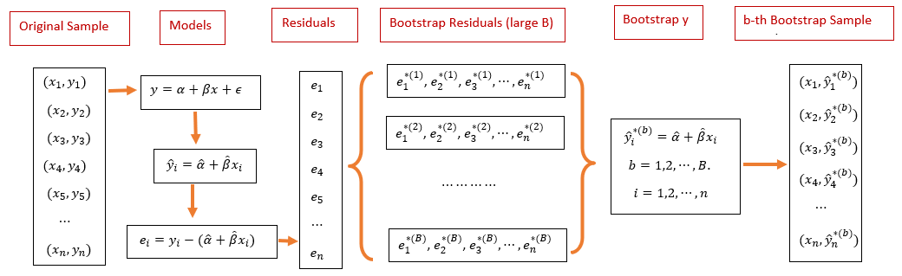

```{=html}

<style type="text/css">

/* Cascading Style Sheets (CSS) is a stylesheet language used to describe the presentation of a document written in HTML or XML. it is a simple mechanism for adding style (e.g., fonts, colors, spacing) to Web documents. */

h1.title {  /* Title - font specifications of the report title */
  font-size: 24px;
  color: DarkRed;
  text-align: center;
  font-family: "Gill Sans", sans-serif;
}
h4.author { /* Header 4 - font specifications for authors  */
  font-size: 20px;
  font-family: system-ui;
  color: DarkRed;
  text-align: center;
}
h4.date { /* Header 4 - font specifications for the date  */
  font-size: 18px;
  font-family: system-ui;
  color: DarkBlue;
  text-align: center;
}
h1 { /* Header 1 - font specifications for level 1 section title  */
    font-size: 22px;
    font-family: system-ui;
    color: navy;
    text-align: left;
}
h2 { /* Header 2 - font specifications for level 2 section title */
    font-size: 20px;
    font-family: "Times New Roman", Times, serif;
    color: navy;
    text-align: left;
}

h3 { /* Header 3 - font specifications of level 3 section title  */
    font-size: 18px;
    font-family: "Times New Roman", Times, serif;
    color: navy;
    text-align: left;
}

h4 { /* Header 4 - font specifications of level 4 section title  */
    font-size: 18px;
    font-family: "Times New Roman", Times, serif;
    color: darkred;
    text-align: left;
}

body { background-color:white; }

.highlightme { background-color:yellow; }

p { background-color:white; }

</style>
```
```{r setup, include=FALSE}
# Detect, install and load packages if needed.
if (!require("knitr")) {
   install.packages("knitr")
   library(knitr)
}
if (!require("MASS")) {
   install.packages("MASS")
   library(MASS)
}
if (!require("nleqslv")) {
   install.packages("nleqslv")
   library(nleqslv)
}
if (!require("scales")) {
install.packages("scales")                                        
library("scales") 
}
#
# specifications of outputs of code in code chunks
knitr::opts_chunk$set(echo = TRUE,      # include code chunk in the output file
                      warnings = FALSE,  # sometimes, you code may produce warning messages,
                                         # you can choose to include the warning messages in
                                         # the output file. 
                      messages = FALSE,  #
                      results = TRUE     # you can also decide whether to include the output
                                         # in the output file.
                      )   
```

\


# Introduction

In this note, we first introduce the bootstrap regression model through sampling residuals. The resulting bootstrap confidence intervals of regression coefficients will be included in the inference table of the output of **lm()**.

We will use some R functions to create nice-looking tables to be used in any professional reports.


# Concept of Bootstrap Residuals

Bootstrapping residuals is another way to generate bootstrap random samples that are supposed to have the same distribution as that $Y$ in the original random sample. The following flow chart explains the process of how to generate bootstrap random samples.


```{r echo=FALSE, fig.align ="center",  out.width = '100%'}

```

Next, we use a simple to demonstrate the steps to generate bootstrap samples based on sampling bootstrap residuals. The data set at <https://raw.githubusercontent.com/pengdsci/sta321/main/ww03/handheight.txt> has three variables: sex, height, and hand span. We will this data set to assess the linear correlation between height and hand span. We first do some exploratory analysis to visualize the potential association between height and hand size.


```{r fig.align='center', fig.height=5, fig.width=5}
handheight = read.table("https://online.stat.psu.edu/stat501/sites/stat501/files/data/handheight.txt", header = TRUE)
MID = which(handheight$Sex=="Male")
MaleData = handheight[MID,]
FealeData = handheight[-MID,]
plot(handheight$Height, handheight$HandSpan, pch=16, col="white",
                        xlab = "Hand Span",
                        ylab = "Height",
                        main = "Hand Span vs Height",
                        col.main = "navy",
                        cex.main = 0.8,
                        bty="n")
points(handheight$Height[MID], handheight$HandSpan[MID], pch=16, col=alpha("darkred", 0.5))
points(handheight$Height[-MID], handheight$HandSpan[-MID], pch=19, col=alpha("blue", 0.5))
```

# Implementing Bootstrapping Residuals

The following code reflects the steps in the above flow-chart


```{r}
height = handheight$Height
handspan = handheight$HandSpan
m0 = lm(height~handspan)
E = resid(m0)            # Original residuals
a.hat = coef(m0)[1]
b.hat = coef(m0)[2]
##
B = 1000                 # generating 1000 bootstrap samples
bt.alpha = rep(0, B)
bt.beta = bt.alpha
for(i in 1:B){
  bt.e = sample(E, replace = TRUE)          # bootstrap residuals
  y.hat = a.hat + b.hat*handspan + bt.e     # bootstrap heights
  ## bootstrap SLR
  bt.m = lm(y.hat ~ handspan)
  bt.alpha[i] = coef(bt.m)[1]
  bt.beta[i] = coef(bt.m)[2]
 }
alpha.CI = quantile(bt.alpha, c(0.025, 0.975))
beta.CI = quantile(bt.beta, c(0.025, 0.975))
##
per.025 = c(alpha.CI[1],beta.CI[1])     # lower CI for alpha and beta
per.975 = c(alpha.CI[2],beta.CI[2])     # upper CI for alpha and beta  
```

Next, we add the confidence limits to the output inferential table from the SLR based on the original sample.

```{r}
lm.inference = as.data.frame((summary(m0))$coef)
lm.inference$per.025 = per.025
lm.inference$per.975 = per.975
kable(as.matrix(lm.inference))
```


