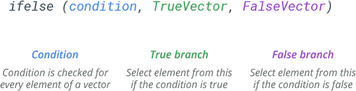

```{=html}

<style type="text/css">

/* Cascading Style Sheets (CSS) is a stylesheet language used to describe the presentation of a document written in HTML or XML. it is a simple mechanism for adding style (e.g., fonts, colors, spacing) to Web documents. */

h1.title {  /* Title - font specifications of the report title */
  font-size: 24px;
  color: DarkRed;
  text-align: center;
  font-family: "Gill Sans", sans-serif;
}
h4.author { /* Header 4 - font specifications for authors  */
  font-size: 20px;
  font-family: system-ui;
  color: DarkRed;
  text-align: center;
}
h4.date { /* Header 4 - font specifications for the date  */
  font-size: 18px;
  font-family: system-ui;
  color: DarkBlue;
  text-align: center;
}
h1 { /* Header 1 - font specifications for level 1 section title  */
    font-size: 22px;
    font-family: system-ui;
    color: navy;
    text-align: left;
}
h2 { /* Header 2 - font specifications for level 2 section title */
    font-size: 20px;
    font-family: "Times New Roman", Times, serif;
    color: navy;
    text-align: left;
}

h3 { /* Header 3 - font specifications of level 3 section title  */
    font-size: 18px;
    font-family: "Times New Roman", Times, serif;
    color: navy;
    text-align: left;
}

h4 { /* Header 4 - font specifications of level 4 section title  */
    font-size: 18px;
    font-family: "Times New Roman", Times, serif;
    color: darkred;
    text-align: left;
}

body { background-color:white; }

.highlightme { background-color:yellow; }

p { background-color:white; }

</style>
```

```{r setup, include=FALSE}
options(digits = 15)
# Detect, install and load packages if needed.
if (!require("knitr")) {
   install.packages("knitr")
   library(knitr)
}
if (!require("pander")) {
   install.packages("pander")
   library(pander)
}

#
# specifications of outputs of code in code chunks
knitr::opts_chunk$set(echo = TRUE,      
                      warnings = FALSE,   
                      messages = FALSE,  
                      results = TRUE     
                      )   
```


\

# Intorduction

In this note, we use a health registry data set as an example to illustrate the use of some of the base R commands in creating an analytic data set analysis and modeling.

# Data Set Description


The Current Population Survey (CPS, http://www.bls.census.gov/cps/overmain.htm) is a monthly survey of about 50,000 households conducted by the Bureau of the Census for the Bureau of Labor Statistics. The survey has been conducted for more than 50 years.  The CPS is the primary source of information on the labor force characteristics of the U.S. population.  The sample is scientifically selected to represent the civilian noninstitutional population. Respondents are interviewed to obtain information about the employment status of each member of the household 15 years of age and older. However, published data focus on those ages 16 and over. The sample provides estimates for the nation as a whole and serves as part of model-based estimates for individual states and other geographic areas.

Estimates obtained from the CPS include 

* employment, 
* unemployment, 
* earnings, 
* hours of work, and 
* other indicators. 

They are available by a variety of demographic characteristics including 
* age, 
* sex, 
* race, 
* marital status, and 
* educational attainment. 

They are also available by 

* occupation, 
* industry, and 
* class of worker.  

Supplemental questions to produce estimates on a variety of topics including 

* School enrollment, 
* income,  
* previous work experience, 
* health, 
* employee benefits, and 
* work schedules 

are also often added to the regular CPS questionnaire.

CPS data are used by government policymakers and legislators as important indicators of our nation's economic situation and for planning and evaluating many government programs. They are also used by the press, students, academics, and the general public.

In this note, we use a very small portion of the sample (https://raw.githubusercontent.com/pengdsci/sta321/main/ww04/cps_00003.csv) for illustrative purposes. The definitions of some of the variables can be found at (https://www.bls.gov/cps/definitions.htm). **We will not use this data to perform any meaningful analysis.** 

The first few columns are what could be called administrative. They’re unique identifiers for the different observations, the timing of the survey they’ve taken, and a bit of other information. So for now we don’t need to pay much attention to MONTH, HWTFINL, CPSID, PERNUM, WTFINL, or CPSIDP. We will drop these variables.

The next few columns are concerned with the different geographies we have for the observations. This data is for individuals, but we also know the individual region (REGION), state (STATEFIP and STATECENSUS), and metropolitan area (METRO and METAREA). We can define a separate data set to store this geoinformation.

\

# Base R Commands for Data Management  

This note introduces several most commonly used R functions in data management.

```{r}
dat = read.csv("https://raw.githubusercontent.com/pengdsci/sta321/main/ww04/cps_00003.csv")
pander(head(dat))
```

The unique identifiers **CPSID** and **CPSIDP** are in the form of scientific notation, we need to convert them to a normal string version of the ID.


## Working with Scientific Notations

Two global options we can use to print out the actual ID. See the self-explained options in the following code.


```{r}
options(digits = 15, scipen=999)
dat = read.csv("https://raw.githubusercontent.com/pengdsci/sta321/main/ww04/cps_00003.csv")
pander(head(dat))
```

A new R function **pander()** in the `pander{}` library was used in the above code to produce an R markdown table. We add more features to the output table (check the help document for more information and examples).

If the ID variable was truncated before saving to CSV format, then the truncated digits will not be recovered.

```{r}
options(digits = 7)  # change the default number digits
```

\

# The **ifelse()** Function

**ifelse** statement is also called a vectorized conditional statement. It is commonly used in defining new variables. 

```{r echo=FALSE, fig.align ="center",  out.width = '70%'}

```

For example, we can define a categorical variable, denoted by **groupAge**, based on the **AGE** variable in the original data frame. If 
`AGE > 50, then groupAge = "(50, 150)"` otherwise `groupAge = "[16, 50]"` The following code defines this new variable.


```{r}
dat$groupAge = ifelse(dat$AGE > 50, "(50, 150)", "[16, 50]")
pander(head(dat[, c("AGE", "groupAge")]))
```

If we define another **groupAge** with more than two categories, we can still call **ifelse** multiple times. For example, we define **groupAge02** as: `is AGE > 50, then groupAge02 = "(50, 150)", if 30 <= AGE < 50, groupAge02 = [30, 50),otherewise, groupAge02 = "[16, 30)"`

```{r}
dat$groupAge02 = ifelse(dat$AGE > 50, "(50, 150)", ifelse(dat$AGE < 30, "[16, 30)", "[30, 50)"))
pander(head(dat[, c("AGE", "groupAge", "groupAge02")]))
```


**Remark**: **ifelse()** is particularly useful when you want to combine categories of existing categorical variables.

\

# The **cut()** Function

The **cut()** function is more flexible than **ifelse()**.

```
Syntax
cut(num_vector,              # Numeric input vector
    breaks,                  # Number or vector of breaks
    labels = NULL,           # Labels for each group
    include.lowest = FALSE,  # Whether to include the lowest 'break' or not
    right = TRUE,            # Whether the right interval is closed (and the left open) or vice versa
    dig.lab = 3,             # Number of digits of the groups if labels = NULL
    ordered_result = FALSE,  # Whether to order the factor result or not
    …)                       # Additional arguments
```

We still use the above example to discretize the age variable using **cut()** function.

```{r}
dat$cutAge01 = cut(dat$AGE, breaks =c(16, 30, 50, 150), labels=c( "[16, 30)", "[30, 50)", "(50, 150)"), include.lowest = TRUE)
pander(head(dat[, c("AGE", "groupAge", "groupAge02", "cutAge01")]))
```


```{r}
dat$cutAge02 = cut(dat$AGE, breaks =c(16, 30, 50, 150), include.lowest = TRUE)
pander(head(dat[, c("AGE", "groupAge", "groupAge02", "cutAge01", "cutAge02")]))
```


# Perform One-sided Test for Regression Models

```{r}
realestate0 <- read.csv("https://raw.githubusercontent.com/pengdsci/sta321/main/ww03/w03-Realestate.csv", header = TRUE)
# re-scale distance: foot -> kilo feet
realestate0$Dist2MRT.kilo = (realestate0$Distance2MRT)/1000   
#names(realestate0)
m0 = lm(PriceUnitArea~ factor(TransactionYear) + HouseAge + NumConvenStores + Distance2MRT, data = realestate0)
summary(m0)
```

**Test the claim that Distance2MRT is NEGATIVELY associated with PriceUnitArea**

Assuming the correct model to be 

$$
PriceUnitArea = \beta_0 + \beta_1 TransactionYear + \beta_2 HouseAge +     \beta_3 NumConvenStores + \beta_4 Distance2MRT
$$

The fitted model has the following form

$$
PriceUnitArea = 41.0090647 + 3.0136617TransactionYear - 0.2587855HouseAge +     1.2965524NumConvenStores - 0.0053972Distance2MRT
$$

The claim is equivalent to $\beta_4 < 0$. Therefore, statistical hypothesis is equivalent to

$$
H_0: \beta_4 \ge 0  \  \  \text{ versus } \ \ H_a: \beta_4 < 0
$$

This is **left-tailed** test from the alternative hypothesis! The rejection region is on the **left tail** of the density curve.  How to calculate the p-value? 

**Note that the p-values given in the table are for the two-tailed tests. other than this, all other statistics are correct regardless of one or two-tailed test!**

The p-value is given by

$$
\text{p-value} = P(TS < t_{414 -5})  \approx 0
$$

where $TS = -12.035$.

```{r}
pt(-12.035, 409)
```

Since the p-value is $p \approx 0$, we **reject** the null hypothesis that the distance between the transportation center and the house price are non-negatively associated. Therefore, we **conclude the alternative hypothesis**, that is, we support the claim that the two variables are negatively correlated.


