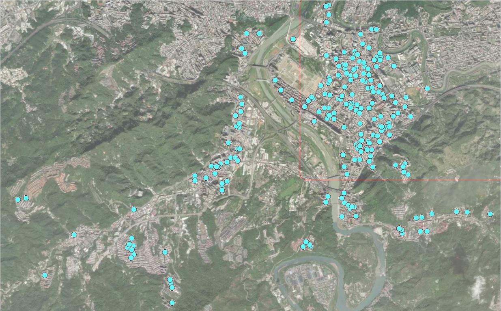

```{=html}

<style type="text/css">

/* Cascading Style Sheets (CSS) is a stylesheet language used to describe the presentation of a document written in HTML or XML. it is a simple mechanism for adding style (e.g., fonts, colors, spacing) to Web documents. */

h1.title {  /* Title - font specifications of the report title */
  font-size: 24px;
  color: DarkRed;
  text-align: center;
  font-family: "Gill Sans", sans-serif;
}
h4.author { /* Header 4 - font specifications for authors  */
  font-size: 20px;
  font-family: system-ui;
  color: DarkRed;
  text-align: center;
}
h4.date { /* Header 4 - font specifications for the date  */
  font-size: 18px;
  font-family: system-ui;
  color: DarkBlue;
  text-align: center;
}
h1 { /* Header 1 - font specifications for level 1 section title  */
    font-size: 22px;
    font-family: system-ui;
    color: navy;
    text-align: left;
}
h2 { /* Header 2 - font specifications for level 2 section title */
    font-size: 20px;
    font-family: "Times New Roman", Times, serif;
    color: navy;
    text-align: left;
}

h3 { /* Header 3 - font specifications of level 3 section title  */
    font-size: 18px;
    font-family: "Times New Roman", Times, serif;
    color: navy;
    text-align: left;
}

h4 { /* Header 4 - font specifications of level 4 section title  */
    font-size: 18px;
    font-family: "Times New Roman", Times, serif;
    color: darkred;
    text-align: left;
}

body { background-color:white; }

.highlightme { background-color:yellow; }

p { background-color:white; }

</style>
```
```{r setup, include=FALSE}
# Detect, install and load packages if needed.
if (!require("knitr")) {
   install.packages("knitr")
   library(knitr)
}
if (!require("MASS")) {
   install.packages("MASS")
   library(MASS)
}
if (!require("car")) {
   install.packages("car")
   library(car)
}
if (!require("scales")) {
install.packages("scales")                                        
library("scales") 
}
#
# specifications of outputs of code in code chunks
knitr::opts_chunk$set(echo = TRUE,      # include code chunk in the output file
                      warnings = FALSE,  # sometimes, you code may produce warning messages,
                                         # you can choose to include the warning messages in
                                         # the output file. 
                      messages = FALSE,  #
                      results = TRUE     # you can also decide whether to include the output
                                         # in the output file.
                      )   
```

\


# Introduction

The general purpose of multiple linear regression (MLR) is to identify a relationship in an explicit functional form between explanatory variables or predictors and the dependent response variable. This relationship will be used to achieve two primary tasks:

* **Association analysis** - understanding the association between predictors and the response variable. As a special association, the causal relationship can be assessed under certain conditions. 

* **Prediction** - the relationship between predictors and the response can be used to predict the response with new out-of-sample values of predictors.


# The structure of MLR

Let $\{x_1, x_2, \cdots, x_k \}$ be $k$ explanatory variables and $y$ be the response variables. The general form of the multiple linear regression model is defined as

$$
y = \beta_0 + \beta_1 x_1 + \beta_2 x_2 + \cdots + \beta_k x_k + \epsilon.
$$
This is a very special form in that y is linear in both parameters and predictors. The actual linear regression only assumes that $y$ is linear only in parameters but not predictors since the value of predictors will be observed in data.

## Assumptions based on the above special form.

* The function form between $y$ and $\{x_1, x_2, \cdots, x_k \}$ must be correctly specified.
* The residual $\epsilon$ must be normally distributed with $\mu = 0$ and a constant variance $\sigma^2$.
* An implicit assumption is that predictor variables are non-random.


## Potential Violations

There are various potential violations of the model assumptions. The following is a shortlist of potential violations of the model assumptions. 

* The potential incorrect functional relationship between the response and the predictor variables.
  + the correct form may have power terms.
  + the correct form may have a cross-product form.
  + the correct form may need important variables that are missing.
  
* The residual term does not follow the normal distribution $N(0, \sigma^2)$. That means that
  + $\epsilon$ is not normally distributed at all.
  + $\epsilon$ is normally distributed but the variance is not a constant.

## Variable types

Since there will be multiple variables involved in the multiple regression model.

* All explanatory variables are continuous variables - classical linear regression models.

* All explanatory variables are categorical variables - analysis of variance (ANOVA) models.

* The model contains both continuous and categorical variables - analysis of covariance (ANCOVA) model.

## Dummy and discrete numerical explanatory variables

* Categorical variables with $n$ ($n > 2$) categories MUST be dichotomized into $n-1$ dummy variables (binary indicator variables).
  + **Caution**: categorical variable with a numerical coding - need to use R function **factor()** to automatically define a sequence of dummy variables for the category variable.

* **Discrete (numerical) variable** - If we want to use discrete numerical as a categorical variable, we must dichotomize it and define a sequence of dummy variables since interpretations of the two types of variables are different. In a categorical variable case, the coefficient of a dummy variable is the relative contribution to the response compared with the baseline category. In the discrete case, the regression coefficient is the relative contribution to the response variable compared with adjacent values and the relative contribution is constant across all adjacent values of the discrete predictor variable. 

## Interpretation of Regression Coefficients

A _multiple linear regression model with $k$ predictor variables has k+1 unknown parameters: intercept parameters ($\beta_0$), slope parameters ($\beta_i, i = 1, 2, \cdots, k$), and the variance of the response variable ($\sigma^2$). The key parameters of interest are the slope parameters since they capture the information on whether the response variable and the corresponding explanatory variables are (linearly) associated. 

* If $y$ and $x_i$ are not linearly associated, that is, $\beta_i = 0, i = 1, 2, \cdots, k$, then $\beta_0$ is the mean of $y$. 

* If $\beta_i > 0$, then $y$ and $x_i$ are positively linearly correlated. Furthermore, $\beta_i$ is the increment of the response when the explanatory variable increases by one unit.

* We can similarly interpret $\beta_i$ when it is negative.


# Model building

Modeling building is an iterative process for searching for the best model to fit the data. An implicit assumption is that the underlying data is statistically valid.  


## Data structure, sample size, and preparation for MLR

In the model-building phase, we assume data is valid and has sufficient information to address the research hypothesis.

* Data records are independent - collected based on a cross-sectional design.

* The sample size should be large enough such that each regression coefficient should have 14 distinct data points to warrant reliable and robust estimates of regression coefficients.

* Imbalanced categorical variables and extremely distributed continuous explanatory variables need to be treated to a warrant valid estimate of regression coefficients. This includes combining categories in meaningful and practically interpretable ways and discretizing extremely skewed continuous variables.

* New variable definition - sometimes we can extract information from several variables to define new variables to build a better model. This is an active area in machine learning fields and data science. There are many different methods and algorithms in literature and practice for creating new variables based on existing ones. 

  + Empirical approach - based on experience and numerical pattern.
  + Model-based approach - this may require a highly technical understanding of algorithms and modeling ideas. This is not the main consideration in this course. 

## Candidate models and residual diagnostics

* Consider only the multiple linear regression models that have a linear relationship between response and predictor variables.

* Perform residual analysis 
   + if a curve pattern appears in residual plots, identify a curve linear relationship between the response and the individual predictor variable
   + if non-constant variance appears in the residual plots, then perform an appropriate transformation to stabilize the constant variance - for example, Box-cox transformation.
   + if the QQ plot indicates non-normal residuals, try transformations to convert it to a normal variable.
   + if there are serial patterns in the residual plot, we need to remove the serial pattern with an appropriate method.
   + if some clusters appear in the residual plot, create a group variable to capture the clustering information.

## Significant test, goodness-of-fit, and Variable selection

Significant tests and goodness-of-fit measures are used to identify the final model. Please keep in mind that a good statistical model must have the following properties;

* Interpretability

* parsimony

* Accuracy

* Scalability

### Significant Tests 

Significant tests are used for selecting statistically significant variables to include in the model. However, in practical applications, some practically important variables should always be included in the model regardless of their statistical significance. The t-test is used for selecting (or dropping) individual statistically significant variables.


### Variable (model) selection criteria - Goodness-of-fit Measures

There are many different methods based on different performance measures for model selection. Most of these goodness-of-fit measures are defined based on **sum of squares** that defined in the following (use SLR for illustration)

```{r echo=FALSE, fig.align ="center", fig.cap="Definitions of sum od squares", out.width="60%"}

```

* $R^2$ - coefficient of determination. It explains the variation explained by the underlying regression model. 

$$
R^2 = \frac{SSR}{SST} = 1 - \frac{SSE}{SST}
$$

$R^2$ is used to compare two candidate models. Adjusted $R^2$ is used when there are many predictor variables in the model. It is defined by

$$
R^2_{adj} = 1 - \frac{n-1}{n-p} \frac{SSE}{SST}
$$

* Information criteria - likelihood-based measures: AIC and SBC.

$$
AIC_p = n \ln(SSE) - n\ln(n) + 2p
$$
$$
BIC_p = n\ln(SSE) - n\ln(n) + p\ln(n)
$$

* The **prediction sum of squares (PRESS)** is a model validation method used to assess a model's predictive ability that can also be used to compare regression models. It is defined based on an iterative algorithm - Leave-on-out (a special Jackknife resampling method to be discussed in the next module).

* Likelihood ratio $\chi^2$ test - comparing two candidate models with a hierarchical relationship.

* Mallow's Cp - a residual-based measure that is used for comparing two models that do not necessarily have a hierarchical structure.


### Variable selection methods

* Step-wise Procedures

* Criterion-based procedures

This short note summarized the above two methods for [Variable Selection](http://www.biostat.jhsph.edu/~iruczins/teaching/jf/ch10.pdf)(click the link to view the text).


## Multicollinearity Detection - VIF

As the name suggests, a variance inflation factor (VIF) quantifies how much the variance is inflated. A variance inflation factor exists for each of the predictors in a multiple regression model. For example, the variance inflation factor for the estimated regression coefficient $b_j$ —denoted $VIF_j$ —is just the factor by which the variance of $b_j$ is "inflated" by the existence of correlation among the predictor variables in the model. To be more specific, the VIF of j-th predictor is defined to be

$$
\text{VIF}_j = \frac{1}{1-R_j^2}
$$

Where $R^2_j$ is the coefficient of determination of of regression $E(x_j) = \alpha_0 + \alpha_1x_1 + \cdots+\alpha_{j-1}x_{j-1} + \alpha_{j+1}x_{j+1} + \cdots + \alpha_kx_k$.

A VIF of 1 means that there is no correlation among the jth predictor and the remaining predictor variables, and hence the variance of bj is not inflated at all. The general rule of thumb is that VIFs exceeding 4 warrant further investigation, while VIFs exceeding 10 are signs of serious multicollinearity requiring correction.

R function in the machine learning library `{car}`(classification and regression) can be used to calculate the variance inflation factor for individual predictor.


# Case Study - Factors That Affect House-Sale Prices

We present a case study to implement various model-building techniques.

## Data Description

The data in this note was found from [Kaggle](https://www.kaggle.com/). I renamed the original variables and modified the sales dates to define the sales year indicator. The modified data set was uploaded to the course web page at <https://raw.githubusercontent.com/pengdsci/sta321/main/ww03/w03-Realestate.csv>. 

* ObsID
* TransactionYear(X1): transaction date	
* HouseAge(X2): house age	
* Distance2MRT(X3): distance to the nearest MRT station	
* NumConvenStores(X4): number of convenience stores	
* Latitude(X5): latitude	
* Longitude(X6): longitude	
* PriceUnitArea(Y): house price of unit area

## Practical Question

The primary question is to identify the association between the house sale price and relevant predictor variables available in the data set.

## Exploratory Data Analysis

We first explore the pairwise association between the variables in the data set. Since longitude and latitude are included in the data set, we first make a map to see if we can define a variable according to the sales based on the geographic regions.

To start, we load the data to R.

```{r fig.align='center'}
realestate0 <- read.csv("https://raw.githubusercontent.com/pengdsci/sta321/main/ww03/w03-Realestate.csv", header = TRUE)
realestate <- realestate0[, -1]
# longitude and latitude will be used to make a map in the upcoming analysis.
lon <- realestate$Longitude
lat <- realestate$Latitude 
plot(lon, lat, main = "Sites of houses sold in 2012-2013")
abline(v=121.529, h=24.96, col="red", lty=2)
```

We use longitude and latitude to define a group variable, **geo.group**, in the following.

  **geo.group = TRUE** if longitude > 121.529 AND latitude > 24.96;
  **geo.group = FALSE** otherwise.
  
From the map representation of the locations of these houses given below (generated by Tableau Public), we can see that **geo. group** is an indicator  

```{r echo=FALSE, fig.align ="center", fig.cap="Locations of houses for sale", out.width="80%", dev="jpeg"}

```


We also turn the variable **TransactionYear** into an indicator variable. At the same time, we scale the distance from the house to the nearest MRT by defining **Dist2MRT = Distance2MRT/1000**.


```{r}
geo.group = (lon > 121.529) & (lat > 24.96)     # define the geo.group variable
                                                # top-right region = TRUE, other region = FALSE
realestate$geo.group = as.character(geo.group)  # convert the logical values to character values.
realestate$sale.year = as.character(realestate$TransactionYear) # convert transaction year to dummy.
realestate$Dist2MRT.kilo = (realestate$Distance2MRT)/1000   # re-scale distance: foot -> kilo feet
final.data = realestate[, -c(1,3,5,6)]          # keep only variables to be used in the candidate
                                                # models
kable(head(final.data))
```
## Fitting MLR to Data

We start the search process for the final model.

### Full model and diagnostics 

We start with a linear model that includes all predictor variables.

```{r fig.align='center'}
full.model = lm(PriceUnitArea ~ ., data = final.data)
kable(summary(full.model)$coef, caption ="Statistics of Regression Coefficients")
```

Next, we conduct residual diagnostic analysis to check the validity of the model before making an inference about the model.

```{r fig.align='center', fig.width=5, fig.height=5, fig.cap="Residual plots of the full model"}
par(mfrow=c(2,2))
plot(full.model)
```

We can see from the residual plots that there are some minor violations:

* the variance of the residuals is not constant.

* the QQ plot indicates the distribution of residuals is slightly off the normal distribution.

* The residual plot seems to have a weak curve pattern.

We first perform Box-Cox transformation to correct the non-constant variance and correct the non-normality of the QQ plot.

```{r}
vif(full.model)
```
The VIF indices show that there is no significant issues on multicollinearity. We can also make a bar plot for the VIFs.

```{r fig.align='center', fig.width= 7, fig.height=5}
#create horizontal bar chart to display each VIF value
barplot(vif(full.model), main = "VIF Values", horiz = FALSE, col = "steelblue")

```


### Models Based on Box-Cox transformation

We first perform Box-Cox transformation and then choose appropriate transformations for both response and predictor variables to build candidate regression models.


#### Box-Cox Transformations

Since non-constant variance, we perform the Box-Cox procedure to search for a transformation of the response variable.  We perform several tried Box-Cox transformations with different transformed 

```{r fig.align='center', fig.width=7, fig.height=6}
par(pty = "s", mfrow = c(2, 2), oma=c(.1,.1,.1,.1), mar=c(4, 0, 2, 0))
##
boxcox(PriceUnitArea ~ HouseAge + NumConvenStores + sale.year +  log(Dist2MRT.kilo)  
       + geo.group, data = final.data, lambda = seq(0, 1, length = 10), 
       xlab=expression(paste(lambda, ": log dist2MRT")))
##
boxcox(PriceUnitArea ~ HouseAge + NumConvenStores + sale.year +  Dist2MRT.kilo  + 
       geo.group, data = final.data, lambda = seq(-0.5, 1, length = 10), 
       xlab=expression(paste(lambda, ": dist2MRT")))
##
boxcox(PriceUnitArea ~ log(1+HouseAge) + NumConvenStores + sale.year +  Dist2MRT.kilo  + 
      geo.group, data = final.data, lambda = seq(-0.5, 1, length = 10), 
       xlab=expression(paste(lambda, ": log-age")))
##
boxcox(PriceUnitArea ~ log(1+HouseAge) + NumConvenStores + sale.year +  log(Dist2MRT.kilo)  + 
      geo.group, data = final.data, lambda = seq(-0.5, 1, length = 10), 
      xlab=expression(paste(lambda, ": log-age, log.dist2MRT")))
```

The above Box-cox transformation plots indicate the optimal $\lambda$  under different transformed predictor variables. log-Transformed distance from MRT impacts the coefficient of the power transformation: $\lambda$. 

As a special power transformation, if $\lambda = 0$, the transformation degenerates to log transformation.

#### Square-root Transformation

We perform Box-Cox transformation with log-transformed distance to the nearest MRT in the following.

```{r}
sqrt.price.log.dist = lm((PriceUnitArea)^0.5 ~ HouseAge + NumConvenStores + sale.year +  log(Dist2MRT.kilo)  + geo.group, data = final.data)
kable(summary(sqrt.price.log.dist)$coef, caption = "log-transformed model")
```

Residual plots are given below.

```{r fig.align='center', fig.height=5, fig.width=5}
par(mfrow = c(2,2))
plot(sqrt.price.log.dist)
```

There are two improvements in the above residual diagnostic plots: (1) the weak curve pattern has been removed from the residual plot; (2) the non-constant variance has also been corrected. However, the violation of the normality assumption is still an issue.

#### Log-Transformation

We take the log transformation of the sale price according to the Box-Cox transformation and then build a linear regression based on the log price.

```{r}
log.price = lm(log(PriceUnitArea) ~ HouseAge + NumConvenStores + sale.year +  Dist2MRT.kilo  + geo.group, data = final.data)
kable(summary(log.price)$coef, caption = "log-transformed model")
```

Residual plots are given below.

```{r fig.align='center', fig.height=5, fig.width=5}
par(mfrow = c(2,2))
plot(log.price)
```

The above residual diagnostic plots are similar to that of the previous model. The Q-Q plots of all three models are similar to each other, this means that the assumption of normal residuals is not satisfied for all three models.


```{r fig.align='center', fig.width= 7, fig.height=4}
#define plotting area
par(pty = "s", mfrow = c(1, 3))
#Q-Q plot for original model
qqnorm(full.model$residuals, main = "Full-Model")
qqline(full.model$residuals)
#Q-Q plot for Box-Cox transformed model
qqnorm(log.price$residuals, main = "Log-Price")
qqline(log.price$residuals)
#display both Q-Q plots
qqnorm(sqrt.price.log.dist$residuals, main = "sqrt price log dist")
qqline(sqrt.price.log.dist$residuals)
```


#### Goodness-of-fit Measures

Next, we extract several other goodness-of-fit from each of the three candidate models and summarize them in the following table.


```{r}
select=function(m){ # m is an object: model
 e = m$resid                           # residuals
 n0 = length(e)                        # sample size
 SSE=(m$df)*(summary(m)$sigma)^2       # sum of squared error
 R.sq=summary(m)$r.squared             # Coefficient of determination: R square!
 R.adj=summary(m)$adj.r                # Adjusted R square
 MSE=(summary(m)$sigma)^2              # square error
 Cp=(SSE/MSE)-(n0-2*(n0-m$df))         # Mellow's p
 AIC=n0*log(SSE)-n0*log(n0)+2*(n0-m$df)          # Akaike information criterion
 SBC=n0*log(SSE)-n0*log(n0)+(log(n0))*(n0-m$df)  # Schwarz Bayesian Information criterion
 X=model.matrix(m)                     # design matrix of the model
 H=X%*%solve(t(X)%*%X)%*%t(X)          # hat matrix
 d=e/(1-diag(H))                       
 PRESS=t(d)%*%d   # predicted residual error sum of squares (PRESS)- a cross-validation measure
 tbl = as.data.frame(cbind(SSE=SSE, R.sq=R.sq, R.adj = R.adj, Cp = Cp, AIC = AIC, SBC = SBC, PRD = PRESS))
 names(tbl)=c("SSE", "R.sq", "R.adj", "Cp", "AIC", "SBC", "PRESS")
 tbl
 }

```

<font color = "red">**\color{red}CAUTION**: *\color{red}SSE, AIC, SBC, and PRESS are dependent on the magnitude of the response. $R^2$, $R^2_{adj}$, and $C_p$ are scaled (index-like measure) and therefore independent on the magnitude of Response. This means that models with transformed response and those with the original magnitude can NOT be compared using SSE, AIC, SBC, and PRESS!*</font>  

<font color = "blue">**\color{blue}In the following table, three models have different magnitudes due to different transformations, the valid goodness of fit measures are $R^2$, $R^2_{adj}$,  and $C_p$!**</font>

```{r}
output.sum = rbind(select(full.model), select(sqrt.price.log.dist), select(log.price))
row.names(output.sum) = c("full.model", "sqrt.price.log.dist", "log.price")
kable(output.sum, caption = "Goodness-of-fit Measures of Candidate Models")
```

We can see from the above table that the goodness-of-fit measures (**$R^2, R^2_{adj}$, and $C_p$**) of the third model are better than the other two models. Considering the interpretability, goodness-of-fit, and simplicity, we choose the last model as the final model.


### Final Model

The inferential statistics of the final working model are summarized in the following table.

```{r}
kable(summary(log.price)$coef, caption = "Inferential Statistics of Final Model")
```

Since the sample size (414) is large, the argument for validating p-values is the Central Limit Theorem (CLT). all p-values are close to 0 meaning that all coefficients are significantly different from 0.

In this specific case study, there is no need to perform variable selection to determine the final model. 


## Summary of the model

We can explicitly write the final model in the following

$$
\log(price) =3.5723 - 0.0076\times HouseAge +0.0275\times NumConvenStores + $$$$   0.0805\times Sale.year2013 - 0.1445\times Dist2MRT.kilo + 0.1826\times geo.groupTRUE
$$

Note that the estimated regression coefficients are based on log price. we now consider **the set of** all houses with ages $x_0$ and $x_0 + 1$ that are in the same conditions except for the sale prices. The exact practical interpretation is given below. Let $p_{x_0}$ and $p_{x_0+1}$ be the mean prices of houses with ages $x_0$ and $x_0 + 1$, respectively. Since the two types of houses are in the same conditions except for the age and the prices.  Then 

$$
\log (p_{x_0+1}) - \log(p_{x_0}) = -0.0076  \to \log(p_{x_0+1}/p_{x_0}) = -0.0076 \to p_{x_0+1} = 0.9924p_{x_0}
$$
We re-express the above equation can be re-written as

$$
p_{x_0+1} - p_{x_0} = -0.0076p_{x_0} \to \frac{p_{x_0+1}-p_{x_0}}{p_{x_0}} = -0.076 = -0.76\%
$$

That is, as the house age increases by one year, the house price **decreases** by 0.76%.  We can similarly interpret other regression coefficients.

The distance to the nearest MRT is also negatively associated with the sale price. The rest of the factors are positively associated with house prices.

## Discussions

We use various regression techniques such as Box-Cox transformation for response variables and other transformations of the explanatory variables to search for the final model in the case study. Since there are five variables in the data set and all are significant, we did not perform any variable selection procedure. 

All candidate models have the same number of variables. We use commonly-used global goodness-of-fit measures as model selection criteria.

The interpretation of the regression coefficients is not straightforward since the response variable was transformed into a log scale. We used some algebra to derive the practical interpretation of the regression coefficients associated with the variables at their original scales. 


The violation of the normal assumption of the residuals remains uncorrected. The inference on the regression coefficients is based on the central limit theorem. We will introduce bootstrap methods to construct bootstrap confidence intervals of the regression coefficients of the **final model**. 


