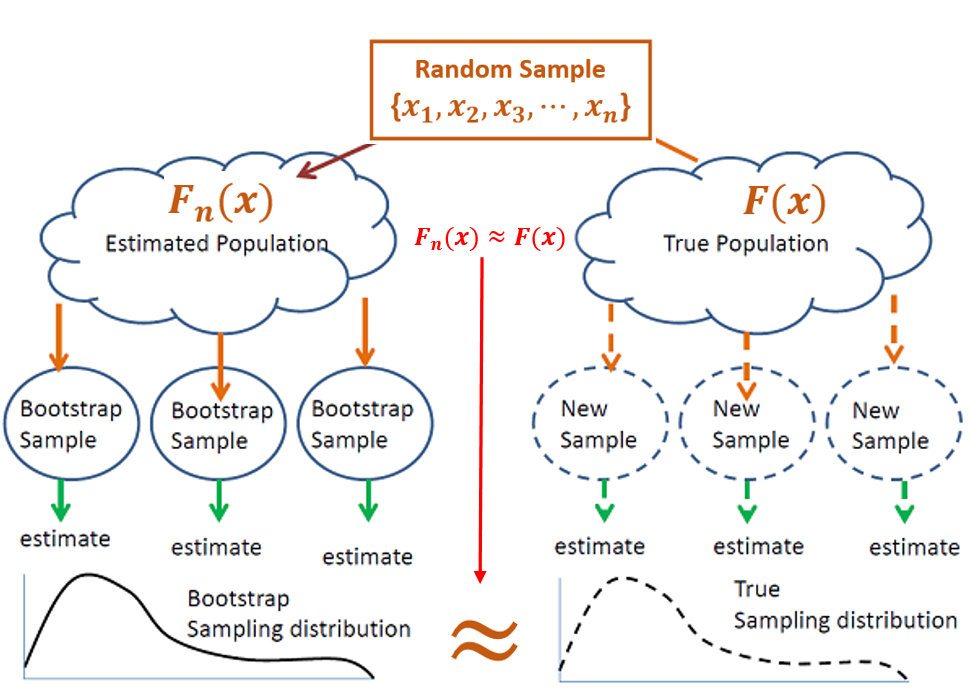
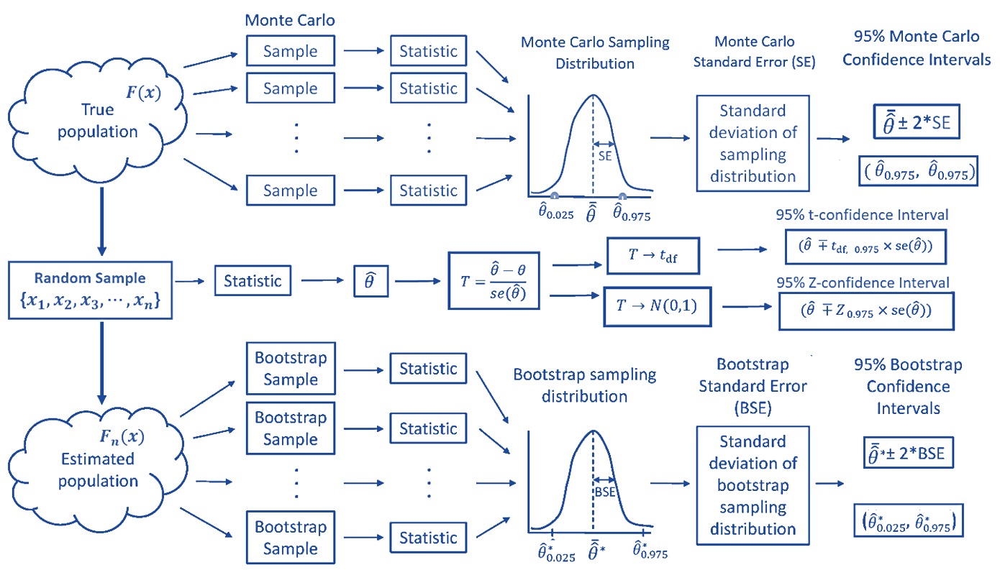
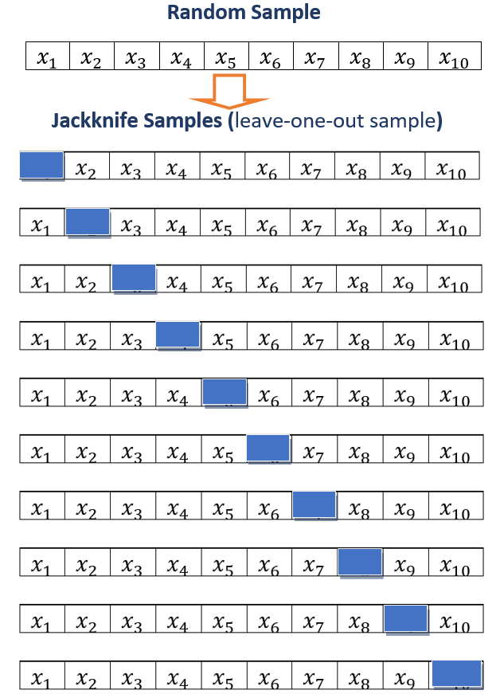
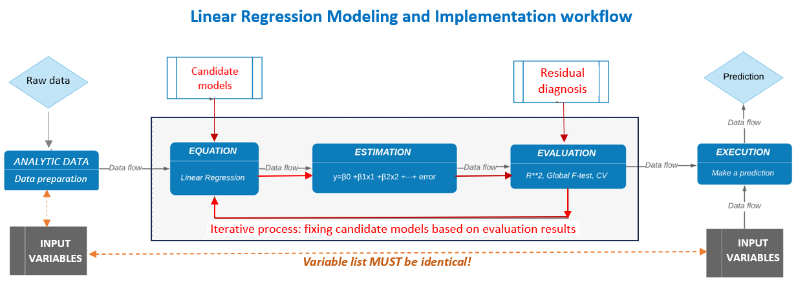

```{=html}

<style type="text/css">

/* Cascading Style Sheets (CSS) is a stylesheet language used to describe the presentation of a document written in HTML or XML. it is a simple mechanism for adding style (e.g., fonts, colors, spacing) to Web documents. */

h1.title {  /* Title - font specifications of the report title */
  font-size: 24px;
  color: DarkRed;
  text-align: center;
  font-family: "Gill Sans", sans-serif;
}
h4.author { /* Header 4 - font specifications for authors  */
  font-size: 20px;
  font-family: system-ui;
  color: DarkRed;
  text-align: center;
}
h4.date { /* Header 4 - font specifications for the date  */
  font-size: 18px;
  font-family: system-ui;
  color: DarkBlue;
  text-align: center;
}
h1 { /* Header 1 - font specifications for level 1 section title  */
    font-size: 22px;
    font-family: system-ui;
    color: navy;
    text-align: left;
}
h2 { /* Header 2 - font specifications for level 2 section title */
    font-size: 20px;
    font-family: "Times New Roman", Times, serif;
    color: navy;
    text-align: left;
}

h3 { /* Header 3 - font specifications of level 3 section title  */
    font-size: 18px;
    font-family: "Times New Roman", Times, serif;
    color: navy;
    text-align: left;
}

h4 { /* Header 4 - font specifications of level 4 section title  */
    font-size: 18px;
    font-family: "Times New Roman", Times, serif;
    color: darkred;
    text-align: left;
}

body { background-color:white; }

.highlightme { background-color:yellow; }

p { background-color:white; }

</style>
```

```{r setup, include=FALSE}
#options(digits = 15)
# Detect, install and load packages if needed.
if (!require("knitr")) {
   install.packages("knitr")
   library(knitr)
}
if (!require("pander")) {
   install.packages("pander")
   library(pander)
}

#
# specifications of outputs of code in code chunks
knitr::opts_chunk$set(echo = TRUE,      
                      warnings = FALSE,   
                      messages = FALSE,  
                      results = TRUE     
                      )   
```


\


# Bootstrap Method Revisited

The **bootstrap** is one of the computationally intensive techniques that is now part of the broad umbrella of **nonparametric statistics** that are commonly called **resampling methods**. 

We have used this method to construct the confidence interval for a unknown population mean and correlation coefficient of two numerical variables (populations). We also fit bootstrap simple linear regression in two different ways and will use it to build bootstrap MLR.

Based on the limited experience using the bootstrap procedure we had, it is time to look into the resampling technique a little more closer to how and why it works. We will also discuss the implicit assumptions for bootstrap resampling procedures. For ease of illustration, we need to review some concepts learned earlier: probability density function (`pdf`) and cumulative distribution function (`CDF`).

## `pdf` vs `CDF`

Let $f(x)$ denote the density function of the distribution of the population of interest. The corresponding cumulative distribution is given by

$$
F(x) = \int_{-\infty}^x f(y)dy
$$

That is, $F^{\prime}(x) = f(x)$. The following animated graph illustrates the relationship geometrically.

```{r echo=FALSE, fig.align ="center",  out.width = '40%', fig.cap="Relationship between Density curve and CDF curve"}
if (knitr:::is_latex_output()) {
  knitr::asis_output('\\url{https://github.com/pengdsci/STA504/blob/main/topic03/w04-PDFvsCDF.gif?raw=true}')
} else {
  knitr::include_graphics("img/w05-PDFvsCDF.gif")
}
```


## Comparing Two Distributions

Next, we use two examples to show how to do visual comparison between distributions.

```{r fig.align='center', fig.width=8, fig.height=4, fig.cap="Comparison between two normal distributions"}
par(mfrow=c(1,2))
x = seq(0, 20, length = 200)
plot(x, dnorm(x,5,1), type="l", xlab = "", ylab = "",
        main = "Comparing Two Normal Density Curves",
        cex.main = 0.8, col.main = "navy", col = "red", lty=1, lwd = 2)
lines(x, dnorm(x, 7, 2), col = "blue", lty =2, lwd = 2)
legend("right", c("N(5,1)", "N(7,2)"), col = c("red", "blue"), lty=1:2, 
                   lwd = rep(2,2), cex = 0.8, bty="n")
###
dist = abs(pnorm(x, 7, 2) - pnorm(x,5,1))
max.id = which(dist == max(dist))
plot(x, pnorm(x,5,1), type="l", xlab = "", ylab = "", 
        main = "Comparing Two Normal CDF Curves",
        cex.main = 0.8, col.main = "navy", col = "red", lty=1, lwd = 2)
lines(x, pnorm(x, 7, 2), col = "blue", lty=2, lwd = 2)
segments(x[63],pnorm(x, 7, 2)[63], x[63], pnorm(x,5,1)[63], col = "purple", lwd = 2)
points(rep(x[63],2), c(pnorm(x, 7, 2)[63], pnorm(x,5,1)[63]), pch=19, cex = 1.5, col = "purple")
###
legend("right", c("N(5,1)", "N(7,2)"), col = c("red", "blue"), lty=1:2, 
                   lwd = rep(2,2), cex = 0.8, bty="n")
```

We can see from the above figure that the **maximum distance between the two CDF curves** (the length of the purple line segment) measures that discrepancy the two distributions. 


## Empirical Distribution and CDF

An empirical distribution is a non-parametric estimation of a theoretical distribution based on a random sample taken from the population. Assume that $\{x_1, x_2, x_3, \cdots, x_n \}$ is a random sample taken from a population with CDF $F(x|\theta)$ ($\theta$ is the population parameter). **The empirical distribution of $F(x|\theta)$ based on the given random sample is defined to be

$$
F_n(x) = \frac{\text{number of values in random sample } \le x}{n}
$$

For example, let's look at the emprical distribution based on the toy data set $\{ 1, 1.4, 2.1, 2.5, 5\}$.

```{r echo = FALSE, fig.align='center', fig.width=4, fig.height=4}
plot(ecdf(c(1,1.4, 2.1, 2.5, 5 )), verticals = TRUE, do.points = TRUE,
     main = "Empirical Distribution of the Data", xlab="", col = "navy")
```


## Relationship between $F(x)$ and $F_n(X)$

As stated earlier, An empirical distribution, $F_n(x)$, is used to estimate the theoretical CDF, $F(x)$. Next, we use several examples to visually check the goodness of the estimation.

```{r echo = FALSE, fig.align='center', fig.width=8, fig.height=8}
par(mfrow=c(2,2), oma=c(1,1,1,1), mar = c(2,2,2,2))
x = seq(1, 10, by = 0.1) 

## desnity curves
plot(x, dexp(x, rate = 0.4), main = "Exponentail density curve", type = "l", 
        col = "navy", xlab = "", ylab = "", lwd = 2)
plot(x, dnorm(x, 6, 1), main = "Normal density curve", type = "l", 
        col = "navy", xlab = "", ylab = "", lwd = 2)
# Apply dexp() function               
y.dexp = pexp(x, rate = 0.4)    
y.norm = pnorm(x, 6, 1)

## 
exp.10 =  rexp(10, rate = 0.4)
exp.50 =  rexp(50, rate = 0.4)
norm.10 = rnorm(10, 6, 1)
norm.50 = rnorm(50, 6, 1)
# Plot dexp values 
plot(x, y.dexp, xlab = "", ylab = "", type = "l", col = "navy", lty = 1, lwd = 2,
         main = "Exponential distributions", cex.main = 1, col.main = "navy")
lines(ecdf(exp.10), verticals = TRUE, do.points = FALSE,  lty = 1, col = "blue", lwd = 1)
lines(ecdf(exp.50), verticals = TRUE, do.points = FALSE,  lty = 1, col = "brown", lwd = 1)
legend("bottomright", c("Theoretical CDF", "Empirical CDF: n = 10", "Empirical CDF: n = 50"),
       lty = rep(1,3), col = c("navy", "blue", "red"), lwd = rep(1,3), cex = 0.8, bty = "n")

###
plot(x, y.norm, xlab = "", ylab = "", type = "l", col = "navy", lwd = 2,
         main = "Normal distributions", cex.main = 1, col.main = "navy")
lines(ecdf(norm.10), verticals = TRUE, do.points = FALSE,  lty = 1, col = "blue",lwd = 1)
lines(ecdf(norm.50), verticals = TRUE, do.points = FALSE,  lty = 1, col = "brown", lwd = 1)
legend("topleft", c("Theoretical CDF", "Empirical CDF: n = 10", "Empirical CDF: n = 50"),
       lty = rep(1,3), col = c("navy", "blue", "red"), lwd = rep(1,3), cex = 0.8, bty = "n")
```

We can see two general but important facts:

1. The goodness of the estimation is dependent on the sample size. The bigger the sample size, the more accurate the estimation.

2. With the same size, the goodness of estimation is dependent on the population distribution. 


## Why Bootstrap Procedure Works?

For a given population, if the sample size is large enough so that the empirical distribution is close to the theoretical distribution, we can take bootstrap samples for non-parametric inference. The following chart explains how bootstrap method works.

```{r echo=FALSE, fig.align ="center",  out.width = '60%', fig.cap="How bootstrap procedure works."}
  
```

The above 


## A Bigger Picture


```{r echo=FALSE, fig.align ="center",  out.width = '100%', fig.cap="Monte Carlo, Bootstrap, parametric, and asymptoic confidence intervals"}
  
```


 
 \
  
# Other Resampling Methods 


In the last module, we listed several goodness-of-fit measures. The **predicted residual error sum of squares (PRESS)** is one of them. It definition is not clearly given. Before we discuss this measure in little bit more details, we first introduce a popular resampling method - Jackknife.

## Jackknif Resampling

The jackknife estimator of a parameter is found by systematically **leaving out each observation from a dataset** and **calculating the parameter estimate over the remaining observations** and **then aggregating these calculations**. It was developed by Maurice Quenouille in 1949 and refined in 1956. John Tukey expanded on the technique in 1958 and name the method "jackknife" because it is handy like a physical jack-knife. Jackknife resampling can improvise a solution for many specific problems more efficiently than some purpose-designed tools. 

The basic leave-one-out Jackknife resampling method is illustrated in the following chart.

```{r echo=FALSE, fig.align ="center", fig.cap="Illustration of leave-one-out Jackknife resampling method", out.width="50%"}

```


## Jackknife for Predictive Sum of Squares (PRESS)

A fitted model having been produced, each observation in turn is removed and the model is refitted using the remaining observations. The out-of-sample predicted value is calculated for the omitted observation in each case, and the PRESS statistic is calculated as the sum of the squares of all the resulting prediction errors.


$$
\text{PRESS}=\sum _{{i=1}}^{n}(y_{i}-{\hat  {y}}_{{i,-i}})^{2}
$$


The PRESS statistic can be calculated for a number of candidate models for the same dataset, with the lowest values of PRESS indicating the best model. 


```{r}
realestate <- read.csv("https://raw.githubusercontent.com/pengdsci/sta321/main/ww03/w03-Realestate.csv", header = TRUE)
unitPrice <- realestate$PriceUnitArea
HouseAge <- realestate$HouseAge
nn <- length(HouseAge)
JK.pred <- NULL
for(i in 1:nn){
  unitPrice0 <- unitPrice[-i]
  HouseAge0 <- HouseAge[-i]
  mm <- lm(unitPrice0 ~ HouseAge0)
  JK.pred[i] = as.vector(predict(mm, newdata = data.frame(HouseAge0 = HouseAge[i])))
}
PRESS = sum((unitPrice-JK.pred)^2)
PRESS
```

## Some Comments on Jackknife

* Jackknife samples can also be used for estimating population parameters just like what we did in bootstrap methods, but the procedure is not as straightforward as that of bootstrap. We will not go to details in this direction.

* The logic of Jackknife sampling is used to define various data-driven methods that used in modern statistics, data science and machine learning. One of such methods is **cross-validation**. We will introduce this method in the second part this course - generalized linear regression.


# Case Study - Factors That Affect House Prices

In this note, we introduce two versions of bootstrap procedures to generate bootstrap samples to estimate the confidence intervals of the coefficients of the regression model identified last week. For reference, The code that creates the analytic data set for the final model and the summarized statistics of the model was included in the note.


## Models with Transformed Response

As mentioned earlier, the price is usually skewed to the right. We will simply tale logarithmic transformation of the price. We could also try Box-cox transformation to explore other potential transformations. 

```{r }
realestate0 <- read.csv("https://raw.githubusercontent.com/pengdsci/sta321/main/ww03/w03-Realestate.csv", header = TRUE)
realestate <- realestate0[, -1]
# longitude and latitude will be used to make a map in the upcoming analysis.
lat <- realestate$Latitude
lon <- realestate$Longitude
##
geo.group <- (lon > 121.529) & (lat > 24.96)     # define the geo.group variable
                                                 # top-right region = TRUE, other region = FALSE
realestate$geo.group <- as.character(geo.group)  # convert the logical values to character values.
realestate$sale.year <- as.character(realestate$TransactionYear) # convert transaction year to dummy.
realestate$Dist2MRT.kilo <- (realestate$Distance2MRT)/1000   # re-scale distance: foot -> kilo feet
final.data = realestate[, -c(1,3,5,6)]          # keep only variables to be used in the candidate models
final.data$logAreaPrice = log(final.data$PriceUnitArea)  # 
## the final model
log.price <- lm(log(PriceUnitArea) ~ HouseAge + NumConvenStores + sale.year +  
                 Dist2MRT.kilo  + geo.group, data = final.data)
log.price02 <- lm(logAreaPrice ~ HouseAge + NumConvenStores + sale.year +  
                 Dist2MRT.kilo  + geo.group, data = final.data)
cmtrx <- summary(log.price)$coef
cmtrx02 <- summary(log.price02)$coef
kable(cmtrx, caption = "Inferential Statistics of Final Model")
```

The explicit expression of the final model is given by

$$
\log(\text{price}) =3.5723 - 0.0076\times \text{HouseAge} +0.0275\times \text{NumConvenStores} + 
$$ 
$$   
0.0805\times \text{Sale.year2013} - 0.1445\times \text{Dist2MRT.kilo} + 0.1826\times \text{geo.groupTRUE}
$$

To interpret the regression coefficient, we choose the coefficient associated with **geo.group**. In the output, you see the name of the dummy variable with the suffix `TRUE`, **geo.groupTRUE**. The suffix **TRUE** indicates that the dummy variable represents the category 'TRUE' of the category variable **geo.group**. The associated coefficient reflects the **mean** difference between the category `TRUE` and the baseline category `FALSE`. In R, the default baseline category is the lowest value of the categorical variable (in alphabetical order).

Let's consider **the set of all houses** that are in the same conditions except the regions (region `TRUE` and region `FALSE` ) and the sale prices. 

```{r echo=FALSE, fig.align ="center", fig.cap="Location of Houses for Sale", out.width="80%", dev="jpeg"}
include_graphics("w05-map.jpg")
```


## Bootstrap Cases (BOOT.C)

In this section, we use bootstrapping cases to find the confidence intervals for the coefficients in the final regression model. The method was used in bootstrap simple linear regression (SLR) in week #3. The following code finds the confidence interval. 

```{r fig.width=7, fig.height=5}
log.price = lm(log(PriceUnitArea) ~ HouseAge + NumConvenStores + sale.year +  
                 Dist2MRT.kilo  + geo.group, data = final.data)
##
B = 1000       # choose the number of bootstrap replicates.
## 
num.p = dim(model.frame(log.price))[2]  # returns number of parameters in the model
smpl.n = dim(model.frame(log.price))[1] # sample size
## zero matrix to store bootstrap coefficients 
coef.mtrx = matrix(rep(0, B*num.p), ncol = num.p)       
## 
for (i in 1:B){
  bootc.id = sample(1:smpl.n, smpl.n, replace = TRUE) # fit final model to the bootstrap sample
  log.price.btc = lm(log(PriceUnitArea) ~ HouseAge + NumConvenStores + sale.year +  
                       Dist2MRT.kilo  + geo.group, data = final.data[bootc.id,])     
  coef.mtrx[i,] = coef(log.price.btc)    # extract coefs from bootstrap regression model    
}
```

We define an R function to make histograms of the bootstrap regression coefficients in the following. I will also use this function to make histograms for the residual bootstrap estimated regression coefficients as well.


```{r}
boot.hist = function(cmtrx, bt.coef.mtrx, var.id, var.nm){
  ## bt.coef.mtrx = matrix for storing bootstrap estimates of coefficients
  ## var.id = variable ID (1, 2, ..., k+1)
  ## var.nm = variable name on the hist title, must be the string in the double quotes
  ## coefficient matrix of the final model
  ## Bootstrap sampling distribution of the estimated coefficients
  x1.1 <- seq(min(bt.coef.mtrx[,var.id]), max(bt.coef.mtrx[,var.id]), length=300 )
  y1.1 <- dnorm(x1.1, mean(bt.coef.mtrx[,var.id]), sd(bt.coef.mtrx[,var.id]))
  # height of the histogram - use it to make a nice-looking histogram.
  highestbar = max(hist(bt.coef.mtrx[,var.id], plot = FALSE)$density) 
  ylimit <- max(c(y1.1,highestbar))
  hist(bt.coef.mtrx[,var.id], probability = TRUE, main = var.nm, xlab="", 
       col = "azure1",ylim=c(0,ylimit), border="lightseagreen")
  lines(x = x1.1, y = y1.1, col = "red3")
  lines(density(bt.coef.mtrx[,var.id], adjust=2), col="blue") 
  #legend("topright", c(""))
}
```

The following histograms of the bootstrap estimates of regression coefficients represent the sampling distributions of the corresponding estimates in the final model.


```{r fig.align='center', fig.width=7, fig.height=5}
par(mfrow=c(2,3))  # histograms of bootstrap coefs
boot.hist(bt.coef.mtrx=coef.mtrx, var.id=1, var.nm ="Intercept" )
boot.hist(bt.coef.mtrx=coef.mtrx, var.id=2, var.nm ="House Age" )
boot.hist(bt.coef.mtrx=coef.mtrx, var.id=3, var.nm ="Num Conven Stores" )
boot.hist(bt.coef.mtrx=coef.mtrx, var.id=4, var.nm ="Year Sold" )
boot.hist(bt.coef.mtrx=coef.mtrx, var.id=5, var.nm ="Dist to MRT" )
boot.hist(bt.coef.mtrx=coef.mtrx, var.id=6, var.nm ="Region" )
```

Two normal-density curves were placed on each of the histograms. 

* The red **density curve** uses the estimated regression coefficients and their corresponding standard error in the output of the regression procedure. The p-values reported in the output are based on the red curve.

* The **blue curve** is a non-parametric data-driven estimate of the density of bootstrap sampling distribution. The bootstrap confidence intervals of the regressions are based on these non-parametric bootstrap sampling distributions.

We can see from the above histograms that the two density curves in all histograms are close to each other. we would expect that significance test results and the corresponding bootstrap confidence intervals are consistent. Next, we find 95% bootstrap confidence intervals of each regression coefficient and combined them with the output of the final model.

```{r}
num.p = dim(coef.mtrx)[2]  # number of parameters
btc.ci = NULL
btc.wd = NULL
for (i in 1:num.p){
  lci.025 = round(quantile(coef.mtrx[, i], 0.025, type = 2),8)
  uci.975 = round(quantile(coef.mtrx[, i],0.975, type = 2 ),8)
  btc.wd[i] =  uci.975 - lci.025
  btc.ci[i] = paste("[", round(lci.025,4),", ", round(uci.975,4),"]")
 }
#as.data.frame(btc.ci)
kable(as.data.frame(cbind(formatC(cmtrx,4,format="f"), btc.ci.95=btc.ci)), 
      caption = "Regression Coefficient Matrix")
```

We can see from the above table of summarized statistics, the significance tests of regression coefficients based on the p-values and the corresponding 95% confidence intervals are consistent.


## Bootstrap Residuals (BOOT.R)

In this section, we introduce bootstrap residual methods to construct bootstrap confidence intervals. The idea is straightforward and is summarized in the following.

```{r echo=FALSE, fig.align ="center", out.width="100%"}
include_graphics("img/w05-BootsResiduals.png")
```


### Fitted Model

Assume that the fitted regression model is given by

$$
\begin{array}{ccc} 
y_1 & = &  \hat{\beta}_0 + \hat{\beta}_1 x_{11} + \hat{\beta}_2 x_{12} + \cdots + \hat{\beta}_k x_{1k} + e_1  \\
y_2 & = &  \hat{\beta}_0 + \hat{\beta}_1 x_{21} + \hat{\beta}_2 x_{22} + \cdots + \hat{\beta}_k x_{2k} + e_2  \\
y_3 & = &  \hat{\beta}_0 + \hat{\beta}_1 x_{31} + \hat{\beta}_2 x_{32} + \cdots + \hat{\beta}_k x_{3k} + e_3  \\
\vdots & \vdots & \vdots \\
y_n & = &  \hat{\beta}_0 + \hat{\beta}_1 x_{n1} + \hat{\beta}_2 x_{n2} + \cdots + \hat{\beta}_k x_{nk} + e_n
\end{array}
$$

where $\{e_1, e_2, \cdots, e_n \}$ is the set of residuals obtained from the final model. $\{x_{i1}, x_{i2}, \cdots, x_{ik} \}$ is the i-th record from the data, and $\{ \hat{\beta}_0, \hat{\beta}_1,  \cdots, \hat{\beta}_k \}$ are the estimated regression coefficients based on the original random sample.

The distribution of the residuals is depicted in the following histogram.

```{r fig.align='center', fig.width=7, fig.height=4}
hist(sort(log.price$residuals),n=40,
     xlab="Residuals",
     col = "lightblue",
     border="navy",
     main = "Histogram of Residuals")
```

The above histogram reveals the same information as we saw in the residual plot in the last note: (1) one outlier; (2). The distribution is slightly skewed to the right.

### Residual Bootstrap Samples

The residual bootstrap sample of $y$ is defined in the following:

* Take a **bootstrap sample** from the set of residuals $\{e_1, e_2, \cdots, e_n \}$, denoted by $\{e_1^{*}, e_2^{*}, \cdots, e_n^{*} \}$.

* The residual bootstrap sample of $\{y_1^{*}, y_2^{*}, \cdots, y_n^{*}  \}$ is defined by

$$
\begin{array}{ccc} 
y_1^{*} & = &  \hat{\beta}_0 + \hat{\beta}_1 x_{11} + \hat{\beta}_2 x_{12} + \cdots + \hat{\beta}_k x_{1k} + e_1^{*}  \\
y_2^{*} & = &  \hat{\beta}_0 + \hat{\beta}_1 x_{21} + \hat{\beta}_2 x_{22} + \cdots + \hat{\beta}_k x_{2k} + e_2^{*}  \\
y_3^{*} & = &  \hat{\beta}_0 + \hat{\beta}_1 x_{31} + \hat{\beta}_2 x_{32} + \cdots + \hat{\beta}_k x_{3k} + e_3^{*}  \\
\vdots & \vdots & \vdots \\
y_n^{*} & = &  \hat{\beta}_0 + \hat{\beta}_1 x_{n1} + \hat{\beta}_2 x_{n2} + \cdots + \hat{\beta}_k x_{nk} + e_n^{*}
\end{array}
$$

The above definition implies that the residual bootstrap is equal to the **fitted value + bootstrap residuals**.


* The resulting **residual bootstrap sample** is given by

$$
\begin{array}{cccccc} 
y_1^{*} &  x_{11} &  x_{12} & \cdots & x_{1k}  \\
y_2^{*} &  x_{21} &  x_{22} & \cdots & x_{2k}  \\
y_3^{*} &  x_{31} &  x_{32} & \cdots & x_{3k}  \\
\vdots  &  \vdots &  \vdots & \vdots & \vdots  \\
y_n^{*} &  x_{n1} &  x_{n2} & \cdots & x_{nk} 
\end{array}
$$

* We fit the final model to the **residual bootstrap sample** and denote the bootstrap estimates of regression coefficients in the following

$$
\{ \hat{\beta}_0^{*}, \hat{\beta}_1^{*},  \cdots, \hat{\beta}_k^{*} \}
$$

* Repeat the above steps B times, we obtain the following bootstrap estimates

$$
\begin{array}{cccccc} 
\hat{\beta}_0^{1*} & \hat{\beta}_1^{1*} &  \cdots  & \hat{\beta}_k^{1*}  \\
\hat{\beta}_0^{2*} & \hat{\beta}_1^{2*} &  \cdots  & \hat{\beta}_k^{2*}  \\
\hat{\beta}_0^{3*} & \hat{\beta}_1^{3*} &  \cdots  & \hat{\beta}_k^{3*}  \\
\vdots  &  \vdots &  \vdots & \vdots  \\
\hat{\beta}_0^{b*} & \hat{\beta}_1^{b*} &  \cdots  & \hat{\beta}_k^{b*}  \\
\vdots  &  \vdots &  \vdots & \vdots  \\
\hat{\beta}_0^{B*} & \hat{\beta}_1^{B*} &  \cdots  & \hat{\beta}_k^{B*}  \\
\end{array}
$$

The residual bootstrap confidence intervals of regression coefficients can be estimated from the above bootstrap coefficients.

### Implementation of Residual Bootstrap Regression

The following code generates bootstrap confidence intervals of regression coefficients.

```{r}
## Final model
log.price <- lm(log(PriceUnitArea) ~ HouseAge + NumConvenStores + sale.year +  
                 Dist2MRT.kilo  + geo.group, data = final.data)
model.resid = log.price$residuals
##
B=1000
num.p = dim(model.matrix(log.price))[2]   # number of parameters
samp.n = dim(model.matrix(log.price))[1]  # sample size
btr.mtrx = matrix(rep(0,6*B), ncol=num.p) # zero matrix to store boot coefs
for (i in 1:B){
  ## Bootstrap response values
  bt.lg.price = log.price$fitted.values + 
        sample(log.price$residuals, samp.n, replace = TRUE)  # bootstrap residuals
  # replace PriceUnitArea with bootstrap log price
  final.data$bt.lg.price =  bt.lg.price   #  send the boot response to the data
  btr.model = lm(bt.lg.price ~ HouseAge + NumConvenStores + sale.year +  
                 Dist2MRT.kilo  + geo.group, data = final.data)   # b
  btr.mtrx[i,]=btr.model$coefficients
}
```


Next, I make histograms of the residual bootstrap estimates of the regression coefficients.

```{r}
boot.hist = function(bt.coef.mtrx, var.id, var.nm){
  ## bt.coef.mtrx = matrix for storing bootstrap estimates of coefficients
  ## var.id = variable ID (1, 2, ..., k+1)
  ## var.nm = variable name on the hist title, must be the string in the double quotes
  ## Bootstrap sampling distribution of the estimated coefficients
  x1.1 <- seq(min(bt.coef.mtrx[,var.id]), max(bt.coef.mtrx[,var.id]), length=300 )
  y1.1 <- dnorm(x1.1, mean(bt.coef.mtrx[,var.id]), sd(bt.coef.mtrx[,var.id]))
  # height of the histogram - use it to make a nice-looking histogram.
  highestbar = max(hist(bt.coef.mtrx[,var.id], plot = FALSE)$density) 
  ylimit <- max(c(y1.1,highestbar))
  hist(bt.coef.mtrx[,var.id], probability = TRUE, main = var.nm, xlab="", 
       col = "azure1",ylim=c(0,ylimit), border="lightseagreen")
  lines(x = x1.1, y = y1.1, col = "red3")       # normal density curve         
  lines(density(bt.coef.mtrx[,var.id], adjust=2), col="blue")    # loess curve
} 
```


```{r fig.align='center', fig.width=7, fig.height=5}
par(mfrow=c(2,3))  # histograms of bootstrap coefs
boot.hist(bt.coef.mtrx=btr.mtrx, var.id=1, var.nm ="Intercept" )
boot.hist(bt.coef.mtrx=btr.mtrx, var.id=2, var.nm ="House Age" )
boot.hist(bt.coef.mtrx=btr.mtrx, var.id=3, var.nm ="Num Conven Stores" )
boot.hist(bt.coef.mtrx=btr.mtrx, var.id=4, var.nm ="Year Sold" )
boot.hist(bt.coef.mtrx=btr.mtrx, var.id=5, var.nm ="Dist to MRT" )
boot.hist(bt.coef.mtrx=btr.mtrx, var.id=6, var.nm ="Region" )
```
The residual bootstrap sampling distributions of each estimated regression coefficient. The normal and LOESS curves are close to each other. This also indicated that the inference of the significance of variables based on p-values and residual bootstrap will yield the same results.

The 95% residual bootstrap confidence intervals are given in the following


```{r}
#
num.p = dim(coef.mtrx)[2]  # number of parameters
btr.ci = NULL
btr.wd = NULL
for (i in 1:num.p){
  lci.025 = round(quantile(btr.mtrx[, i], 0.025, type = 2),8)
  uci.975 = round(quantile(btr.mtrx[, i],0.975, type = 2 ),8)
  btr.wd[i] = uci.975 - lci.025
  btr.ci[i] = paste("[", round(lci.025,4),", ", round(uci.975,4),"]")
}
#as.data.frame(btc.ci)
kable(as.data.frame(cbind(formatC(cmtrx,4,format="f"), btr.ci.95=btr.ci)), 
      caption = "Regression Coefficient Matrix with 95% Residual Bootstrap CI")
```

As expected, the residual bootstrap confidence intervals yield the same results as p-values do. This is because the sample size is large enough so that the sampling distributions of estimated coefficients have sufficiently good approximations of normal distributions. 


### Combining All Inferential Statistics

Finally, we put all inferential statistics in a single table so we can compare these results.

```{r}
kable(as.data.frame(cbind(formatC(cmtrx[,-3],4,format="f"), btc.ci.95=btc.ci,btr.ci.95=btr.ci)), 
      caption="Final Combined Inferential Statistics: p-values and Bootstrap CIs")
```

The above table shows that

* All three methods yield the same results in terms of the significance of individual explanatory variables. The reason is that the final working model does not have a serious violation of the model assumption.


```{r}
kable(round(cbind(btc.wd, btr.wd),4), caption="width of the two bootstrap confidence intervals")
```

We see from the above table that the widths of residual-bootstrap and case-bootstrap confidence intervals are similar to each other. 


## Discussions on Model Reporting 

We have used different methods to perform regression analysis. The inferential results of all three major methods yield similar results. We chose the parametric model to report.

```{r}
kable(cmtrx, caption = "Inferential Statistics of Final Model")
```

Regression coefficients explain the correlation between log price and the corresponding explanatory variables. As an example, We explain the estimated regression coefficient of 0.1826. Let $p_{TRUE}$ be the mean price of a house in the region `TRUE` and $p_{FALSE}$ be the mean price of houses in the region `FALSE`. Then 

$$
\log (p_{TRUE}) - \log(p_{FALSE}) = 0.1826  \to \log(p_{TRUE}/p_{FALSE}) = 0.1826 \to p_{TRUE} = 1.20p_{FALSE}
$$
We re-express the above equation can be re-written as

$$
p_{TRUE} - p_{FALSE} = 0.206p_{FALSE} \to \frac{p_{TRUE}-p_{FALSE}}{p_{FALSE}} = 0.20 = 20\%.
$$

That is, the average house sales price in the `TRUE` region (top right corner on the map) is about 20% higher than that in the `FALSE` region. We can similarly interpret other regression coefficients.


# Some Concluding Remarks

```{r echo=FALSE, fig.align ="center", out.width="80%"}

```


## Key Elements in Storytelling

Data storytelling is an effective way of communicating insights. It involves constructing a clear and relevant narrative in context, analyzing and visualizing data, and presenting findings effectively and persuasively. Data storytelling is an essential skill for statisticians.

Effective data storytelling involves three core elements: data, narrative, and visuals.

**Data** is the foundation of every data story. 

**Narrative** is the structure of the data story. It’s not just about the words or context that are used to explain the information extracted from data, it is about how to organize the information into a meaningful and engaging story.

**Visuals** are the scenes of the data story. When the data is complex, visualizing it in data charts helps the audience to **see** the **information** they might not otherwise see. 


## Title and Heading in Statistics Report

Although headings and titles are similar, they are distinct: A title leads the entire document and captures its content in one or two phrases; a heading leads only a chapter or section and captures only the content of that chapter or section. 

* A good **title** should be 
  + descriptive, 
  + Direct 
  + Accurate 
  + appropriate 
  + concise 
  + precise 
  + unique and 
  + should **not** be misleading. 


* A good **heading** should be
  + Headings should be as long as it takes to communicate the content of the sections they head.
  + Higher-level headings often make do with a single word (e.g. **Introduction** or **Methods**), while lower-level headings are often longer.
  + Headings should be as descriptive as possible.
  + Headings should be unique.


## Regression Modeling and Reporting

There are different approaches to regression modeling and reporting. We summarized the modeling process and techniques learned and suggested guidelines for reporting.

### Modeling Workflow

Linear regression workflow is summarized in the following chart

```{r echo=FALSE, fig.align ="center", out.width="100%"}

```

The specific model diagnostic methods and remedies to be included in the analysis are

* residual analysis - normality, constant variance, linearity of the regression equation, etc.

* multicollinearity - variance inflation factor

* potential transformation of the response variable - conventional and Box-cox methods

* variable selection - expert-assisted variable selection (focusing on practical importance) and automatic variable selection (focusing on statistical significance).

* non-parametric robust estimation of regression coefficients - two types of bootstrap methods.

### Reporting Guidelines

We have discussed the basic components of a statistics report. The following book chapter summarizes methods of writing and organizing statistical reports.

<https://instruction.bus.wisc.edu/jfrees/jfreesbooks/Regression%20Modeling/BookWebDec2010/Writing/Chap20FreesRegBook03May2009.pdf>

We have adopted the major components for our project reporting. Please review this document and pay attention to the sections related to how to report tables and figures.


