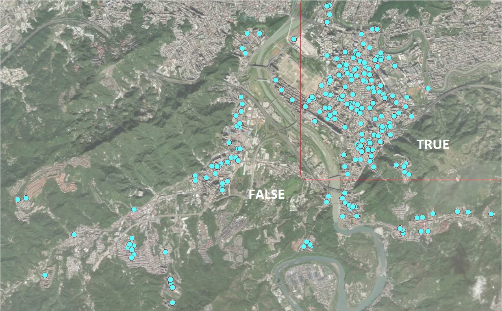
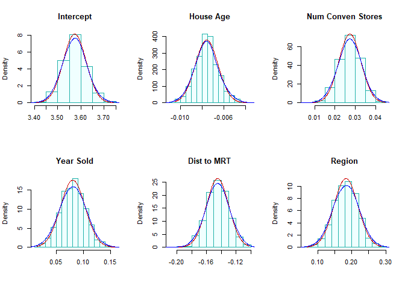
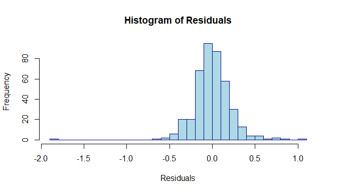
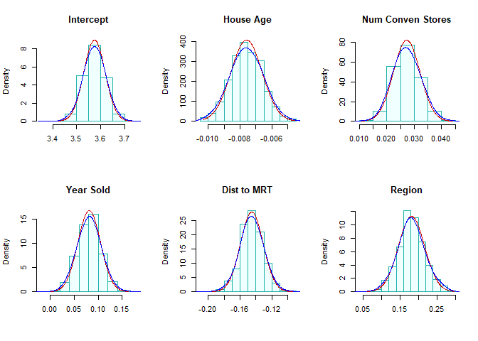

<style type="text/css">
h1.title {
  font-size: 20px;
  color: DarkRed;
  text-align: center;
}
h4.author { /* Header 4 - and the author and data headers use this too  */
    font-size: 18px;
  font-family: "Times New Roman", Times, serif;
  color: DarkRed;
  text-align: center;
}
h4.date { /* Header 4 - and the author and data headers use this too  */
  font-size: 18px;
  font-family: "Times New Roman", Times, serif;
  color: DarkBlue;
  text-align: center;
}
h1 { /* Header 3 - and the author and data headers use this too  */
    font-size: 22px;
    font-family: "Times New Roman", Times, serif;
    color: darkred;
    text-align: center;
}
h2 { /* Header 3 - and the author and data headers use this too  */
    font-size: 18px;
    font-family: "Times New Roman", Times, serif;
    color: navy;
    text-align: left;
}

h3 { /* Header 3 - and the author and data headers use this too  */
    font-size: 15px;
    font-family: "Times New Roman", Times, serif;
    color: navy;
    text-align: left;
}

h4 { /* Header 4 - and the author and data headers use this too  */
    font-size: 18px;
    font-family: "Times New Roman", Times, serif;
    color: darkred;
    text-align: left;
}
</style>


# Introduction

In this note, we introduce two versions of bootstrap procedures to generate bootstrap samples to estimate the confidence intervals of the coefficients of the regression model identified last week. For reference, I include the code that creates the analytic data set for the final model and the summarized statistics of the model as well.


```r
realestate0 <- read.csv("https://stat321.s3.amazonaws.com/w03-Realestate.csv", header = TRUE)
realestate <- realestate0[, -1]
# longitude and latitude will be used to make a map in the upcoming analysis.
lat <- realestate$Latitude
lon <- realestate$Longitude
##
geo.group <- (lon > 121.529) & (lat > 24.96)     # define the geo.group variable
                                                 # top-right region = TRUE, other region = FALSE
realestate$geo.group <- as.character(geo.group)  # convert the logical values to character values.
realestate$sale.year <- as.character(realestate$TransactionYear) # convert transaction year to dummy.
realestate$Dist2MRT.kilo <- (realestate$Distance2MRT)/1000   # re-scale distance: foot -> kilo feet
final.data = realestate[, -c(1,3,5,6)]          # keep only variables to be used in the candidate models
final.data$logAreaPrice = log(final.data$PriceUnitArea)  # 
## the final model
log.price <- lm(log(PriceUnitArea) ~ HouseAge + NumConvenStores + sale.year +  
                 Dist2MRT.kilo  + geo.group, data = final.data)
log.price02 <- lm(logAreaPrice ~ HouseAge + NumConvenStores + sale.year +  
                 Dist2MRT.kilo  + geo.group, data = final.data)
cmtrx <- summary(log.price)$coef
cmtrx02 <- summary(log.price02)$coef
kable(cmtrx, caption = "Inferential Statistics of Final Model")
```


Table: Inferential Statistics of Final Model

|                |   Estimate| Std. Error|    t value| Pr(>&#124;t&#124;)|
|:---------------|----------:|----------:|----------:|------------------:|
|(Intercept)     |  3.5724282|  0.0443235|  80.599030|          0.0000000|
|HouseAge        | -0.0075712|  0.0010097|  -7.498507|          0.0000000|
|NumConvenStores |  0.0274872|  0.0049096|   5.598667|          0.0000000|
|sale.year2013   |  0.0805519|  0.0244373|   3.296272|          0.0010655|
|Dist2MRT.kilo   | -0.1445122|  0.0137541| -10.506820|          0.0000000|
|geo.groupTRUE   |  0.1825871|  0.0347151|   5.259583|          0.0000002|

The explicit expression of the final model is given by

$$
\log(price) =3.5723 - 0.0076\times HouseAge +0.0275\times NumConvenStores + 
$$ 
$$   
0.0805\times Sale.year2013 - 0.1445\times Dist2MRT.kilo + 0.1826\times geo.groupTRUE
$$

As another example of interpretation of the regression coefficient, we choose the coefficient associated with **geo.group**. In the output, you see the name of the dummy variable with a suffix `TRUE`, **geo.groupTRUE**. The suffix **TRUE** indicates that the dummy variable represents category 'TRUE' of category variable **geo.group**. The associated coefficient reflects the **mean** difference between category `TRUE` and the baseline category `FALSE`. In R, the default baseline category is the lowest value of the categorical variable (in the alphabetical order).

Let's consider **the set of all houses** that are in the same conditions except the regions (region `TRUE` and region `FALSE` ) and the sale prices. 



Next, we explain estimated regression coefficient 0.1826. Let $p_{TRUE}$ be the mean price of house in region `TRUE` and $p_{FALSE}$ be the mean price of houses in region `FALSE`. Then 

$$
\log (p_{TRUE}) - \log(p_{FALSE}) = 0.1826  \to \log(p_{TRUE}/p_{FALSE}) = 0.1826 \to p_{TRUE} = 1.20p_{FALSE}
$$
We re-express the above equation can be re-written as

$$
p_{TRUE} - p_{FALSE} = 0.206p_{FALSE} \to \frac{p_{TRUE}-p_{FALSE}}{p_{FALSE}} = 0.20 = 20\%.
$$

That is, the average house sales price in `TRUE` region (top right corner on the map) is about 20%   higher than that in the `FALSE` region. We can interpret other regression coefficients in a similar way.


# Bootstrap Cases (BOOT.C)

In this section, we use bootstrapping cases to find the confidence intervals for the coefficients in the final regression model. The method was used in bootstrap simple linear regression (SLR) in week #3. The following code finds the confidence interval. 


```r
log.price = lm(log(PriceUnitArea) ~ HouseAge + NumConvenStores + sale.year +  
                 Dist2MRT.kilo  + geo.group, data = final.data)
##
B = 1000       # choose number of bootstrap replicates.
## 
num.p = dim(model.frame(log.price))[2]  # returns number of parameters in the model
smpl.n = dim(model.frame(log.price))[1] # sample size
## zero matrix to store bootstrap coefficients 
coef.mtrx = matrix(rep(0, B*num.p), ncol = num.p)       
## 
for (i in 1:B){
  bootc.id = sample(1:smpl.n, smpl.n, replace = TRUE) # fit final model to the bootstrap sample
  log.price.btc = lm(log(PriceUnitArea) ~ HouseAge + NumConvenStores + sale.year +  
                       Dist2MRT.kilo  + geo.group, data = final.data[bootc.id,])     
  coef.mtrx[i,] = coef(log.price.btc)    # extract coefs from bootstrap regression model    
}
```

We define an R function to make histograms of the bootstrap regression coefficients in the following. I will also use this function to make histograms for the residual bootstrap estimated regression coefficients as well.


```r
boot.hist = function(cmtrx, bt.coef.mtrx, var.id, var.nm){
  ## bt.coef.mtrx = matrix for storing bootstrap estimates of coefficients
  ## var.id = variable ID (1, 2, ..., k+1)
  ## var.nm = variable name on the hist title, must be the string in the double quotes
  ## coefficient matrix of the final model
  ## Bootstrap sampling distribution of the estimated coefficients
  x1.1 <- seq(min(bt.coef.mtrx[,var.id]), max(bt.coef.mtrx[,var.id]), length=300 )
  y1.1 <- dnorm(x1.1, mean(bt.coef.mtrx[,var.id]), sd(bt.coef.mtrx[,var.id]))
  # height of the histogram - use it to make a nice-looking histogram.
  highestbar = max(hist(bt.coef.mtrx[,var.id], plot = FALSE)$density) 
  ylimit <- max(c(y1.1,highestbar))
  hist(bt.coef.mtrx[,var.id], probability = TRUE, main = var.nm, xlab="", 
       col = "azure1",ylim=c(0,ylimit), border="lightseagreen")
  lines(x = x1.1, y = y1.1, col = "red3")
  lines(density(bt.coef.mtrx[,var.id], adjust=2), col="blue") 
  #legend("topright", c(""))
}
```

The following histograms of the bootstrap estimates of regression coefficients represents the sampling distributions of the corresponding estimates in the final model.


```r
par(mfrow=c(2,3))  # histograms of bootstrap coefs
boot.hist(bt.coef.mtrx=coef.mtrx, var.id=1, var.nm ="Intercept" )
boot.hist(bt.coef.mtrx=coef.mtrx, var.id=2, var.nm ="House Age" )
boot.hist(bt.coef.mtrx=coef.mtrx, var.id=3, var.nm ="Num Conven Stores" )
boot.hist(bt.coef.mtrx=coef.mtrx, var.id=4, var.nm ="Year Sold" )
boot.hist(bt.coef.mtrx=coef.mtrx, var.id=5, var.nm ="Dist to MRT" )
boot.hist(bt.coef.mtrx=coef.mtrx, var.id=6, var.nm ="Region" )
```



Two normal density curves were placed on each of the histograms. 

* The red **density curve** uses the estimated regression coefficients and their corresponding standard error in the output of the regression procedure. The p-values reported in the output are based on the red curve.

*The **blue curve** is a non-parametric data-driven estimate of the density of bootstrap sampling distribution. The bootstrap confidence intervals of the regressions are based on these non-parametric bootstrap sampling distributions.

We can see from the above histograms that the two density curves in all histograms are close to each other. we would expect that significance test results and the corresponding bootstrap confidence intervals are consistent. Next, we find 95% bootstrap bootstrap confidence intervals of each regression coefficients and combined them with output of the final model.


```r
num.p = dim(coef.mtrx)[2]  # number of parameters
btc.ci = NULL
btc.wd = NULL
for (i in 1:num.p){
  lci.025 = round(quantile(coef.mtrx[, i], 0.025, type = 2),8)
  uci.975 = round(quantile(coef.mtrx[, i],0.975, type = 2 ),8)
  btc.wd[i] =  uci.975 - lci.025
  btc.ci[i] = paste("[", round(lci.025,4),", ", round(uci.975,4),"]")
 }
#as.data.frame(btc.ci)
kable(as.data.frame(cbind(formatC(cmtrx,4,format="f"), btc.ci.95=btc.ci)), 
      caption = "Regression Coefficient Matrix")
```


Table: Regression Coefficient Matrix

|                |Estimate |Std. Error |t value  |Pr(>&#124;t&#124;) |btc.ci.95              |
|:---------------|:--------|:----------|:--------|:------------------|:----------------------|
|(Intercept)     |3.5724   |0.0443     |80.5990  |0.0000             |[ 3.4795 ,  3.6728 ]   |
|HouseAge        |-0.0076  |0.0010     |-7.4985  |0.0000             |[ -0.0096 ,  -0.0054 ] |
|NumConvenStores |0.0275   |0.0049     |5.5987   |0.0000             |[ 0.0165 ,  0.0382 ]   |
|sale.year2013   |0.0806   |0.0244     |3.2963   |0.0011             |[ 0.0355 ,  0.1249 ]   |
|Dist2MRT.kilo   |-0.1445  |0.0138     |-10.5068 |0.0000             |[ -0.1757 ,  -0.1151 ] |
|geo.groupTRUE   |0.1826   |0.0347     |5.2596   |0.0000             |[ 0.1125 ,  0.2526 ]   |

We can see from the above table of summarized statistics, the significance tests of regression coefficients based on the p-values and the corresponding 95% confidence intervals are consistent.


# Bootstrap Residuals (BOOT.R)

This section, we introduce bootstrap residual methods to estimate bootstrap confidence intervals. The idea is straightforward and is summarized in the following.

## Fitted Model

Assume that the fitted regression model is given by

$$
\begin{array}{ccc} 
y_1 & = &  \hat{\beta}_0 + \hat{\beta}_1 x_{11} + \hat{\beta}_2 x_{12} + \cdots + \hat{\beta}_k x_{1k} + e_1  \\
y_2 & = &  \hat{\beta}_0 + \hat{\beta}_1 x_{21} + \hat{\beta}_2 x_{22} + \cdots + \hat{\beta}_k x_{2k} + e_2  \\
y_3 & = &  \hat{\beta}_0 + \hat{\beta}_1 x_{31} + \hat{\beta}_2 x_{32} + \cdots + \hat{\beta}_k x_{3k} + e_3  \\
\vdots & \vdots & \vdots \\
y_n & = &  \hat{\beta}_0 + \hat{\beta}_1 x_{n1} + \hat{\beta}_2 x_{n2} + \cdots + \hat{\beta}_k x_{nk} + e_n
\end{array}
$$

where $\{e_1, e_2, \cdots, e_n \}$ is the set of residuals obtained from the final model. $\{x_{i1}, x_{i2}, \cdots, x_{ik} \}$ is the i-th record from the data, and $\{ \hat{\beta}_0, \hat{\beta}_1,  \cdots, \hat{\beta}_k \}$

The distribution of the residuals is depicted in the following histogram.


```r
hist(sort(log.price$residuals),n=40,
     xlab="Residuals",
     col = "lightblue",
     border="navy",
     main = "Histogram of Residuals")
```



The above histogram reveals the same information as we saw in the residual plot in the last note: (1) one out-lier; (2). The distribution is skewed to the right.

## Residual Bootstrap Samples

The residual bootstrap sample of $y$ is defined in the following:

* Take a **bootstrap sample** from the set of residuals $\{e_1, e_2, \cdots, e_n \}$, denoted by $\{e_1^{*}, e_2^{*}, \cdots, e_n^{*} \}$.

* The residual bootstrap sample of $\{y_1^{*}, y_2^{*}, \cdots, y_n^{*}  \}$ is defined by

$$
\begin{array}{ccc} 
y_1^{*} & = &  \hat{\beta}_0 + \hat{\beta}_1 x_{11} + \hat{\beta}_2 x_{12} + \cdots + \hat{\beta}_k x_{1k} + e_1^{*}  \\
y_2^{*} & = &  \hat{\beta}_0 + \hat{\beta}_1 x_{21} + \hat{\beta}_2 x_{22} + \cdots + \hat{\beta}_k x_{2k} + e_2^{*}  \\
y_3^{*} & = &  \hat{\beta}_0 + \hat{\beta}_1 x_{31} + \hat{\beta}_2 x_{32} + \cdots + \hat{\beta}_k x_{3k} + e_3^{*}  \\
\vdots & \vdots & \vdots \\
y_n^{*} & = &  \hat{\beta}_0 + \hat{\beta}_1 x_{n1} + \hat{\beta}_2 x_{n2} + \cdots + \hat{\beta}_k x_{nk} + e_n^{*}
\end{array}
$$

The above definition implies that the residual bootstrap is equal to **fitted value + bootstrap residual**.


* The resulting **residual bootstrap sample** is given by

$$
\begin{array}{cccccc} 
y_1^{*} &  x_{11} &  x_{12} & \cdots & x_{1k}  \\
y_2^{*} &  x_{21} &  x_{22} & \cdots & x_{2k}  \\
y_3^{*} &  x_{31} &  x_{32} & \cdots & x_{3k}  \\
\vdots  &  \vdots &  \vdots & \vdots & \vdots  \\
y_n^{*} &  x_{n1} &  x_{n2} & \cdots & x_{nk} 
\end{array}
$$

* We fit the final model to the **residual bootstrap sample** and denote the bootstrap estimates of regression coefficients in the following

$$
\{ \hat{\beta}_0^{*}, \hat{\beta}_1^{*},  \cdots, \hat{\beta}_k^{*} \}
$$

* Repeat the above steps B times, we obtain the following bootstrap estimates

$$
\begin{array}{cccccc} 
\hat{\beta}_0^{1*} & \hat{\beta}_1^{1*} &  \cdots  & \hat{\beta}_k^{1*}  \\
\hat{\beta}_0^{2*} & \hat{\beta}_1^{2*} &  \cdots  & \hat{\beta}_k^{2*}  \\
\hat{\beta}_0^{3*} & \hat{\beta}_1^{3*} &  \cdots  & \hat{\beta}_k^{3*}  \\
\vdots  &  \vdots &  \vdots & \vdots  \\
\hat{\beta}_0^{b*} & \hat{\beta}_1^{b*} &  \cdots  & \hat{\beta}_k^{b*}  \\
\vdots  &  \vdots &  \vdots & \vdots  \\
\hat{\beta}_0^{B*} & \hat{\beta}_1^{B*} &  \cdots  & \hat{\beta}_k^{B*}  \\
\end{array}
$$

The residual bootstrap confidence intervals of regression coefficients can be estimated from the above bootstrap coefficients.

## Implementation of Residual Bootstrap Regression

The following code generate bootstrap confidence intervals of regression coefficients.


```r
## Final model
log.price <- lm(log(PriceUnitArea) ~ HouseAge + NumConvenStores + sale.year +  
                 Dist2MRT.kilo  + geo.group, data = final.data)
model.resid = log.price$residuals
##
B=1000
num.p = dim(model.matrix(log.price))[2]   # number of parameters
samp.n = dim(model.matrix(log.price))[1]  # sample size
btr.mtrx = matrix(rep(0,6*B), ncol=num.p) # zero matrix to store boot coefs
for (i in 1:B){
  ## Bootstrap response values
  bt.lg.price = log.price$fitted.values + 
        sample(log.price$residuals, samp.n, replace = TRUE)  # bootstrap residuals
  # replace PriceUnitArea with bootstrap log price
  final.data$bt.lg.price =  bt.lg.price   #  send the boot response to the data
  btr.model = lm(bt.lg.price ~ HouseAge + NumConvenStores + sale.year +  
                 Dist2MRT.kilo  + geo.group, data = final.data)   # b
  btr.mtrx[i,]=btr.model$coefficients
}
```


Next, I make histograms of the residual bootstrap estimates of the regression coefficients.


```r
boot.hist = function(bt.coef.mtrx, var.id, var.nm){
  ## bt.coef.mtrx = matrix for storing bootstrap estimates of coefficients
  ## var.id = variable ID (1, 2, ..., k+1)
  ## var.nm = variable name on the hist title, must be the string in the double quotes
  ## Bootstrap sampling distribution of the estimated coefficients
  x1.1 <- seq(min(bt.coef.mtrx[,var.id]), max(bt.coef.mtrx[,var.id]), length=300 )
  y1.1 <- dnorm(x1.1, mean(bt.coef.mtrx[,var.id]), sd(bt.coef.mtrx[,var.id]))
  # height of the histogram - use it to make a nice-looking histogram.
  highestbar = max(hist(bt.coef.mtrx[,var.id], plot = FALSE)$density) 
  ylimit <- max(c(y1.1,highestbar))
  hist(bt.coef.mtrx[,var.id], probability = TRUE, main = var.nm, xlab="", 
       col = "azure1",ylim=c(0,ylimit), border="lightseagreen")
  lines(x = x1.1, y = y1.1, col = "red3")       # normal density curve         
  lines(density(bt.coef.mtrx[,var.id], adjust=2), col="blue")    # loess curve
} 
```


```r
par(mfrow=c(2,3))  # histograms of bootstrap coefs
boot.hist(bt.coef.mtrx=btr.mtrx, var.id=1, var.nm ="Intercept" )
boot.hist(bt.coef.mtrx=btr.mtrx, var.id=2, var.nm ="House Age" )
boot.hist(bt.coef.mtrx=btr.mtrx, var.id=3, var.nm ="Num Conven Stores" )
boot.hist(bt.coef.mtrx=btr.mtrx, var.id=4, var.nm ="Year Sold" )
boot.hist(bt.coef.mtrx=btr.mtrx, var.id=5, var.nm ="Dist to MRT" )
boot.hist(bt.coef.mtrx=btr.mtrx, var.id=6, var.nm ="Region" )
```


The residual bootstrap sampling distributions of each estimated regression coefficients. We normal and LOESS curves are close to each other. This also indicated that the inference of the significance of variables based on p-values and residual bootstrap will yield same results.

The 95% residual bootstrap confidence interval are given in the following


```r
#
num.p = dim(coef.mtrx)[2]  # number of parameters
btr.ci = NULL
btr.wd = NULL
for (i in 1:num.p){
  lci.025 = round(quantile(btr.mtrx[, i], 0.025, type = 2),8)
  uci.975 = round(quantile(btr.mtrx[, i],0.975, type = 2 ),8)
  btr.wd[i] = uci.975 - lci.025
  btr.ci[i] = paste("[", round(lci.025,4),", ", round(uci.975,4),"]")
}
#as.data.frame(btc.ci)
kable(as.data.frame(cbind(formatC(cmtrx,4,format="f"), btr.ci.95=btr.ci)), 
      caption = "Regression Coefficient Matrix with 95% Residual Bootstrap CI")
```


Table: Regression Coefficient Matrix with 95% Residual Bootstrap CI

|                |Estimate |Std. Error |t value  |Pr(>&#124;t&#124;) |btr.ci.95              |
|:---------------|:--------|:----------|:--------|:------------------|:----------------------|
|(Intercept)     |3.5724   |0.0443     |80.5990  |0.0000             |[ 3.48 ,  3.6618 ]     |
|HouseAge        |-0.0076  |0.0010     |-7.4985  |0.0000             |[ -0.0095 ,  -0.0057 ] |
|NumConvenStores |0.0275   |0.0049     |5.5987   |0.0000             |[ 0.0182 ,  0.0369 ]   |
|sale.year2013   |0.0806   |0.0244     |3.2963   |0.0011             |[ 0.0354 ,  0.1282 ]   |
|Dist2MRT.kilo   |-0.1445  |0.0138     |-10.5068 |0.0000             |[ -0.1735 ,  -0.1175 ] |
|geo.groupTRUE   |0.1826   |0.0347     |5.2596   |0.0000             |[ 0.1117 ,  0.2572 ]   |

As expected, the residual bootstrap confidence intervals yield the same results as p-values do. This is because the sample size is large enough so that the sampling distributions of estimated coefficients have sufficiently good approximations of normal distributions. 


## Combining All Inferential Statistics

Finally, we put all inferential statistics in a single table so we can compare these results.


```r
kable(as.data.frame(cbind(formatC(cmtrx[,-3],4,format="f"), btc.ci.95=btc.ci,btr.ci.95=btr.ci)), 
      caption="Final Combined Inferential Statistics: p-calues and Bootstrap CIs")
```


Table: Final Combined Inferential Statistics: p-calues and Bootstrap CIs

|                |Estimate |Std. Error |Pr(>&#124;t&#124;) |btc.ci.95              |btr.ci.95              |
|:---------------|:--------|:----------|:------------------|:----------------------|:----------------------|
|(Intercept)     |3.5724   |0.0443     |0.0000             |[ 3.4795 ,  3.6728 ]   |[ 3.48 ,  3.6618 ]     |
|HouseAge        |-0.0076  |0.0010     |0.0000             |[ -0.0096 ,  -0.0054 ] |[ -0.0095 ,  -0.0057 ] |
|NumConvenStores |0.0275   |0.0049     |0.0000             |[ 0.0165 ,  0.0382 ]   |[ 0.0182 ,  0.0369 ]   |
|sale.year2013   |0.0806   |0.0244     |0.0011             |[ 0.0355 ,  0.1249 ]   |[ 0.0354 ,  0.1282 ]   |
|Dist2MRT.kilo   |-0.1445  |0.0138     |0.0000             |[ -0.1757 ,  -0.1151 ] |[ -0.1735 ,  -0.1175 ] |
|geo.groupTRUE   |0.1826   |0.0347     |0.0000             |[ 0.1125 ,  0.2526 ]   |[ 0.1117 ,  0.2572 ]   |

The above table shows that

* All three methods yield the same results in terms of significance of individual explanatory variables. The reason is that the final working model does not have serious violation of model assumption.

* The widths of residual bootstrap and case-bootstrap confidence intervals are similar to each other.


```r
kable(cbind(btc.wd, btr.wd), caption="width of the two bootstrap confidence intervals")
```


Table: width of the two bootstrap confidence intervals

|    btc.wd|    btr.wd|
|---------:|---------:|
| 0.1933040| 0.1818385|
| 0.0042446| 0.0038839|
| 0.0216718| 0.0186652|
| 0.0894027| 0.0928452|
| 0.0606261| 0.0559965|
| 0.1400672| 0.1454545|


