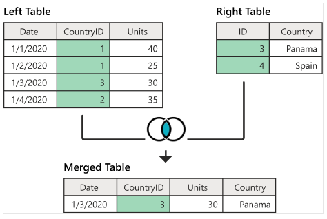
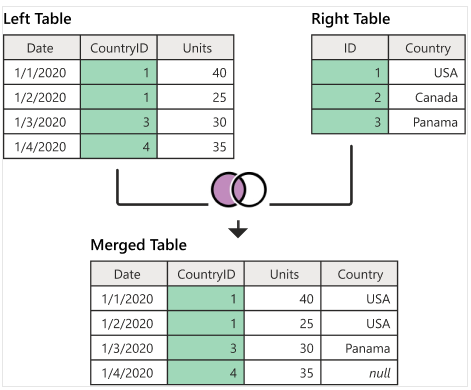
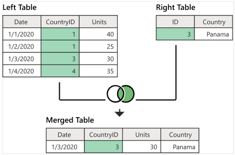
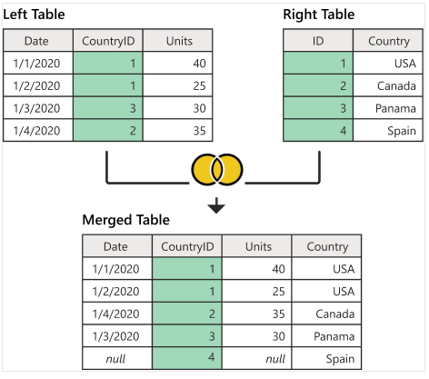

```{=html}

<style type="text/css">

/* Cascading Style Sheets (CSS) is a stylesheet language used to describe the presentation of a document written in HTML or XML. it is a simple mechanism for adding style (e.g., fonts, colors, spacing) to Web documents. */

h1.title {  /* Title - font specifications of the report title */
  font-size: 24px;
  color: DarkRed;
  text-align: center;
  font-family: "Gill Sans", sans-serif;
}
h4.author { /* Header 4 - font specifications for authors  */
  font-size: 20px;
  font-family: system-ui;
  color: DarkRed;
  text-align: center;
}
h4.date { /* Header 4 - font specifications for the date  */
  font-size: 18px;
  font-family: system-ui;
  color: DarkBlue;
  text-align: center;
}
h1 { /* Header 1 - font specifications for level 1 section title  */
    font-size: 22px;
    font-family: system-ui;
    color: navy;
    text-align: left;
}
h2 { /* Header 2 - font specifications for level 2 section title */
    font-size: 20px;
    font-family: "Times New Roman", Times, serif;
    color: navy;
    text-align: left;
}

h3 { /* Header 3 - font specifications of level 3 section title  */
    font-size: 18px;
    font-family: "Times New Roman", Times, serif;
    color: navy;
    text-align: left;
}

h4 { /* Header 4 - font specifications of level 4 section title  */
    font-size: 18px;
    font-family: "Times New Roman", Times, serif;
    color: darkred;
    text-align: left;
}

body { background-color:white; }

.highlightme { background-color:yellow; }

p { background-color:white; }

</style>
```

```{r setup, include=FALSE}
#options(digits = 15)
# Detect, install and load packages if needed.
if (!require("knitr")) {
   install.packages("knitr")
   library(knitr)
}
if (!require("pander")) {
   install.packages("pander")
   library(pander)
}

#
# specifications of outputs of code in code chunks
knitr::opts_chunk$set(echo = TRUE,      
                      warnings = FALSE,   
                      messages = FALSE,  
                      results = TRUE     
                      )   
```


\

# Intorduction

In this note, we continue to introduce a few more base R functions that are also commonly used in data management.

# **with()** and **within()** Functions

 **with()** and **within()** are two closely related yet different base R functions that are useful in data management.


## The **with()** Function

`with()` function enables us to define a new variable based on the variables in a **data frame** using basic **R expressions** that include mathematical and logical operations. We can add the newly defined variables to the existing data frame as usual.


**with()** Syntax

```
with(data-frame, R-expression)
```

**Example 1**

```{r}
Num <- c(1400,1200,1100,1700,1500)
Cost <- c(1200,1300,1400,1500,1600)
##
dataA <- data.frame(Num,Cost,stringsAsFactors = FALSE)
##
product <- with(dataA, Num*Cost)
quotient <- with(dataA, Cost/Num)
logical <- with(dataA, Num > Cost)
pander(cbind(product = product, quotient = quotient, logical = logical))
## add the new variables to data frame dataA
dataA$product = product
dataA$quotient = quotient
dataA$logical = logical
##
pander(dataA)
```

\
## The **within()** Function

**within()** function allows us to create a copy of the data frame and add a column that would eventually store the result of the R expression.


```{r}
Num <- c(1400,1200,1100,1700,1500)
Cost <- c(1200,1300,1400,1500,1600)
##
dataA <- data.frame(Num,Cost,stringsAsFactors = FALSE)
##
dataB <- within(dataA, Product <- Num*Cost)   # defined Product and added to dataA simultaneously
dataC <- within(dataB, Quotient <- Cost/Num)
dataD <- within(dataC, Logical <- Num > Cost)
pander(dataD)
```


# The **merge()** Function - Table Joins

The R **merge()** function allows merging two data frames by **row names** (common key). This function allows us to perform different database (SQL) joins, like left join, inner join, right join, or full join, among others. In this note, we only introduce four different ways of merging datasets in base R with examples. We will introduce the SQL clause in R later.


\


## Inner Join


The following figure illustrates how A **left joins** B and the resulting merged data set.

```{r echo=FALSE, fig.align ="center",  out.width = '70%'}

```

The following code implements the above left-join.

```{r}
A = data.frame(Date = c("1/1/2020", "1/2/2020", "1/3/2020", "1/4/2020"),
               CountryID = c(1,1,3,2),
               Units = c(40, 25, 30, 35))
B = data.frame(ID=c(3,4),
               Country=c( "Panama", "Spain"))
AinnerB = merge(A, B, by.x = "CountryID", by.y = "ID")
pander(AinnerB)
```

\

## Left Join


The following figure illustrates how A **left joins** B and the resulting merged data set.

```{r echo=FALSE, fig.align ="center",  out.width = '70%'}

```

The following code implements the above left-join.

```{r}
A = data.frame(Date = c("1/1/2020", "1/2/2020", "1/3/2020", "1/4/2020"),
               CountryID = c(1,1,3,4),
               Units = c(40, 25, 30, 35))
B = data.frame(ID=c(1,2,3),
               Country=c("USA", "Canada", "Panama"))
AleftB = merge(A, B, by.x = "CountryID", by.y = "ID", all.x = TRUE)
pander(AleftB)
```
Note that, left-join produces missing values of the record in A and does not have any information in B.

\

## Right Join


The following figure illustrates how A **right joins** B and the resulting merged data set.

```{r echo=FALSE, fig.align ="center",  out.width = '70%'}

```

The following code implements the above left-join.

```{r}
A = data.frame(Date = c("1/1/2020", "1/2/2020", "1/3/2020", "1/4/2020"),
               CountryID = c(1,1,3,4),
               Units = c(40, 25, 30, 35))
B = data.frame(ID=c(3),
               Country=c("Panama"))
ArightB = merge(A, B, by.x = "CountryID", by.y = "ID", all.y = TRUE)
pander(ArightB)
```

Note also that right-join could also produce missing values.

\

## Full (outer) Join


The following figure illustrates how A **Full outer joins** B and the resulting merged data set.

```{r echo=FALSE, fig.align ="center",  out.width = '70%'}

```

The following code implements the above left-join.

```{r}
A = data.frame(Date = c("1/1/2020", "1/2/2020", "1/3/2020", "1/4/2020"),
               CountryID = c(1,1,3,2),
               Units = c(40, 25, 30, 35))
B = data.frame(ID=c(1,2,3,4),
               Country=c("USA", "Canada", "Panama", "Spain"))
AfullB = merge(A, B, by.x = "CountryID", by.y = "ID", all = TRUE)
pander(AfullB)
```

\

# Subsetting Data Frame

There are two different ways for subsetting a data frame: subsetting by rows and by columns.

We first define the following working data set.

```{r}
working.data <- data.frame(
  id = c(10,11,12,13,14,15,16,17),
  name = c('sai','ram','deepika','sahithi','kumar','scott','Don','Lin'),
  gender = c('M','M',NA,'F','M','M','M','F'),
  dob = as.Date(c('1990-10-02','1981-3-24','1987-6-14','1985-8-16',
                  '1995-03-02','1991-6-21','1986-3-24','1990-8-26')),
  state = c('CA','NY',NA,NA,'DC','DW','AZ','PH'),
  row.names=c('r1','r2','r3','r4','r5','r6','r7','r8')
)
pander(working.data)
```

## Subsetting by Columns

This is a relatively easy job - we can simply select or drop variables to make a subset. The following is just an example.

```{r}

```

## Subsetting by Rows


```{r}
# subset by row name
pander(subset(working.data, subset=rownames(df) == 'r1'))

# subset row by the vector of row names
pander(subset(working.data, rownames(df) %in% c('r1','r2','r3')))

# subset by condition
pander(subset(working.data, gender == 'M'))

# subset by condition with %in%
pander(subset(working.data, state %in% c('CA','DC')))

# subset by multiple conditions using |
pander(subset(working.data, gender == 'M' | state == 'PH'))
```

\

# Create Publication-ready Tables Manually

We create publication-ready tables manually in R markdown. These tables can be used when you want to aggregate information from different outputs. 

## Regular text style table. 

It is simple and easy to use. However, there is no mechanism to specify cell alignment.

--------------------------------------------
 Num    Cost   Product   Quotient   Logical 
------ ------ --------- ---------- ---------
 1400   1200   1680000    0.8571     TRUE   

 1200   1300   1560000    1.083      FALSE  

 1100   1400   1540000    1.273      FALSE  

 1700   1500   2550000    0.8824     TRUE   

 1500   1600   2400000    1.067      FALSE  
--------------------------------------------


## Markdown Table

Markdown style table. colon(:) is used to specify the cell alignment.

| Num  |Cost |  Product | Quotient | Logical |
|:-----|:-----|:--------|:---------|:--------|
| 1400 | 1200 | 1680000 |  0.8571  |  TRUE   |
| 1200 | 1300 | 1560000 |  1.083   |  FALSE  |
| 1100 | 1400 | 1540000 |  1.273   |  FALSE  |
| 1700 | 1500 | 2550000 |  0.8824  |  TRUE   |
| 1500 | 1600 | 2400000 |  1.067   |  FALSE  |


