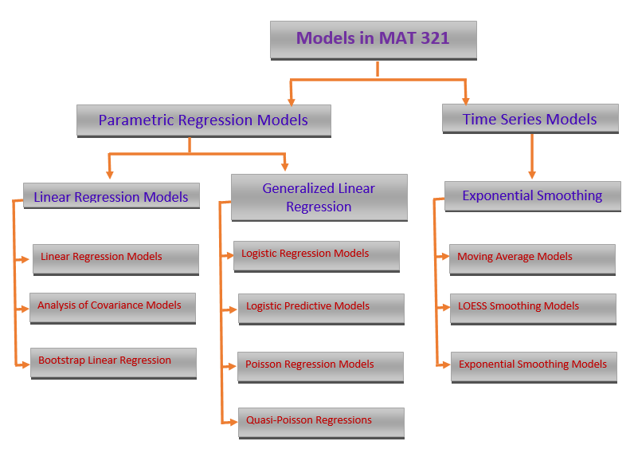
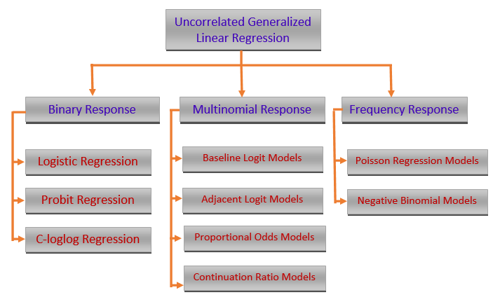
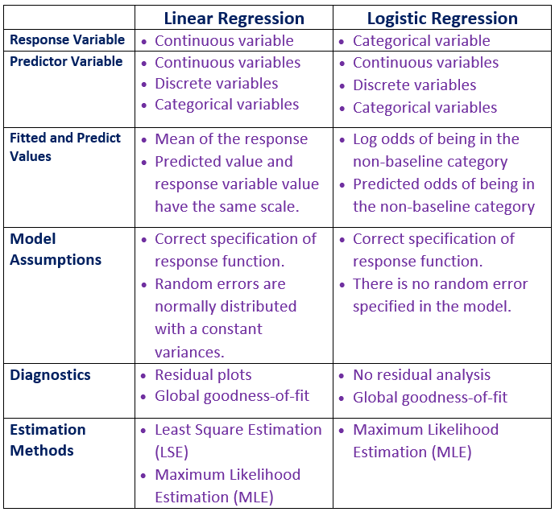
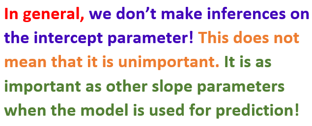
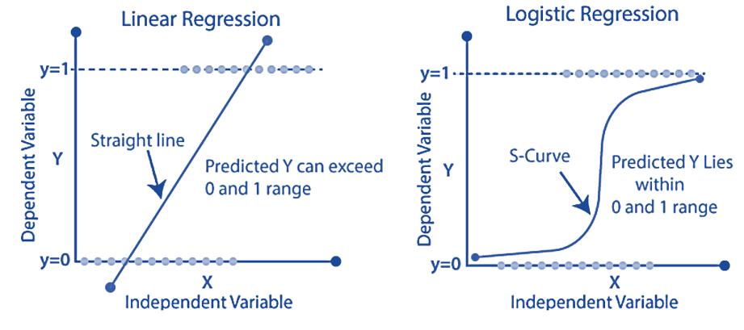
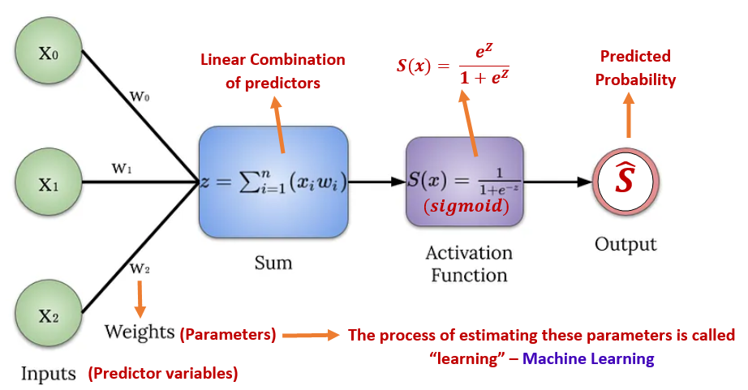

```{=html}

<style type="text/css">

/* Cascading Style Sheets (CSS) is a stylesheet language used to describe the presentation of a document written in HTML or XML. it is a simple mechanism for adding style (e.g., fonts, colors, spacing) to Web documents. */

h1.title {  /* Title - font specifications of the report title */
  font-size: 24px;
  color: DarkRed;
  text-align: center;
  font-family: "Gill Sans", sans-serif;
}
h4.author { /* Header 4 - font specifications for authors  */
  font-size: 20px;
  font-family: system-ui;
  color: DarkRed;
  text-align: center;
}
h4.date { /* Header 4 - font specifications for the date  */
  font-size: 18px;
  font-family: system-ui;
  color: DarkBlue;
  text-align: center;
}
h1 { /* Header 1 - font specifications for level 1 section title  */
    font-size: 22px;
    font-family: system-ui;
    color: navy;
    text-align: left;
}
h2 { /* Header 2 - font specifications for level 2 section title */
    font-size: 20px;
    font-family: "Times New Roman", Times, serif;
    color: navy;
    text-align: left;
}

h3 { /* Header 3 - font specifications of level 3 section title  */
    font-size: 18px;
    font-family: "Times New Roman", Times, serif;
    color: navy;
    text-align: left;
}

h4 { /* Header 4 - font specifications of level 4 section title  */
    font-size: 18px;
    font-family: "Times New Roman", Times, serif;
    color: darkred;
    text-align: left;
}

body { background-color:white; }

.highlightme { background-color:yellow; }

p { background-color:white; }

</style>
```
```{r setup, include=FALSE}
# Detect, install and load packages if needed.
if (!require("knitr")) {
   install.packages("knitr")
   library(knitr)
}
if (!require("pander")) {
   install.packages("pander")
   library(pander)
}
if (!require("mlbench")) {
   install.packages("mlbench")
   library(mlbench)
}
#
# specifications of outputs of code in code chunks
knitr::opts_chunk$set(echo = TRUE,      
                      warnings = FALSE,   
                      messages = FALSE,  
                      results = TRUE,
                      comment = NA
                      )   
```


\

# Introduction

We have systematically reviewed linear regression models and used parametric and bootstrap methods to build the linear regression models. 

\

```{r echo=FALSE, fig.align ="center",  out.width = '95%'}

```

\

Starting from this note, we will study several models in the family of generalized linear models (GLM). We first overview the major members of this family.     

\

```{r echo=FALSE, fig.align ="center",  out.width = '95%'}

```

\

Three models will be introduced in the subsequent notes. We primarily focus on the commonly used models that are used in statistics and machine learning fields. The **binary logistic regression models** and their variants are probably the most popular models that have been used in almost all areas of quantitative decision.  

Before taking presenting the technical introduction of the binary logistic regression model, we look at the major structural differences between the regular linear regression model and logistic regression models.


```{r echo=FALSE, fig.align ="center",  out.width = '80%'}

```

\

# Simple Binary Logistic Regression

In this module, we study a new regression model with a binary response variable that takes on exactly one of two possible values such as **success** v.s. **failure**, **diseased** v.s. **disease-free**, etc. 


For a binary population, we are interested in the proportion of one of the two values. For example, if we study a disease of a certain population, the primary interest is the prevalence of a disease - the proportion of subjects in the population who had the disease. We also know that the relative frequency (proportion) of the disease can be used to estimate the disease probability of the population. A natural and practical question is whether the disease probability is impacted by some factors - this is a repression problem. In the subsequent sections, we present a brief but little technical introduction to <font color = "red"><b>**\color{red}the binary logistic regression model with a single predictor variable**</b></font>.


## The Model Structure

Let $Y$ be a binary variable that takes on exactly one of the two possible values, say **success** or **failure**. Assume the proportion of **success** to be $p$. That is, $P(Y = \text{success}) = p$. Let $x$ be a factor that may impact the success probability. Clearly, $Y$ is a Bernoulli random variable. Since we are interested in the success probability, we encode the values of variable $Y$ by setting **success** to 1 and **failure** to 0. 

Recall that the linear regression model is defined by $E[Y] = \beta_0 + \beta_1 x_1 + \cdots + \beta_k x_k$ and

$$
\epsilon = Y - E[Y] \to N(0, \sigma^2).
$$
where $Y$ is a continuous random variable and $X$'s are assumed to be non-random. 


\

When we have a binary population (i.e., $Y$ takes only two possible distinct values: **success** or **failure**), we are primarily interested in the proportion of **success** or **failure**. Since the $Y$ is a Bernoulli (random) variable,  the expected value of the binary response variable $Y$ is given by.


$$
E[Y] = 1\times p + 0\times (1-p) = p.
$$

That is, the success probability $p$ is the expected value of the binary random variable. The regression problem is to look at how the **success** probability is affected by potential factors. One initial guess is to use the formulation of the linear regression model by setting

$$
p =E[Y] = \beta_0 + \beta_1 x.
$$
The above formulation is inappropriate since the right-hand side of the equation can take on any real value while the left-hand side equation can take on only values in the interval $[0,1]$. 


One of the most important criteria for a good statistical model is its interpretability. We cannot link the success probability with the linear function of the predictor. Next, we link the **odds of success** ($p/(1-p)$) with the linear function of the predictor variable in the following.

$$
\frac{p}{1-p} = \beta_0 + \beta_1x.
$$

The above expression shows the association between the **odds of success**, $p/(1-p)$, and the predictor variable $x$. It is easy to interpret. But the **odds of success** take on the value in $[0, \infty)$. The above formulation is still inappropriate.

However, $-\infty <\log\frac{p}{1-p} < \infty$, it is reasonable to explore the association between the logarithm of odds of success and the predictor variable $x$. That is,

$$
\log\frac{p}{1-p} = \beta_0 + \beta_1x.
$$


The above model is called the **simple logistic regression model**. 


**Remarks on the model formulation** 

* The above logistic regression model was formulated based on the interpretability of the transformed mean response, $E[Y]$, and its linear association with the predictor variable.

* Mathematically, there are different transformations of the mean response to define a family of regression models $g(p) = \beta_0 + \beta_1x$. Clearly, the above simple logistic regression model is a special member of this family - generalized linear regression models. There are two other less famous but commonly used in some specific fields: the complementary log-log model and the probit model.


## Interpretation of Regression Coefficients

If we use numerical coding 1 = "success" and 0 = "failure", the simple logistic regression model can be explicitly expressed in the following form

$$
\log \frac{P(Y=1|x)}{1-P(Y=1|x)}= \beta_0 + \beta_1x.
$$

The expression $P(Y=1|x)$ highlights that the success probability is dependent on the predictor variable $x$. 

The regression coefficients of the simple logistic regression model have a meaningful interpretation.


* Intercept $\beta_0$ is the baseline log odds of success. In other words, if the success probability is not impacted by any factors, $\beta_0$ is the log odds of success of the homogeneous population.


* the slope parameter $\beta_1$ is called log odds ratio of two categories corresponding to $x$ and $x+1$. To see this, denote $p_x = P(Y=1|x)$ and $p_{x+1} = P(Y=1|x+1)$, then

$$
\log \frac{p_x}{1-p_x} = \beta_0 + \beta_1x\hspace{3mm} \mbox{and} \hspace{3mm} \log \frac{p_{x+1}}{1-p_{x+1}} = \beta_0 + \beta_1(x+1).
$$

Taking the difference between the above two equations, we have

$$
\log \frac{p_{x+1}}{1-p_{x+1}}- \log \frac{p_x}{1-p_x} = \beta_1
$$

Therefore, 

$$
\log \frac{p_{x+1}/(1-p_{x+1})}{p_x/(1-p_x)} = \beta_1,
$$

that is, $\beta_1$ is the ratio of log odds of success in two sub-populations. 


```{r echo=FALSE, fig.align ="center",  out.width = '80%'}

```


## Use of Simple Logistic Regression Model

We first express the success probability with respect to the predictor variable $x$ in the following 

$$
P(Y=1|x) = \frac{e^{\beta_0 + \beta_1x}}{1+e^{\beta_0 + \beta_1x}}.
$$

The above explicit model expression shows a **curve linear** relation between $x$ and the probability of observing the value the response $Y$. The following figure show the nonlinear relationship between $x$ and $y$ and its comparison between linear regression model.

```{r echo=FALSE, fig.align ="center",  out.width = '80%'}

```

Using the above expression, we can do one of the following analyses.

* **Association Analysis** - if $\beta_1 \ne 0$, then the success probability is impacted by the predictor variable $x$. Note that, this is a non-linear association.   


* **Predictive Analysis** - predicting the success probability for a given new value of the predictor variable. That is,

$$
\widehat{P(Y=1|x_\text{new})} = \frac{e^{\hat{\beta}_0 + \hat{\beta}_1x_\text{new}}}{1+e^{\hat{\beta}_0 + \hat{\beta}_1x_\text{new}}},
$$ 

  where $\hat{\beta}_0$ and $\hat{\beta}_1$ are estimated from the data.


```{r echo=FALSE, fig.align ="center",  out.width = '90%'}

```


* **Classification Analysis** - predicting the status of success. That is, for a given new value of the predictor variable, we predict the value of $Y$ through $P(Y=1|x_{new})$. 

  + To predict whether the value of $Y$ is  **success** or **failure**, we need to identify the cut-off probability to determine the value of $Y$.
  
  + The predicted model can be used in an **intervention analysis** - this means values of $X$ can alter the value of $Y$. This is commonly used in clinical studies. For example, an effective treatment ($X$) can permanently cure a disease ($Y$).

  + The predicted model can be used for membership classification. For example, the response value is the gender ($Y$) of a car buyer at a car dealer, the predictor variable is the purchase status ($X$). If a customer bought a car from the dealer, the fitted model can identify whether the customer is a man or woman. This is apparently different from the intervention analysis since purchase status cannot change the gender ($Y$) of the customer.


## Parameter Estimation

In linear regression models, both likelihood and least square methods can be used for estimating the coefficients of linear regression models. Both methods yield the same estimates. However, in the logistic regression model, we can only use the likelihood methods to estimate the regression coefficients.

Let $\{(y_1, x_1), (y_2, x_2), \cdots, (y_n, x_n)\}$ be a random sample taken from a binary population associated with $Y$. $x$ is a nonrandom predictor variable associated with $Y$. The logistic model is defined to be 

$$
p(x) = \frac{e^{\beta_0 + \beta_1 x}}{1 + e^{\beta_0 + \beta_1 x}}.
$$

Since $Y_i$ is a Bernoulli random variable with success probability $p_x$. We use numerical coding: 1 = "success" and 0 = "failure". The likelihood function of $(\beta_0, \beta_1)$ is given by

$$
L(\beta_0, \beta_1)= \prod_{i=1}^n p(x_i)^{y_i}\left[1 - p(x_i) \right]^{1-y_i} 
= \prod_{i=1}^n \left[\frac{e^{\beta_0 + \beta_1 x_i}}{1 + e^{\beta_0 + \beta_1 x_i}}\right]^{y_i}\times \left[\frac{1}{1 + e^{\beta_0 + \beta_1 x_i}} \right]^{1-y_i}
$$

The maximum likelihood estimate (MLE) of $\beta_0$ and $\beta_1$, denoted by $\hat{\beta}_0$ and $\hat{\beta}_1$, maximizes the above likelihood.  We will use the R build-in function **glm()** to find the MLE of the parameters and related statistics.


## Model Assumptions and Diagnostics

In linear regression, we assume the response variable follows a normal distribution with a constant variance. With this assumption, several effective diagnostic methods were developed based on the residual analysis. In logistic regression, we don’t have many diagnostic methods. However, several likelihood-based goodness of fit metrics such as AIC and deviance can be used for comparing the performance of candidate models.

More technical discussion of diagnostics with the left to the future specialized courses in generalized linear regression models.


## Concluding Remarks

We only introduced the basic logistic regression modeling in this note. some important topics you may want to study but not mentioned in this note are

* logistic regression as a machine learning algorithm for predictive modeling.

* logistic regression model with a large number of predictor variables - regularized logistic regression.

* performance metrics based on prediction errors.


# A Case Study

The diabetes data set in this case study contains 768 observations on 9 variables. The data set is available in the UCI machine learning data repository. R library {mlbench} has two versions of this data. The data set contains a significant number of missing values.

## Data and Variable Descriptions

There are 9 variables in the data set.

1. **pregnant**:	Number of times pregnant

2. **glucose**:	Plasma glucose concentration (glucose tolerance test)

3. **pressure**:	Diastolic blood pressure (mm Hg)

4. **triceps**:	Triceps skin fold thickness (mm)

5. **insulin**:	2-Hour serum insulin (mu U/ml)

6. **mass**:	Body mass index (weight in kg/(height in m)\^2)

7. **pedigree**:	Diabetes pedigree function

8. **age**:	Age (years)

9. **diabetes**:	Class variable (test for diabetes)

I load the data from R **library{mlbench}** in the following code.


```{r}
library(mlbench)
data(PimaIndiansDiabetes2)           # load the data to R work-space
diabetes.0 = PimaIndiansDiabetes2    # make a copy of the data for data cleansing 
diabetes = na.omit(diabetes.0)       # Delete all records with missing components
y0=diabetes$diabetes
diabete.01 = rep(0, length(y0))      # define a 0-1 to test which probability is used in glm()
diabete.01[which(y0=="pos")] = 1
diabetes$diabetes.01 = diabete.01
head(diabetes)
```


For convenience, I delete all records with missing values and keep only the records with complete records in this case study. The final analytic data set has 392 records.


## Clinical Question

Many studies indicated that body mass index (BMI) is a more powerful risk factor for diabetes than genetics. The objective of this case study is to explore the **association** between BMI and diabetes.

The general interpretation of BMI for adults is given below:

* **underweight**: < 18.5
* **Normal and Healthy Weight**: [18.5, 24.9]
* **Overweight**: [25.0, 29.9]
* **Obese**: > 30.0

In this study, we focus only on simple logistic regression modeling, we stay with the original (continuous) numerical variable BMI. The above discretization will be used in the case study in the next note.


## Building the Simple Logistic Regression

Since we only study the simple logistic regression model, only one predictor variable is included in the model. We first perform exploratory data analysis on the predictor variable to make sure the variable is not extremely skewed.

```{r fig.align='center', fig.width=5, fig.height=4, fig.cap=""}
ylimit = max(density(diabetes$mass)$y)
hist(diabetes$mass, probability = TRUE, main = "BMI Distribution", xlab="BMI", 
       col = "azure1", border="lightseagreen")
  lines(density(diabetes$mass, adjust=2), col="blue") 
```

Since the simple logistic regression contains only one continuous variable of a binary categorical variable as the predictor variable, no there is no issue of potential imbalance. We will not transform BMI and fit a logistic regression directly to the data.

```{r comment = NA}
s.logit = glm(diabetes ~ mass, 
          family = binomial(link = "logit"),  # family is the binomial, logit(p) = log(p/(1-p))!
          data = diabetes)                    # the data frame is a subset of the original iris data
result = summary(s.logit)
result
```

Note that the response variable is a binary factor variable, R uses alphabetical order to define the level of the factor variable. In our case, "neg" = 0 and "pos" = 1. The "success" probability is defined to be P(diabetes = "pos"). The simple logistic regression is fitted in the following.

The summary of major statistics is given below.

```{r comment = NA, message = FALSE}
model.coef.stats = summary(s.logit)$coef       # output stats of coefficients
conf.ci = confint(s.logit)                     # confidence intervals of betas
sum.stats = cbind(model.coef.stats, conf.ci.95=conf.ci)   # rounding off decimals
kable(sum.stats,caption = "The summary stats of regression coefficients")  
```

From the above table, we can see that BMI is positively associated with the status of diabetes since $\beta_1 = 0.0863$ with a p-value close to 0. The 95% confidence interval [0.0538, 0.1208]. This also supports the results of the research in the literature.

It is more common to interpret the association results from a practical perspective using the odds ratio. Next, we convert the estimated regression coefficients to the odds ratio. 


```{r}
# Odds ratio
model.coef.stats = summary(s.logit)$coef
odds.ratio = exp(coef(s.logit))
out.stats = cbind(model.coef.stats, odds.ratio = odds.ratio)                 
kable(out.stats,caption = "Summary Stats with Odds Ratios")
```

The odds ratio associated with BMI is 1.09 meaning that as the BMI increases by one unit, the odds of being tested positive for diabetes increase by about $9\%$. This is a practically significant risk factor for diabetes. 

Some global goodness-of-fit measures are summarized in the following table.


```{r}
## Other global goodness-of-fit
dev.resid = s.logit$deviance
dev.0.resid = s.logit$null.deviance
aic = s.logit$aic
goodness = cbind(Deviance.residual =dev.resid, Null.Deviance.Residual = dev.0.resid,
      AIC = aic)
pander(goodness)

```


Since the above global goodness-of-fit is based on the likelihood function, we don't have other candidate models with corresponding likelihood at the same scale to compare in this simple logistic regression model, we will not interpret these goodness-of-fit measures.


The success probability curve (so-called S curve) is given below.


```{r fig.align='center', fig.height=4, fig.width=7}
bmi.range = range(diabetes$mass)
x = seq(bmi.range[1], bmi.range[2], length = 200)
beta.x = coef(s.logit)[1] + coef(s.logit)[2]*x
success.prob = exp(beta.x)/(1+exp(beta.x))
failure.prob = 1/(1+exp(beta.x))
ylimit = max(success.prob, failure.prob)
##
beta1 = coef(s.logit)[2]
success.prob.rate = beta1*exp(beta.x)/(1+exp(beta.x))^2
##
##
par(mfrow = c(1,2))
plot(x, success.prob, type = "l", lwd = 2, col = "navy",
     main = "The probability of being \n  tested positive in diabetes", 
     ylim=c(0, 1.1*ylimit),
     xlab = "BMI",
     ylab = "probability",
     axes = FALSE,
     col.main = "navy",
     cex.main = 0.8)
# lines(x, failure.prob,lwd = 2, col = "darkred")
axis(1, pos = 0)
axis(2)
# legend(30, 1, c("Success Probability", "Failure Probability"), lwd = rep(2,2), 
#       col = c("navy", "darkred"), cex = 0.7, bty = "n")
##
y.rate = max(success.prob.rate)
plot(x, success.prob.rate, type = "l", lwd = 2, col = "navy",
     main = "The rate of change in the probability \n  of being tested positive in diabetes", 
     xlab = "BMI",
     ylab = "Rate of Change",
     ylim=c(0,1.1*y.rate),
     axes = FALSE,
     col.main = "navy",
     cex.main = 0.8
     )
axis(1, pos = 0)
axis(2)
```

The left-hand side plot in the above figure is the standard **S curve** representing how the probability of a positive test increases as the BMI increases. After diving deeper to see the rate of change in the probability of a positive test, we obtain the curve on the right-hand side that indicates that the rate of change in the probability of positive test increases when BMI is less than 40 and decreases when BMI is greater than 40. The turning point is about 40. 

# Conclusion

This note focuses on the structure and association analysis of the simple logistic regression model. The case study uses a real-world diabetes data set to illustrate the steps for carrying out the simple logistic regression model.

In the following modules, we will discuss multiple logistic regression models that will include more modeling techniques.

Since logistic regression has been used as a standard machine-learning algorithm for classification, I will use a standalone module to discuss this topic.


