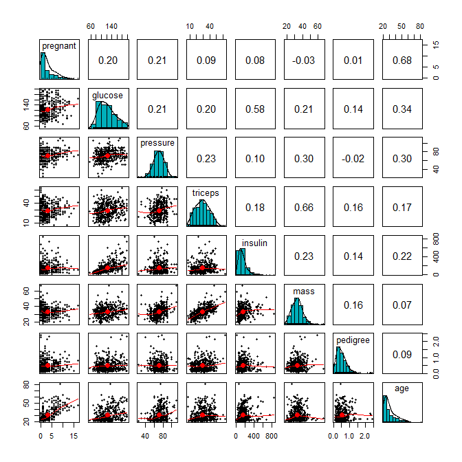
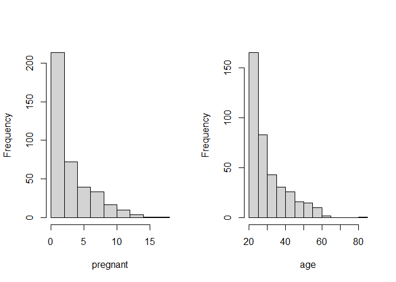

<style type="text/css">
h1.title {
  font-size: 20px;
  color: DarkRed;
  text-align: center;
}
h4.author { /* Header 4 - and the author and data headers use this too  */
    font-size: 18px;
  font-family: "Times New Roman", Times, serif;
  color: DarkRed;
  text-align: center;
}
h4.date { /* Header 4 - and the author and data headers use this too  */
  font-size: 18px;
  font-family: "Times New Roman", Times, serif;
  color: DarkBlue;
  text-align: center;
}
h1 { /* Header 3 - and the author and data headers use this too  */
    font-size: 22px;
    font-family: "Times New Roman", Times, serif;
    color: darkred;
    text-align: center;
}
h2 { /* Header 3 - and the author and data headers use this too  */
    font-size: 18px;
    font-family: "Times New Roman", Times, serif;
    color: navy;
    text-align: left;
}

h3 { /* Header 3 - and the author and data headers use this too  */
    font-size: 15px;
    font-family: "Times New Roman", Times, serif;
    color: navy;
    text-align: left;
}

h4 { /* Header 4 - and the author and data headers use this too  */
    font-size: 18px;
    font-family: "Times New Roman", Times, serif;
    color: darkred;
    text-align: left;
}
</style>


# Introduction

The general multivariable linear regression model is given below.


$$
y = \beta_0 + \beta_1x_1 + \beta_2 x_2 + \cdots + \beta_kx_k + \epsilon,
$$

where $y$ is the response variable that is assumed to be a random variable and $\epsilon \to N(0, \sigma^2)$. This also implies that

$$
E[y] = \beta_0 + \beta_1x_1 + \beta_2 x_2 + \cdots + \beta_kx_k
$$

For a population with binary data, the underlying random variable can only takes exactly two values, say $Y=1$ or $Y=0$, and $P(Y=1) = p$, then $E[Y] = 1\times p + 0\times (1-p) = p.$ 

That is, the success probability is the expected value of the binary random variable. If we mimic the formulation of the linear regression model by setting

The simple linear regression model (also called log-odds regression model) is also formulated with the mean response $E[Y]$
$$
\frac{E[Y]}{1-E[Y]} = \beta_0 + \beta_1x.
$$

Let $g(t) = t/(1-t)$ (also called logit function), the simple logistic regression is re-expressed as $g(E[Y]) = \beta_0 + \beta_1x$. 


# Multiple Logistic Regression Model

Let $Y$ be the binary response variable and $\{x_1, x_2, \cdots, x_n \}$ be the set of predictor variables. If $Y$ takes on either 1 or 0, the multiple logistic regression model is then defined as

$$
\frac{E[Y]}{1-E[Y]} = \beta_0 + \beta_1x_1 + \beta_2 x_2 + \cdots + \beta_kx_k
$$

The success probability function 

$$
p(x_1, x_2, \cdots, x_k)=P(Y=1|x_1, x_2, \cdots, x_k) =\frac{\exp(\beta_0 + \beta_1x_1 + \beta_2 x_2 + \cdots + \beta_kx_k)}{1+\exp(\beta_0 + \beta_1x_1 + \beta_2 x_2 + \cdots + \beta_kx_k)}
$$

If $Y$ takes on character values, R uses chooses the alphabetically higher value to model the above probability. For example, if $Y$ = "disease" or "no.disease", by default, the logistic regression will be defined as 

$$
p(x_1, x_2, \cdots, x_k)=P(Y="no.disease"|x_1, x_2, \cdots, x_k) =\frac{\exp(\beta_0 + \beta_1x_1 + \beta_2 x_2 + \cdots + \beta_kx_k)}{1+\exp(\beta_0 + \beta_1x_1 + \beta_2 x_2 + \cdots + \beta_kx_k)}
$$
Of cause, you can also redefine the factor level of the response variable to model the probability of the desired category.


## Data Requirements: Sources, Layout, and Cleansing

The logistic regression models we are discussing require an I.I.D. sample collected from a cross-sectional study design. Auto-correlation between observations are **not** allowed. For a longitudinal data that involves auto-correlation, there are different models that can be used to handle the correlation between observations taken from the same subject in the study. 

The general data layout for fitting a logistic regression in R has the following form.


Table: Data set layout for multiple logistic regression model

|Y   |X1  |X2  |    |Xk  |
|:---|:---|:---|:---|:---|
|Y1  |X11 |X21 |... |Xk1 |
|Y2  |X12 |X22 |... |Xk2 |
|... |... |... |... |... |
|Yn  |X1n |X2n |... |Xkn |


## Issues of Predictor Variables and Variable Inspection-Transformation 

All models have some explicit and implicit assumptions about the predictor variables and structure of the models. Unlike multiple linear regression models in which the diagnostic residual plots reveal some special patterns of potential violations of the model assumptions, in logistic regression modeling, we don't have many diagnostic tools to use. Some pre-processing procedures should be performed on predictor variables before a logistic regression model is fit to data.


The variable inspection-transformation is an iterative process, some of the following potential issues of predictor variables may considered in the inspection-transformation-inspection workflow.


* **Variable Types**: Predictor variables could be numeric, categorical, or the mixture of numeric and categorical.

* **Collinearity**: Predictor variables are assume to be non-linearly correlated since the multi-collinearity causes unstable estimates of the regression coefficients, hence, fails to obtain a valid model. Remedy for collinearity
 
  + Remove some of the highly correlated independent variables - Variable selection.
 
  + Perform an analysis designed for highly correlated variables such as principal components analysis or partial least squares regression - variable extraction.

  + Variable centralization.
  
  + Non-probabilistic variable selection - Regularization.
  
* **Dummy Variables**: If categorical predictor variables were numerically coded, we have to turn these numerically coded variables to factor variables. For example, the status of a disease could be "severe", "mild", and "disease-free", if a numerical coding: 2 = "severe", 1 = "mild" and 0 = "disease-free", then you need to R function **factor()** to convert the numerically coded disease status to a factor variable.

* **"Fake Variable"**: The observation ID is **NOT** a variable, you should **never** include the observation ID in any of your regression models.

* **Sparse Category Variables**: Grouping the categories in a meaningful way if necessary. For example, Assume that you have a data set of information about cars of different models from various manufacturers. If you want to build regression on a data set with a relatively small sample size, the use the car-model as a categorical variable is not appropriate since too many different car models will result too many dummy variables. From mathematical point of view, the number of parameters should be less than the number of data points. From statistical point of view, the desired sample size is 15 times the number of parameters to ensure a stable estimates of model parameters.

* **Variable transformation**:  - In logistic regression models, the response variable has already been transformed in the form of log odds of "success". The predictor variables could be transformed in different ways for different purposes.

  + **Association Analysis** - a transformation of predictor makes the interpretation of the coefficient much more difficult. 
  
  + **Predictive Analysis** - transforming all *numerical variables* to the same scale may improve the performance of predictive models. One of the benefits of standardizing predictor variables is to make variable selection (model regularization) straightforward and interpretable. 
  
* **Variable Discretization** - several methods can be used for the discretization: (1) **empirical approaches** include equal spaced and equal frequency, (2) **model assisted approaches** include decision tree and k-mean. The discretization 
is commonly used for different purposes. 
  
  + Model interpretability and understandability - it is easier to understand continuous data (such as age) when divided and stored into meaningful categories or groups. It is commonly used in association analysis. 
  
  + Fixing the potential imbalance issues that could potentially lead to unstable estimate of the coefficients.


## Estimation and Interpretation of Regression Coefficients

As mentioned in the simple logistic regression model, regression coefficients are estimated by using the maximum likelihood approach.


Let $\{(y_1, x_{11}, x_{21}, \cdots, x_{k1}), (y_2, x_{12}, x_{22}, \cdots, x_{k2}), \cdots, (y_n, x_{1n}, x_{2n}, \cdots, x_{kn})\}$ be a random sample taken from a binary population associated with $Y$. $x$ is a nonrandom predictor variable associated with $Y$. The logistic model is defined to be 

$$
p(x) = \frac{e^{\beta_0 + \beta_1 x_1 +\cdots + \beta_kx_k}}{1 + e^{\beta_0 + \beta_1 x_1 + \cdots + \beta_kx_k}}.
$$
The likelihood function of $(\beta_0, \beta_1, \cdots, \cdots, \beta_k)$ is given by

$$
L(\beta_0, \beta_1,\cdots, \beta_k)
= \prod_{i=1}^n \left[\frac{e^{\beta_0 + \beta_1 x_{i1}+\cdots+\beta_kx_{ik}}}{1 + e^{\beta_0 + \beta_1 x_{i1}+\cdots+\beta_kx_{ik}}}\right]^{y_i}\times \left[\frac{1}{1 + e^{\beta_0 + \beta_1 x_{i1}+\cdots+\beta_kx_{ik}}} \right]^{1-y_i}
$$

The maximum likelihood estimate (MLE) of $\beta_0, \beta_1, \cdots, \beta_k$, denoted by $\hat{\beta}_0,\hat{\beta}_1, \cdots, \hat{\beta}_k$, maximizes the above likelihood.  The R build-in function **glm()** uses the MLE method to estimate parameters and reports related MLE-based statistics.

The coefficients is interpreted in a similar way as used in the simple logistic regression model. To interpret $\beta_j$ in the multiple logistic regression model, 

$$
\log\left(\frac{P[Y=1|\cdots,x_j,\cdots]}{1-P[Y=1|\cdots,x_j,\cdots]}\right) = \beta_0 + \beta_1x_1 + \cdots + \beta_{j-1}x_{j-1}+ \beta_jx_j + \beta_{j+1} + \cdots+\beta_kx_k
$$
If we **fix the values of all $X_i$ except for increasing $x_j$ by one unit**, then 

$$
\log\left(\frac{P[Y=1|\cdots,(x_j+1),\cdots]}{1-P[Y=1|\cdots,(x_j+1),\cdots]}\right) = \beta_0 + \beta_1x_1 + \cdots + \beta_{j-1}x_{j-1}+ \beta_j(x_j+1) + \beta_{j+1}x_{j+1} + \cdots+\beta_kx_k
$$
Then

$$
\beta_j = \log\left(\frac{P[Y=1|\cdots,(x_j+1),\cdots]}{1-P[Y=1|\cdots,(x_j+1),\cdots]}\right) - \log\left(\frac{P[Y=1|\cdots,x_j,\cdots]}{1-P[Y=1|\cdots,x_j,\cdots]}\right)
=\log \left(\frac{\frac{P[Y=1|\cdots,(x_j+1),\cdots]}{1-P[Y=1|\cdots,(x_j+1),\cdots]}}{\frac{P[Y=1|\cdots,x_j,\cdots]}{1-P[Y=1|\cdots,x_j,\cdots]}}\right)
$$

Therefore, $\beta_j$ (for $j=1, 2, \cdots, k$) is log odds ratio as explained in te simple logistic regression model.

If $\beta_j = 0$, then $x_j$ is insignificant meaning that the odds of "success" in a subset of subjects with predictor values $\{x_1, \cdots, x_{j-1}, x_{j+1}, x_{j+1}, \cdots, x_k \}$ is equal to the odds of "success" in other subset with predictor values $\{x_1, \cdots, x_{j-1}, x_{j}, x_{j+1}, \cdots, x_k \}$. 


# Build-blocks for Predictive Performance of Logistics Regression

Prediction in the logistic regression is not straightforward. The logistic regression function

$$
p(x) = \frac{e^{\beta_0 + \beta_1 x_1 +\cdots + \beta_kx_k}}{1 + e^{\beta_0 + \beta_1 x_1 + \cdots + \beta_kx_k}}.
$$

predicts the probability of "success" but not the status of "success". In order to predict the value of $Y$, we still need to have cut-off probability to define the predicted "success" and "failure". How to find the optimal cut-off probability will be addressed later module.

Next, we assume there is a cut-off probability for predicting the original value of the response variable. Most software programs as R and SAS use 0.5 as the cut-off for predicting $Y$.

## Understanding the Performance of Medical Diagnostics

In this section, we define some performance metrics of the logistic regression as a predict model based on the predictive error. For the ease of illustration, we consider a simple model using a diagnostic test result (X = T+ or T-) to predict a disease (Y = D+ or D-) to define these performance metrics where

T+ = positive test result: numerical coding 1

T- = negative test result: numerical coding 0

D+ = diseased: numerical coding 1

D- = disease-free: numerical coding 0

The following metrics measures the predictive performance of the logistic regression model. The first two measures reflect the correct decision of the model and last two error rates of the logistic regression model.

* **Positive Predictive Value**: P(Y = D+ | X = T+)
   
   $PPV =P(Y=1|X=1)= \frac{e^{\beta_0+\beta_1}}{1+e^{\beta_0+\beta_1}}$

* **Negative Predictive Value**: P(Y = D- | X = T-)

   $NPV=P(Y=1|X=0)= \frac{e^{\beta_0}}{1+e^{\beta_0}}$

* **False Positive Predictive Rate**: P(Y = D- | X = T+)

   $FPPV=P(Y=0|X=1)= \frac{1}{1+e^{\beta_0+\beta_1}}$

* **False Positive Predictive Rate**: P(Y = D+ | X = T-)

   $FNPV=P(Y=0|X=0)= \frac{1}{1+e^{\beta_0}}$


The above four conditional probabilities can also be estimated by calculating the corresponding relative frequencies from the following two-way contingency table - also called **confusion matrix**. For convenience, we call the above four metrics **prediction performance metrics**.


```r
D1 = c("n11", "n12")
D0 = c("n21", "n22")
M=as.data.frame(rbind(D1, D0))
names(M)=c("T+", "T-")
row.names(M) = c("D+", "D-")
kable(M)
```


|   |T+  |T-  |
|:--|:---|:---|
|D+ |n11 |n12 |
|D- |n21 |n22 |

The above four metrics are used by clinical diagnosis after the test was approved by the FDA since the diagnostic decision is based on the test result.

## Performance Metrics Used in Clinical Trials: 

Now, let's consider the case that a manufacturer conducting a clinical phase II trial and submit the results for FDA's approval. The FDA uses the following metrics in the approval process.  

* **Sensitivity**: P( T+ | D+)

* **Specificity**: P( T- | D-)

* **False Negative Rate**: P( T- | D+)

* **False Positive Rate**: P( T+ | D-)

The above metrics are well defined since the disease status subjects is known in the clinical trial. The estimated values of these metric can be found the clinical data.  For convenience, we call the above four metrics **Validation Performance Metrics**.

## Remarks

Here are several remarks on the above two sets of performance metrics.

* The **prediction performance metrics** are dependent on the choice of the cut-off "success" probability. They can be estimated from a fitted logistic regression model.

* The **validation performance metrics** are defined based on the data with known disease status. A proposed diagnostic test is good if both sensitivity and specificity are high. 

* Thinking about the logistic regression model you developed as "a diagnostic test" (since it can predict the status of a disease), which sets metrics you should use to show the goodness of your model? The answer is the set of **validation performance metrics**. 

* **Sensitivity and Specificity** are the basic building blocks used to define various performance metric to assess the goodness of predictive model using the **testing data** with known response values. This will be the one of the major topics in the next module.


# Case Study

In this case study, we still use the diabetes data that was used in the last module. 

## Data and Variable Descriptions

There are 9 variables in the data set.

1. **pregnant**:	Number of times pregnant

2. **glucose**:	Plasma glucose concentration (glucose tolerance test)

3. **pressure**:	Diastolic blood pressure (mm Hg)

4. **triceps**:	Triceps skin fold thickness (mm)

5. **insulin**:	2-Hour serum insulin (mu U/ml)

6. **mass**:	Body mass index (weight in kg/(height in m)\^2)

7. **pedigree**:	Diabetes pedigree function

8. **age**:	Age (years)

9. **diabetes**:	Class variable (test for diabetes)


I load the data from R **library{mlbench}** in the following code. For convenience, I delete all records with missing values and keep only the records with complete records in this case study. The final analytic data set has 392 records. This


```r
library(mlbench)
data(PimaIndiansDiabetes2)           # load the data to R work-space
diabetes.0 = PimaIndiansDiabetes2    # make a copy of the data for data cleansing 
diabetes = na.omit(diabetes.0)       # Delete all records with missing components
#head(diabetes)
```

## Research Question

The objective of this case study is to identify the risk factors for diabetes. 


## Exploratory Anaysis

We first make the following pairwise scatter plots to inspect the potential issues with predictor variables.


```r
library(psych)
pairs.panels(diabetes[,-9], 
             method = "pearson", # correlation method
             hist.col = "#00AFBB",
             density = TRUE,  # show density plots
             ellipses = TRUE # show correlation ellipses
             )
```



From the correlation matrix plot, we can see several patterns about the predictor variables.

* All predictor variables are unimodal. But **pregnant** and **age** arte significantly skewed. We next take a close look at the frequency distribution of these two variable.


```r
par(mfrow=c(1,2))
hist(diabetes$pregnant, xlab="pregnant", main = "")
hist(diabetes$age, xlab = "age", main = "")
```



Based on the above histogram, we discretize **pregnant** and **age** in the following.


```r
preg = diabetes$pregnant
grp.preg = preg
grp.preg[preg %in% c(4:6)] = "4-6"
grp.preg[preg %in% c(7:9)] = "7-9"
grp.preg[preg %in% c(10:17)] = "10+"
##
age = diabetes$age
##
grp.age = age
grp.age[age %in% c(21:24)] = "21-25"
grp.age[age %in% c(25:30)] = "25-30"
grp.age[age %in% c(31:40)] = "31:40"
grp.age[age %in% c(41:50)] = "41-50"
grp.age[age %in% c(51:99)] = "50 +"
## added to the diabetes data set
diabetes$grp.age = grp.age
diabetes$grp.preg = grp.preg
```


* A moderate correlation is observed in several pairs of variables: age v.s. number of pregnant times, glucose v.s. insulin, and triceps v.s. BMI. We will not drop any of these variable for the moment, but will perform automatic variable selection.

* Since out goal is association analysis, we will not perform variable transformation.

* It very common in real-world applications that some of the practically important variable are always included in the final model regardless their statistical significance. In diabetes study, three insulin, MBI, and pedigree are considered significant risk factors. We will include this three variables in the final model. This means the smallest model must have these three variables. 


## Building the Simple Logistic Regression

Based on the above exploratory analysis, we first build the full model and the smallest model.


```r
full.model = glm(diabetes ~grp.preg+glucose+pressure+triceps+insulin+mass+pedigree+grp.age, 
          family = binomial(link = "logit"),  #  logit(p) = log(p/(1-p))!
          data = diabetes)  
kable(summary(full.model)$coef, 
      caption="Summary of inferential statistics of the full model")
```


Table: Summary of inferential statistics of the full model

|             |   Estimate| Std. Error|    z value| Pr(>&#124;z&#124;)|
|:------------|----------:|----------:|----------:|------------------:|
|(Intercept)  | -8.7503322|  1.3331796| -6.5635058|          0.0000000|
|grp.preg1    | -0.3977538|  0.5093087| -0.7809679|          0.4348214|
|grp.preg10+  |  0.3935217|  0.7902561|  0.4979673|          0.6185071|
|grp.preg2    | -0.2958769|  0.5571478| -0.5310564|          0.5953797|
|grp.preg3    |  0.3842810|  0.5700718|  0.6740923|          0.5002526|
|grp.preg4-6  | -0.9140847|  0.5668123| -1.6126761|          0.1068149|
|grp.preg7-9  | -0.2284477|  0.6514907| -0.3506538|          0.7258481|
|glucose      |  0.0382521|  0.0060502|  6.3224381|          0.0000000|
|pressure     | -0.0072937|  0.0121999| -0.5978495|          0.5499403|
|triceps      |  0.0107744|  0.0180674|  0.5963470|          0.5509435|
|insulin      | -0.0002279|  0.0013854| -0.1645109|          0.8693290|
|mass         |  0.0583354|  0.0284914|  2.0474744|          0.0406115|
|pedigree     |  1.0412541|  0.4461747|  2.3337362|          0.0196095|
|grp.age25-30 |  1.0829606|  0.4193260|  2.5826224|          0.0098053|
|grp.age31:40 |  1.5405843|  0.4909205|  3.1381545|          0.0017002|
|grp.age41-50 |  2.2601500|  0.6144945|  3.6780639|          0.0002350|
|grp.age50 +  |  2.0014940|  0.7174832|  2.7896040|          0.0052773|


```r
reduced.model = glm(diabetes ~ insulin + mass + pedigree, 
          family = binomial(link = "logit"),  # logit(p) = log(p/(1-p))!
          data = diabetes) 
kable(summary(reduced.model)$coef, 
      caption="Summary of inferential statistics of the reduced model")
```


Table: Summary of inferential statistics of the reduced model

|            |   Estimate| Std. Error|   z value| Pr(>&#124;z&#124;)|
|:-----------|----------:|----------:|---------:|------------------:|
|(Intercept) | -4.3288188|  0.6463940| -6.696874|          0.0000000|
|insulin     |  0.0047984|  0.0010835|  4.428585|          0.0000095|
|mass        |  0.0673268|  0.0178494|  3.771943|          0.0001620|
|pedigree    |  1.0779952|  0.3601870|  2.992876|          0.0027636|


```r
## automatic variable selection
library(MASS)
final.model.forward = stepAIC(reduced.model, 
                      scope = list(lower=formula(reduced.model),upper=formula(full.model)),
                      direction = "forward",   # forward selection
                      trace = 0   # do not show the details
                      )
kable(summary(final.model.forward)$coef, 
      caption="Summary of inferential statistics of the final model")
```


Table: Summary of inferential statistics of the final model

|             |   Estimate| Std. Error|    z value| Pr(>&#124;z&#124;)|
|:------------|----------:|----------:|----------:|------------------:|
|(Intercept)  | -9.5340546|  1.0941037| -8.7140321|          0.0000000|
|insulin      | -0.0005617|  0.0013568| -0.4140043|          0.6788710|
|mass         |  0.0703082|  0.0212351|  3.3109430|          0.0009298|
|pedigree     |  1.0567094|  0.4305469|  2.4543423|          0.0141143|
|glucose      |  0.0387018|  0.0058814|  6.5804090|          0.0000000|
|grp.age25-30 |  1.0012238|  0.3918271|  2.5552695|          0.0106106|
|grp.age31:40 |  1.3679308|  0.4163693|  3.2853782|          0.0010185|
|grp.age41-50 |  2.1962925|  0.4712387|  4.6606796|          0.0000032|
|grp.age50 +  |  1.9277491|  0.5802575|  3.3222305|          0.0008930|


```r
## Other global goodness-of-fit
global.measure=function(s.logit){
dev.resid = s.logit$deviance
dev.0.resid = s.logit$null.deviance
aic = s.logit$aic
goodness = cbind(Deviance.residual =dev.resid, Null.Deviance.Residual = dev.0.resid,
      AIC = aic)
goodness
}
goodness=rbind(full.model = global.measure(full.model),
      reduced.model=global.measure(reduced.model),
      final.model=global.measure(final.model.forward))
row.names(goodness) = c("full.model", "reduced.model", "final.model")
kable(goodness, caption ="Comaprison of global goodness-of-fit statistics")
```


Table: Comaprison of global goodness-of-fit statistics

|              | Deviance.residual| Null.Deviance.Residual|      AIC|
|:-------------|-----------------:|----------------------:|--------:|
|full.model    |          324.9106|               498.0978| 358.9106|
|reduced.model |          434.7276|               498.0978| 442.7276|
|final.model   |          334.2005|               498.0978| 352.2005|


## Final Model

In the exploratory analysis, we observed three pairs of variables are linearly correlated. After automatic variable selection, triceps and age were dropped out from the final model. Both insulin and glucose are still in the model. Although insulin is statistically insignificant, we still include it in the model since it is clinically important. 


```r
# Odds ratio
model.coef.stats = summary(final.model.forward)$coef
odds.ratio = exp(coef(final.model.forward))
out.stats = cbind(model.coef.stats, odds.ratio = odds.ratio)                 
kable(out.stats,caption = "Summary Stats with Odds Ratios")
```


Table: Summary Stats with Odds Ratios

|             |   Estimate| Std. Error|    z value| Pr(>&#124;z&#124;)| odds.ratio|
|:------------|----------:|----------:|----------:|------------------:|----------:|
|(Intercept)  | -9.5340546|  1.0941037| -8.7140321|          0.0000000|  0.0000723|
|insulin      | -0.0005617|  0.0013568| -0.4140043|          0.6788710|  0.9994384|
|mass         |  0.0703082|  0.0212351|  3.3109430|          0.0009298|  1.0728388|
|pedigree     |  1.0567094|  0.4305469|  2.4543423|          0.0141143|  2.8768887|
|glucose      |  0.0387018|  0.0058814|  6.5804090|          0.0000000|  1.0394605|
|grp.age25-30 |  1.0012238|  0.3918271|  2.5552695|          0.0106106|  2.7216105|
|grp.age31:40 |  1.3679308|  0.4163693|  3.2853782|          0.0010185|  3.9272159|
|grp.age41-50 |  2.1962925|  0.4712387|  4.6606796|          0.0000032|  8.9916151|
|grp.age50 +  |  1.9277491|  0.5802575|  3.3222305|          0.0008930|  6.8740202|

The interpretation of the odds ratios is similar to the case of simple logistic regression. The group age variable has five categories. The baseline category is aged 21-24. We can from the above table inferential table that odds of being diabetes increases as age increases.  For example, the odds ratio associated with age group 31-39 is 3.927 meaning that, given the same level of insulin, BMI, pedigree and glucose, the odds of being diabetes in the age group of 31-40 is almost 4 times of that in the baseline group aged 21-24. But the same ratio becomes nine times when comparing the age group 41-50 with the baseline group of age 21-24. 

## Summary and Conclusion

The case study focused on the association analysis between a set of potential risk factors for diabetes. The initial data set has 8 numerical and categorical variables.

After exploratory analysis, we decide to re-group two sparse discrete variables **pregnant** and **age** and define dummy variables for the associated variables. These new group variables were use the model search process.

Since **insulin**, **BMI**, and **pedigree** are considered to be major contributor to the development of diabetes, we include three risk factors to the final model regardless of the statistical significance.

After automatic variable selection, we obtain the final model with 4 factors, BMI, pedigree, glucose, age (with 4 dummy variable), and insulin (that is not statistically significant but clinically important).

Diabetes prediction or classification is another important practical issue. We will address this practical question in m=the next module.


