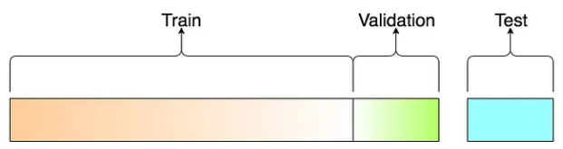
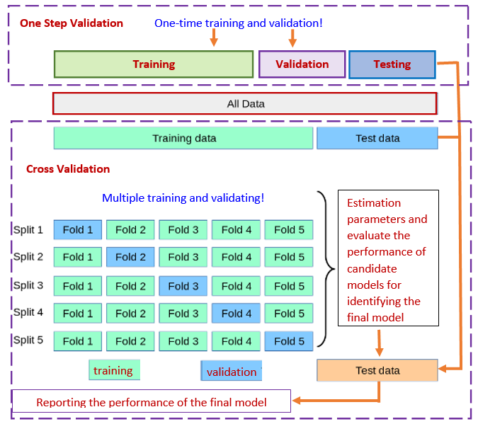
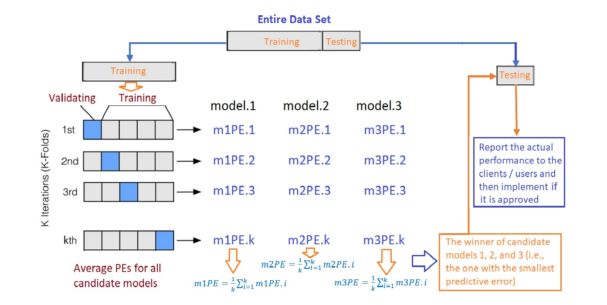
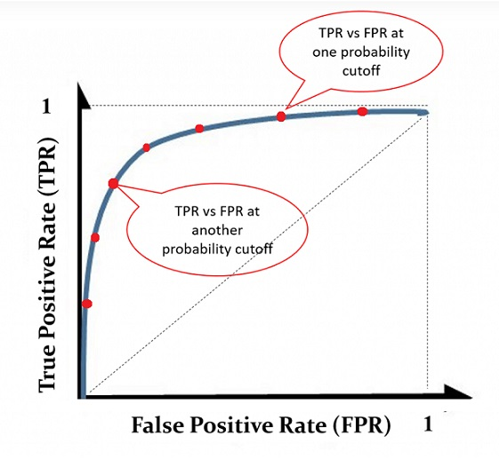
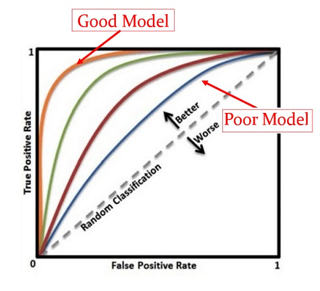

```{=html}

<style type="text/css">

/* Cascading Style Sheets (CSS) is a stylesheet language used to describe the presentation of a document written in HTML or XML. it is a simple mechanism for adding style (e.g., fonts, colors, spacing) to Web documents. */

h1.title {  /* Title - font specifications of the report title */
  font-size: 24px;
  color: DarkRed;
  text-align: center;
  font-family: "Gill Sans", sans-serif;
}
h4.author { /* Header 4 - font specifications for authors  */
  font-size: 20px;
  font-family: system-ui;
  color: DarkRed;
  text-align: center;
}
h4.date { /* Header 4 - font specifications for the date  */
  font-size: 18px;
  font-family: system-ui;
  color: DarkBlue;
  text-align: center;
}
h1 { /* Header 1 - font specifications for level 1 section title  */
    font-size: 22px;
    font-family: system-ui;
    color: navy;
    text-align: left;
}
h2 { /* Header 2 - font specifications for level 2 section title */
    font-size: 20px;
    font-family: "Times New Roman", Times, serif;
    color: navy;
    text-align: left;
}

h3 { /* Header 3 - font specifications of level 3 section title  */
    font-size: 18px;
    font-family: "Times New Roman", Times, serif;
    color: navy;
    text-align: left;
}

h4 { /* Header 4 - font specifications of level 4 section title  */
    font-size: 18px;
    font-family: "Times New Roman", Times, serif;
    color: darkred;
    text-align: left;
}

body { background-color:white; }

.highlightme { background-color:yellow; }

p { background-color:white; }

</style>
```
```{r setup, include=FALSE}
# Detect, install and load packages if needed.
if (!require("knitr")) {
   install.packages("knitr")
   library(knitr)
}
if (!require("pander")) {
   install.packages("pander")
   library(pander)
}
if (!require("mlbench")) {
   install.packages("mlbench")
   library(mlbench)
}
if (!require("MASS")) {
   install.packages("MASS")
   library(MASS)
}
#
# specifications of outputs of code in code chunks
knitr::opts_chunk$set(echo = TRUE,      
                      warnings = FALSE,   
                      messages = FALSE,  
                      results = TRUE     
                      )   
```

\

# Introduction

The logistic regression model as a member of the family of the generalized linear regression model has the following form.

Let $Y$ be the binary response variable and $\{x_1, x_2, \cdots, x_n \}$ be the set of predictor variables. If $Y$ takes on either 1 or 0, the multiple logistic regression model is then defined as

$$
\log\frac{E[Y]}{1-E[Y]} = \beta_0 + \beta_1x_1 + \beta_2 x_2 + \cdots + \beta_kx_k
$$

The success probability function

$$
p(x_1, x_2, \cdots, x_k)=P(Y=1|x_1, x_2, \cdots, x_k) =\frac{\exp(\beta_0 + \beta_1x_1 + \beta_2 x_2 + \cdots + \beta_kx_k)}{1+\exp(\beta_0 + \beta_1x_1 + \beta_2 x_2 + \cdots + \beta_kx_k)}
$$

If $Y$ takes on character values, R uses chooses the alphabetically higher value to model the above probability. For example, if $Y$ = "diseased" or "disease-free", by default, the logistic regression will be defined as

$$
p(x_1, x_2, \cdots, x_k)=P(Y= \text{disease-free}|x_1, x_2, \cdots, x_k) =\frac{\exp(\beta_0 + \beta_1x_1 + \beta_2 x_2 + \cdots + \beta_kx_k)}{1+\exp(\beta_0 + \beta_1x_1 + \beta_2 x_2 + \cdots + \beta_kx_k)}
$$

We can also redefine the factor level of the response variable to model the probability of the desired category.

In the previous module, we introduced the strategies for searching the final model using both manual and automatic variable selection approaches using likelihood-based performance metrics. However, in predictive modeling, the classical model search strategies might not work satisfactorily. It is a common practice to use data-driven and algorithm-based approaches to assess the predictive performance of a predictive model or an algorithm.

In the following sections, we assume that a set of several candidate models/algorithms have already been developed. The candidate models and algorithms include logistic regression models and other algorithms such as tree-based algorithms, neural nets, support vector machines, etc. The objective is to use various methods to choose the one with the best predictive power to implement in real-world applications.

# Cross-Validation in Predictive Modeling

In classical statistical modeling, we evaluate the predictive performance of a model using the large sample theory developed based on the likelihood. However, in algorithm-based predictive modeling, we don't assume the distribution of the population or the underlying population is uncertain. In other words, there is no general theory that can derive the predictive performance. Therefore, data-driven methods are used to define the goodness of the model. The key is to hold up a portion of the sample as "unseen" observations to test the actual performance of the predictive models and algorithms.

## The Logic of the Three-way Split

The general idea is to randomly partition the data into several subsets for different purposes. One of them will be used to build the model, one is used to validate the model, and one is used as "unseen real-world" data to report the "actual" performance of the final model.

```{r echo=FALSE, fig.align ="center", fig.cap="Three-way splitting mechanism", out.width = '40%'}

```

With this three-way split, the **model selection** and the **true error rate computation** can be carried out simultaneously. One important observation is that the error rate estimate of the final model on validation data is, in general, underestimated since the validation set is used to select the final model. Therefore, a third independent part of the data, the **test data**, is needed to report the actual prediction performance.

**After the performance of the final model was evaluated on the test set, all estimated parameters of the model based on the training data *must not* be changed any further**.

The three-way splitting method may face practical challenges such as the insufficiency of the data and variation of the error estimate based on a single-step process of model development. To overcome these potential challenges, researchers and practitioners developed resampling-based cross-validation (CV) methods to combine training, validating, and testing in an iterative process. The following subsection outlines this

## Cross-validation (CV)

Among the methods available for estimating prediction error, the most widely used is cross-validation. Contrary to most people who thought that CV was developed by machine learning researchers, it was developed by statisticians. The idea was initially formulated in the 1930s and formally published in statistics literature in the 1970s. Maybe due to computational constraints, the cross-validation methods have not been used by the statistics community. Recently, machine learning researchers dug this old but gold algorithm out for assessing the performance of predictive modeling and algorithms.

```{r echo=FALSE, fig.align ="center", fig.cap="Three-way data splitting versus cross-validation", out.width = '70%'}

```

Essentially cross-validation includes techniques to split the sample into multiple training and test data sets. To obtain multiple training and testing subsets, we use various random sub-sampling methods to perform K data splits of the entire sample. Different random splits constitute different cross-validation methods. The most commonly used cross-validation method is k-fold cross-validation.

The following are steps for choosing the final working model from a set of candidate models using the cross-validation method.

-   **Step 1**: Split the entire data into a training set and a testing set.

-   **Step 2**: Perform the cross-validation in the training set and don't touch the test data.

    -   *step 2.1*. Randomly split the training set into k subsets with equal size, say,$F_1$, $F_2$, $\cdots$, $F_k$.
    -   *step 2.2*. hold up $F_i$ and combine $T_i =\{$$\cdots$, $F_{i-1}$, $F_{i+1}$, $\cdots$ $\}$. Fit all candidate models to $T_i$ and then use the fitted model to predict the response using the testing set $F_i$, for $i=1, 2, \cdots, k$.\
    -   *step 2.3*. Since the actual response values are available in the test set $F_i$, we can compare the predicted response value with the true response values to calculate the predictive error for each candidate model in each of the k-rounds.

-   **Step 3**: Calculate the average of the predictive errors for each candidate model. The one with the smallest average predictive error is the winner.

-   **Step 4**: Fit the winner to the entire training set $\{F_1, F_2, \cdots, F_k\}$ to obtain the final working model.

-   **Step 5**: Report the *actual* predictive error using the testing data set that has not been used in the above cross-validation process.

The above process is summarized in the following figure.

```{r echo=FALSE, fig.align ="center", fig.cap="The workflow of the cross-validation process", out.width="90%", dev="jpeg"}

```

**Remarks** on the cross-validation.

1.  The proportions of the training and testing sets are determined by modelers. 75%:25% is a commonly used ratio.

2.  The number of folds used in the cross-validation is the **hyper-parameter** or **tuning-parameter**. The 10-fold cross-validation is commonly used. The reason 10-fold is commonly used is that when $k \ge 10$, the predictive errors in the training and testing become stable.

## Predictive Performance Measures

We introduced two sets of conditional probabilities using clinical language in the previous module. As an analogy, we can think about the logistic predictive model to be a **diagnostics test** for predicting a specific disease. Note that what the logistic model predicted is the probability of having a **disease**. In order to predict the value ( T+ = "predicted disease" or T- = "predicted no-disease") of the binary response, we need to use a cut-off probability to define "T+" and "T-". In most software programs, 0.5 was used. If the success probability is greater than 0.5, the predicted value of the response will be "T+", otherwise, the predicted response value will be "T-".

Since each of the hold-up validating set has the true values of the response, we then can use corresponding predicted values based on a selected cut-off probability to make a two-way table in the following form

|                 |   Actual pos  |  Actual neg  |
|-----------------|:-------------:|-------------:|
| **Predict pos** |   a (TP)      |    b (FP)    |
| **Predict neg** |   c (FN)      |    d (TN)    |


The above two-way contingency table is called the **confusion matrix** which can be used to estimate the following four performance measures introduced in the previous module.

-   **Sensitivity**: $$TPR = \widehat{P( T+ | D+)} = TP/(TP+FN)$$

-   **Specificity**: $$TNR = \widehat{P( T- | D-)}=TN/(TN+FP)$$

-   **False Negative Rate**: $$FNR = \widehat{P( T- | D+)} = FN/(TP+FN)$$

-   **False Positive Rate**: $$\widehat{P( T+ | D-)}=FP/(FP+TN)$$

Ideally, a good binary predictive model such as the logistic regression model should have a high sensitivity and specificity and a low false negative rate and false-positive rate (FPR, also called false alarm rate).

The overall accuracy is defined by

$$
\text{accuracy} = (TP + TN)/(TP+TN+FP+FN)
$$ 

and the predictive error (PE) is defined by

$$
PE = (FP + FN)/(TP+FP+TN+FN).
$$

The above PE was used in the iterations of the process of cross-validation for a binary predictive model. In the logistic regression model, the confusion matrix is dependent on the choice of the cut-off probability. In other words, the values of the above 6 measures are dependent on the choice of the cut-off probability. Therefore, the above performance metrics are called **local performance** measures.

**Remarks**

1.  The default choice of 0.5 in most software programs may not be the optimal choice.

2.  The "disease" probability is a continuous variable on [0,1], we can search the optimal cut-off probability by plotting the cut-off probability against the accuracy and then find the optimal cut-off from the plot.

## Measuring Global Performance - ROC Curve

In many practical applications, we may have different candidate models that behaved differently from different perspectives. For example, (1). how to report the performance of a medical diagnostic test if it is dependent on the age of the patient? (2). If there are two tests and both are dependent on the age of patients, how to compare the performance of the two tests? (3). sometimes the costs of false positive and false negative rates are very different in a specific application, how to minimize the cost due to errors? These questions can be addressed using the Receiver Operating Characteristics (ROC) analysis.

An ROC curve is the plot of sensitivity (i.e., TPR = True Positive Rate) against (1-specificity) = False Positive Rate (FPR). Drawing the ROC curve is straightforward. We only need to choose a sequence of cut-off probability and then calculate the corresponding TPR and FPR. Then we can plot these points to get the ROC curve which is similar to the following figure.

```{r echo=FALSE, fig.align ="center", fig.cap="An illustrative ROC curve", out.width="80%", dev="jpeg"}

```

Using the same set of cut-off probabilities, different candidate models have different ROC curves. The area under the curve (AUC) reflects the **global goodness of the model**. See the following illustrative curve.

```{r echo=FALSE, fig.align ="center", fig.cap="Illustrative comparison of multiple ROC curves associated with the corresponding candidate models", out.width="80%", dev="jpeg"}

```

With the ROC curve, we can answer the questions in the opening paragraph of this section.


## Area Under The Curve (AUC)

If two or more ROC curves intersect at least one point, we may want to report the area under the curves (AUC) to compare the global performance between the two corresponding models. See the illustrative example below. 

```{r echo=FALSE, fig.align='center', out.width="80%",fig.cap="Using ROC for model selection."}
include_graphics("w08-Equal-AUC-ROC.jpg")
```

There are several R packages that have functions to calculate the AUC. We are going use R functions `roc()` and `auc()` in package `pROC` to calculate the AUC in the case study. 


# Case Study - Diabetes Prediction with Logistic Regression

In this case study, we still use the diabetes data that was used in the last module.

## Data and Variable Descriptions

There are 9 variables in the data set.

1.  **pregnant**: Number of times pregnant

2.  **glucose**: Plasma glucose concentration (glucose tolerance test)

3.  **pressure**: Diastolic blood pressure (mm Hg)

4.  **triceps**: Triceps skinfold thickness (mm)

5.  **insulin**: 2-Hour serum insulin (mu U/ml)

6.  **mass**: Body mass index (weight in kg/(height in m)\^2)

7.  **pedigree**: Diabetes pedigree function

8.  **age**: Age (years)

9.  **diabetes**: Class variable (test for diabetes)

I load the data from R **library{mlbench}** in the following code. For convenience, I delete all records with missing values and keep only the records with complete records in this case study. The final analytic data set has 392 records. This

```{r}
library(mlbench)
data(PimaIndiansDiabetes2)           # load the data to R work-space
diabetes.0 = PimaIndiansDiabetes2    # make a copy of the data for data cleansing 
diabetes = na.omit(diabetes.0)       # Delete all records with missing components
#head(diabetes)
```

## Research Question

The objective of this case study is to build a logistic regression model to predict diabetes using various risk factors associated with the individual patient.

## Exploratory Analysis

We first make the following pairwise scatter plots to inspect the potential issues with predictor variables.

```{r fig.align='center', fig.width=7, fig.height=7}
library(psych)
pairs.panels(diabetes[,-9], 
             method = "pearson", # correlation method
             hist.col = "#00AFBB",
             density = TRUE,  # show density plots
             ellipses = TRUE # show correlation ellipses
             )
detach("package:psych", unload = TRUE)
```

From the correlation matrix plot, we can see several patterns in the predictor variables.

-   All predictor variables are unimodal. But **pregnant** and **age** are significantly skewed. we discretize **pregnant** and **age** in the following.

```{r}
preg = diabetes$pregnant
grp.preg = preg
grp.preg[preg %in% c(4:6)] = "4-6"
grp.preg[preg %in% c(7:9)] = "7-9"
grp.preg[preg %in% c(10:17)] = "10+"
##
age = diabetes$age
##
grp.age = age
grp.age[age %in% c(21:24)] = "21-25"
grp.age[age %in% c(25:30)] = "25-30"
grp.age[age %in% c(31:40)] = "31-40"
grp.age[age %in% c(41:50)] = "41-50"
grp.age[age %in% c(51:99)] = "50 +"
## added to the diabetes data set
diabetes$grp.age = grp.age
diabetes$grp.preg = grp.preg
```

A moderate correlation is observed in several pairs of variables: **age** v.s. **pregnant**, **glucose** v.s. **insulin**, and **triceps** v.s. **mass**. We will not drop any of these variables. We will standardize these variables. Part of the correlation may be removed after they are standardized.

## Standizing Numerical Predictor Variables

Since this is a predictive model, we don't worry about the interpretation of the coefficients. The objective is to identify a model that has the best predictive performance.

```{r}
## standardizing numerical variables
diabetes$sd.glucose = (diabetes$glucose-mean(diabetes$glucose))/sd(diabetes$glucose)
diabetes$sd.pressure = (diabetes$pressure-mean(diabetes$pressure))/sd(diabetes$pressure)
diabetes$sd.triceps = (diabetes$triceps-mean(diabetes$triceps))/sd(diabetes$triceps)
diabetes$sd.insulin = (diabetes$insulin-mean(diabetes$insulin))/sd(diabetes$insulin)
diabetes$sd.mass = (diabetes$mass-mean(diabetes$mass))/sd(diabetes$mass)
diabetes$sd.pedigree = (diabetes$pedigree-mean(diabetes$pedigree))/sd(diabetes$pedigree)
## drop the original variables except for the response variable
sd.diabetes = diabetes[, -(1:8)]
```

**Remark**: If the final model is used for real-time prediction, we need to write a separate function to perform all variable transformations and modifications before feeding it to the model for prediction.

## Data Split - Training and Testing Data

We **randomly** split the data into two subsets. 70% of the data will be used as training data. We will use the training data to search the candidate models, validate them and identify the final model using the cross-validation method. The 30% of the hold-up sample will be used for assessing the performance of the final model.

```{r}
## splitting data: 80% training and 20% testing
n <- dim(sd.diabetes)[1]
train.n <- round(0.8*n)
train.id <- sample(1:n, train.n, replace = FALSE)
## training and testing data sets
train <- sd.diabetes[train.id, ]
test <- sd.diabetes[-train.id, ]
```

## Best Model Identification

In the previous module, we introduced full and reduced models to set up the scope for searching for the final model. In this case study, we use the full, reduced, and final models obtained based on the step-wise variable selection as the three candidate models.

For illustration, we use 0.5 as the common cut-off for all three models to define the predicted. In a real application, **we may want to find the optimal cut-off for each candidate model in the cross-validation process**.

### Cross-Validation for Model Identification

Since our training data is relatively small, I will use 5-fold cross-validation to ensure the validation data set has enough diabetes cases.

```{r}
## 5-fold cross-validation
k=5
## floor() function must be used to avoid producing NA in the subsequent results
fold.size = floor(dim(train)[1]/k)
## PE vectors for candidate models
PE1 = rep(0,5)
PE2 = rep(0,5)
PE3 = rep(0,5)
for(i in 1:k){
  ## Training and testing folds
  valid.id = (fold.size*(i-1)+1):(fold.size*i)
  valid = train[valid.id, ]
  train.dat = train[-valid.id,]
  ##  full model
  candidate01 = glm(diabetes ~grp.preg + sd.glucose +sd.pressure+ sd.triceps + sd.insulin + 
                    sd.mass + sd.pedigree + grp.age, family = binomial(link = "logit"),  
                    data = train.dat)  
## reduced model
  candidate03 = glm(diabetes ~ sd.insulin + sd.mass + sd.pedigree, 
                    family = binomial(link = "logit"),  
                    data = train.dat) 
## 
   candidate02 = stepAIC(candidate01, 
                      scope = list(lower=formula(candidate03),upper=formula(candidate01)),
                      direction = "forward",   # forward selection
                      trace = 0                # do not show the details
                      )
  ##  predicted probabilities of each candidate model
   pred01 = predict(candidate01, newdata = valid, type="response")
   pred02 = predict(candidate02, newdata = valid, type="response")
   pred03 = predict(candidate03, newdata = valid, type="response")
   
   pre.outcome01 = ifelse(as.vector(pred01) > 0.5, "pos", "neg")
   pre.outcome02 = ifelse(as.vector(pred02) > 0.5, "pos", "neg")
   pre.outcome03 = ifelse(as.vector(pred03) > 0.5, "pos", "neg")
   
   PE1[i] = sum(pre.outcome01 == valid$diabetes )/length(pred01)
   PE2[i] = sum(pre.outcome02 == valid$diabetes )/length(pred02)
   PE3[i] = sum(pre.outcome02 == valid$diabetes )/length(pred03)
}
avg.pe = cbind(PE1 = mean(PE1), PE2 = mean(PE2), PE3 = mean(PE3))
kable(avg.pe, caption = "Average of prediction errors of candidate models")

```


The average predictive errors show that candidate models 1 and 2 have the same predictive error. Since model 2 is simpler than model 1, we choose model 2 as the final predictive model. **This selection of the final model is based on the cut-off probability 0.5**.

### Final Model Reporting

The previous cross-validation procedure identified the best model with pre-selected cut-off 0.5. The actual accuracy to be report to the client MUST be based on the withheld **test data**. Therefore, the actual accuracy of the final model is given by

```{r}
pred02 = predict(candidate02, newdata = test, type="response")
pred02.outcome = ifelse(as.vector(pred02)>0.5, "pos", "neg")

accuracy = sum(pred02.outcome == test$diabetes)/length(pred02)
kable(accuracy, caption="The actual accuracy of the final model")
```


Therefore, the final model has an accuracy rate given in the above table.

**Remark**: Since we used a random split method to define the training and testing data when re-running the code, the performance metrics will be slightly different.


## ROC Analysis - Global Performance 

The ROC curve as a visual tool is used to compare the **global performance** of binary predictive models. Since it is used for the purpose of model selection, we need to construct ROC curves based on the training data. Next, we will construct ROC curves and calculate the corresponding AUCs using package `pROC`.

We first estimate the TPR (true positive rate, sensitivity) and FPR (false positive rate, 1 - specificity) at each cut-off probability for each of the three candidate models using the following R function.

```{r}
## A function to extract false positive and false negative rates
TPR.FPR=function(pred){
  prob.seq = seq(0,1, length=50)  # 50 equally spaced cut-off probabilities
  pn=length(prob.seq)
  true.lab=as.vector(train$diabetes)
  TPR = NULL
  FPR = NULL
  ##
  for (i in 1:pn){
   pred.lab = as.vector(ifelse(pred >prob.seq[i],"pos", "neg"))
   TPR[i] = length(which(true.lab=="pos" & pred.lab=="pos"))/length(which(true.lab=="pos"))
   FPR[i] = length(which(true.lab=="neg" & pred.lab=="pos"))/length(which(true.lab=="neg"))
  }
 cbind(FPR = FPR, TPR = TPR)
}
```

The ROC curves of the three candidate models are given below.

```{r, fig.align='center', fig.width=5, fig.height=5, message= FALSE}
## we need a function to calculate the AUC.
if (!require("pROC")) {
   install.packages("pROC")
   library(pROC)
}
##  candidate models
##  full model
candidate01 = glm(diabetes ~grp.preg + sd.glucose +sd.pressure+ sd.triceps + sd.insulin + 
                    sd.mass + sd.pedigree + grp.age, family = binomial(link = "logit"),  
                    data = train)  
## reduced model
candidate03 = glm(diabetes ~ sd.insulin + sd.mass + sd.pedigree, 
                    family = binomial(link = "logit"),  
                    data = train) 
## 
candidate02 = stepAIC(candidate03, 
                      scope = list(lower=formula(candidate03),upper=formula(candidate01)),
                      direction = "forward",   # forward selection
                      trace = 0                # do not show the details
                      )
##  predicted probabilities
pred01 = predict.glm(candidate01, newdata = train, type="response") 
pred02 = predict.glm(candidate02, newdata = train, type="response")
pred03 = predict.glm(candidate03, newdata = train, type="response")
####
## ROC curve
 plot(TPR.FPR(pred01)[,1], TPR.FPR(pred01)[,2], 
      type="l", col=2, lty=1, xlim=c(0,1), ylim=c(0,1),
      xlab = "FPR: 1 - specificity",
      ylab ="TPR: sensitivity",
      main = "ROC curves of the three candidate models",
      cex.main = 0.8,
      col.main = "navy")
 lines(TPR.FPR(pred02)[,1], TPR.FPR(pred02)[,2],  col=3, lty=2)
 lines(TPR.FPR(pred03)[,1], TPR.FPR(pred03)[,2],  col=4, lty=3)    

  ##
  category = train$diabetes == "pos"
  ROCobj01 <- roc(category, as.vector(pred01))
  ROCobj02 <- roc(category, as.vector(pred02))
  ROCobj03 <- roc(category, as.vector(pred03))
  AUC01 = round(auc(ROCobj01),4)
  AUC02 = round(auc(ROCobj02),4)
  AUC03 = round(auc(ROCobj03),4)
  ##
  legend("bottomright", c(paste("Full model: AUC = ",AUC01), 
                         paste("Stepwise model: AUC =",AUC02),
                         paste("reduced model: AUC =", AUC03)),
        col=2:4, lty=1:3, cex = 0.8, bty="n")
```

We can see from the ROC curve that full model and the stepwise model are better than the reduced model. However, the full model and the stepwise model have similar ROC curve and AUCs. Since stepwise model is simpler than the full model, therefore, the final model to report to the client is the stepwise model.

The accuracy measure of the stepwise model based one the test data has been reported in the earlier section. 


## Summary and Conclusion

The case study focused on predicting diabetes. For illustrative purposes, we used three models as candidates and use both cross-validation and ROC curve to select the final working model. Both cross-validation and ROC curve yielded the same result.
