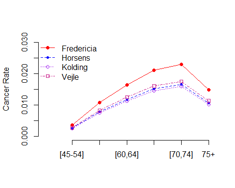

<style type="text/css">
h1.title {
  font-size: 20px;
  color: DarkRed;
  text-align: center;
}
h4.author { /* Header 4 - and the author and data headers use this too  */
    font-size: 18px;
  font-family: "Times New Roman", Times, serif;
  color: DarkRed;
  text-align: center;
}
h4.date { /* Header 4 - and the author and data headers use this too  */
  font-size: 18px;
  font-family: "Times New Roman", Times, serif;
  color: DarkBlue;
  text-align: center;
}
h1 { /* Header 3 - and the author and data headers use this too  */
    font-size: 22px;
    font-family: "Times New Roman", Times, serif;
    color: darkred;
    text-align: center;
}
h2 { /* Header 3 - and the author and data headers use this too  */
    font-size: 18px;
    font-family: "Times New Roman", Times, serif;
    color: navy;
    text-align: left;
}

h3 { /* Header 3 - and the author and data headers use this too  */
    font-size: 15px;
    font-family: "Times New Roman", Times, serif;
    color: navy;
    text-align: left;
}

h4 { /* Header 4 - and the author and data headers use this too  */
    font-size: 18px;
    font-family: "Times New Roman", Times, serif;
    color: darkred;
    text-align: left;
}
</style>


# Introduction and Review

We have studied the normal-based linear and binary logistic regression models dependent on the types of the random response variable. 

## Linear Regression Models

The primary regression models are normal linear models. The basic distributional assumption is that the residuals follow a normal distribution with mean zero and constant variance. The explanatory variables (also called predictor variables) are assumed to be uncorrelated with the response variable. Of course, the functional form of the explanatory variables must be correctly specified. Furthermore, the predictor variables are assumed to be non-random. This means that the response variable is a normal random variable - a special continuous random variable.


The regression coefficients are estimated by the least square method - also the least square estimation (LSE). When making inferences about the LSE, we still assume the residuals are normally distributed in order to construct confidence intervals of the regression coefficients and test the significance of the regression coefficient as well.


However, many continuous variables in the real world are not normally distributed, for example, a system’s lifetime in reliability engineering, toxic concentrations in underground water, survival times of cancer patients who received surgery, the waiting time of a customer at a service desk, etc. These random variables are not normal.


## Binary Logistic Regression Model

Contrary to the linear regression model that requires the response variable to be a continuous normal random variable, the logistic regression model, the response variable is assumed to be a Bernoulli random variable that takes on only two distinct values such as “diseased” vs “disease-free”, “success” vs “failure”, etc.

The actual regression function in the logistic regression is the probability of “success” not the value of the response variable “success”. The model was constructed with a special structure. The estimation of the regression coefficients is based on the likelihood theory.

The interpretation of the logistic regression model is also different from that in the linear regression model due to the special structure of the logistic regression. The regression coefficients measure how the corresponding explanatory variable impacts the log odds of success.

The resulting logistic regression model can be used for the association analysis and prediction as well. The use of predictive modeling is one of the most important classification algorithms in data science.
This module will focus on the discrete response variable which represents the number of occurrences of some event. Here are some examples.


* the number of sun-spots over the years.
* the number of positive COVID-19 cases in a period of time.
* the number of the COVID-19 death counts.
* the number of people walking into an Emergency Room per hour.


# Poisson Regression Models

The Poisson regression model assumes the random response variable to be a frequency count or a rate of a specific event such as COVID-19 positivity rates, COVID-19 death mortality, etc. As in the linear and logistic regression models, we also assume that predictor variables are non-random. 

The family of logistic regression models assumes that the response variable follows a binomial distribution while Poisson regression models assume that the response variable has a Poisson distribution.


## Assumptions of Poisson Regression Model

The basic assumptions of Poisson regression are

* **Poisson Response**: The response variable is a count per unit of time or space, described by a Poisson distribution.

* **Independence**:  The observations must be independent of one another.

* **Mean is equal to variance**: By definition, the mean of a Poisson random variable must be equal to its variance.

* **Linearity**:  The log of the mean rate, $\log( \lambda)$, must be a linear function of $x$.


## Structure of Poisson Regression Model for Counts

Let $Y$ be the response variable that takes on frequency counts as values and $X$ be the set of predictor variables such as demographics and social determinants. Further, let $\mu=E[Y]$ be the mean of the response variable. The Poisson regression model is defined in the following analytic expression.

$$
\log(\mu) = \beta_0 + \beta_1 x_1 + \beta_2 x_2 + \cdots + \beta_p x_p,
$$
where $\beta_0, \beta_1, \cdots, \beta_p$ are coefficients of the Poisson regression model. The interpretation of the regression coefficient $\beta_i$ is as following

* $\beta_0$ = the baseline logarithm of the mean of $Y$, $\log(\mu)$, when all predictor variables $x_i = 0$, for $i = 1, 2, \cdots, p$. As usual, we are not interested in the inference of the intercept parameter.

* $\beta_i$ = is the change of the log mean due to one unit increases in $x_i$ with all other $x_j$ being fixed, for $j\ne i$. 

To be more specific, let $\mu(x_i) = E[Y|(\cdots,x_i,\cdots)]$ be the mean counts with variables $\cdots, x_{i-1}, x_{i+1}, \cdots$ being fixed except for $x_i$. To look at how $x_i$ impacts the value of $E[Y]$, we increase $x_i$ by one unit and fix all other predictor variables.

$$
\log \mu(x_i) =  \beta_0 + \cdots + \beta_{i-1} x_{i-1}+ \beta_{i} x_{i} + \beta_{i+1} x_{i+1} + \cdots + \beta_p x_p
$$

After the increasing $x_i$ by one unit, the corresponding log mean is given by

$$
\log \mu(x_i+1), = \beta_0 + \cdots + \beta_{i-1} x_{i-1}+ \beta_{i} (x_{i}+1) + \beta_{i+1} x_{i+1} + \cdots + \beta_p x_p
$$
Therefore,

$$
\beta_i = \log\mu(x_i+1)  - \log\mu(x_i)
$$

  - If $\beta_i = 0$, then $\log\mu(x_i+1) = \log\mu(x_i)$. This implies that $x_i$ does not impact the mean of $Y$, equivalently, $Y$ and $X_i$ are not associated with each other.

  - If $\beta_i > 0$, then $\log\mu(x_i+1) > \log\mu(x_i)$. This implies that $\mu(x_i+1) > \mu(x_i)$, equivalently, $Y$ and $X_i$ are positively associated with each other.

  - Similarly, if $\beta_i < 0$, then $Y$ and $X_i$ are negatively associated with each other.


Because the Poisson distribution is usually used to model rare event such as diseases and anomalies and the regression  coefficients $\beta_i$ can be expressed as $\beta_i = \log (\mu(x_i+1)/\mu(x_i))$, $\beta_i$ is called **relative risk**, sometimes also called **risk ratio** or **log risk ratio**.


## Poisson Models for Rates

Poisson log-linear regression model for the expected rate of the occurrence of the event is defined by

$$
\log(\mu/t) = \beta_0 + \beta_1 x_1 + \beta_2 x_2 + \cdots + \beta_p x_p
$$
This can be re-expressed as

$$
\log(\mu)=\beta_0 + \beta_1 x_1 + \beta_2 x_2 + \cdots + \beta_p x_p+\log(t)
$$

The term $\log(t)$ is referred to as an offset. It is an adjustment term and a group of observations may have the same offset, or each individual may have a different value of t. $\log(t)$ is an observation and it will change the value of estimated counts:


$$
\mu=\exp[(]\beta_0 + \beta_1 x_1 + \beta_2 x_2 + \cdots + \beta_p x_p+log(t)]\\
= t\exp(\beta_0)\exp(\beta_1 x_1 + \beta_2 x_2 + \cdots + \beta_p x_p)
$$
This means that mean count is proportional to t.

Note that the interpretation of parameter estimates $\beta_0$ and $\beta_1, \beta_2, \cdots, \beta_p$ will stay the same as for the model of counts; you just need to multiply the expected counts by t.


## Estimation of Regression Coefficients and Goodness-of-fit

Unlike the linear regression in which we have assumptions about the residuals. The estimated residuals can be used to test the assumptions about the distribution. In GLM, the goodness-of-fit is much more complex than the normal-based regression modeling. But we can mimic residuals in the linear regression modeling to define a similar quantity called **deviance residual** based on the likelihood of the model. We will give this definition in the next module.


The estimation of the regression coefficients is based on the maximum likelihood estimation (MLE) which requires numerical solutions. In the Poisson distribution, the mean and variance are equal ($E[Y] = var[Y]$). Failing to meet this assumption results the issue of **dispersion**, a common violation of the Poisson regression. We will discuss this issue and the relevant remedies in the next module. 


We will not go into details about how to estimate the regression coefficients and perform model diagnostics in this module. Instead, we will focus on data analysis, in particular, the interpretation of regression coefficients.


## Data Set Layout

The data set required for the Poisson regression model in R should have the following layout.


|ID(optional)|  $x_1$ | $x_2$  |  ...  |$x_k$    |  $y$ (counts) |    total (counts, optional)|
|------------|--------|--------|-------|---------|---------------|----------------------------|
|      1     |$x_{11}$|$x_{21}$|  ...  |$x_{k1}$ |  $y_1$        |          $t_1$             |    
|      2     |$x_{12}$|$x_{22}$|  ...  |$x_{k2}$ |  $y_2$        |          $t_2$             |
|     ...    |  ...   |   ...  |  ...  |  ...    |  ...          |             ...            |
|      n     |$x_{1n}$|$x_{2n}$|  ...  |$x_{kn}$ |  $y_n$        |          $t_n$             |


As usual, if there are categorical variables (with numerical coding), we need to introduce dummy variable to capture the unequal effects on the response across the categories of the variables.


# Case Study

In this section, we use cancer data that have a frequency count and other predictor variables. The data set was built in the R library {ISwR}.


```r
data(eba1977)
kable(head(eba1977), caption = "First few records in the data set") 
```


Table: First few records in the data set

|city       |age   |  pop| cases|
|:----------|:-----|----:|-----:|
|Fredericia |40-54 | 3059|    11|
|Horsens    |40-54 | 2879|    13|
|Kolding    |40-54 | 3142|     4|
|Vejle      |40-54 | 2520|     5|
|Fredericia |55-59 |  800|    11|
|Horsens    |55-59 | 1083|     6|

```r
# check the values of the variables in the data set
```

The data set represented the lung cancer incidence in four Danish cities 1968-1971. This data set contains counts of incident lung cancer cases and population size in four neighboring Danish cities by age group. The primary random response variable is lung cancer cases. The predictor variables are the age group and the total population size of the neighboring cities.

## Poisson Regression on Cancer Counts

We first build a Poisson frequency regression model and ignore the population size of each city in the data.


```r
model.freq <- glm(cases ~ city + age, family = poisson(link = "log"), data = eba1977)
##
pois.count.coef = summary(model.freq)$coef
kable(pois.count.coef, caption = "The Poisson regression model for the counts of lung 
      cancer cases versus the geographical locations and the age group.")
```


Table: The Poisson regression model for the counts of lung 
      cancer cases versus the geographical locations and the age group.

|            |   Estimate| Std. Error|    z value| Pr(>&#124;z&#124;)|
|:-----------|----------:|----------:|----------:|------------------:|
|(Intercept) |  2.2437446|  0.2036265| 11.0189233|          0.0000000|
|cityHorsens | -0.0984401|  0.1812909| -0.5429952|          0.5871331|
|cityKolding | -0.2270575|  0.1877041| -1.2096561|          0.2264109|
|cityVejle   | -0.2270575|  0.1877041| -1.2096561|          0.2264109|
|age55-59    | -0.0307717|  0.2480988| -0.1240298|          0.9012916|
|age60-64    |  0.2646926|  0.2314278|  1.1437369|          0.2527328|
|age65-69    |  0.3101549|  0.2291839|  1.3533017|          0.1759593|
|age70-74    |  0.1923719|  0.2351660|  0.8180261|          0.4133423|
|age75+      | -0.0625204|  0.2501222| -0.2499593|          0.8026188|

The above inferential table about the regression coefficients indicates both city and age are insignificant. This means, if we look at the cancer count across the age group and city, there is no statistical evidence to support the potential discrepancy across the age groups and the cities. However, this does not imply that the model is meaningless from the practical perspective since statistical significance is not equivalent the clinical importance. Moreover, the sample size could impact the statistical significance of some of the variables.

The other way to look at the model is the appropriateness of the model. The cancer counts are dependent on the population sizes. Ignoring the population size implies the information in the sample was not effectively used. In the next subsection, we model the cancer rates that involve the population size.


The other way to look at the model is the appropriateness of the model. The cancer counts are dependent on the population sizes. Ignoring the population size implies the information in the sample was not effectively used. In the next subsection, we model the cancer rates that involve the population size.


## Poisson Regression on Rates

The following model assesses the potential relationship between cancer death rates and age. This is the primary interest of the model. We also want to adjust the relation be the potential neighboring cities.


```r
model.rates <- glm(cases ~ city + age, offset = log(pop), 
                   family = poisson(link = "log"), data = eba1977)

kable(summary(model.rates)$coef, caption = "Poisson regression on the rate of the 
      cancer rate in the four Danish cities adjusted by age.")
```


Table: Poisson regression on the rate of the 
      cancer rate in the four Danish cities adjusted by age.

|            |   Estimate| Std. Error|    z value| Pr(>&#124;z&#124;)|
|:-----------|----------:|----------:|----------:|------------------:|
|(Intercept) | -5.6320645|  0.2002545| -28.124529|          0.0000000|
|cityHorsens | -0.3300600|  0.1815033|  -1.818479|          0.0689909|
|cityKolding | -0.3715462|  0.1878063|  -1.978348|          0.0478895|
|cityVejle   | -0.2723177|  0.1878534|  -1.449629|          0.1471620|
|age55-59    |  1.1010140|  0.2482858|   4.434463|          0.0000092|
|age60-64    |  1.5186123|  0.2316376|   6.555985|          0.0000000|
|age65-69    |  1.7677062|  0.2294395|   7.704455|          0.0000000|
|age70-74    |  1.8568633|  0.2353230|   7.890701|          0.0000000|
|age75+      |  1.4196534|  0.2502707|   5.672472|          0.0000000|

The above table indicates that the log of cancer rate is not identical across the age groups and among the four cities. To be more specific, the log rates of Fredericia (baseline city) were higher than in the other three cities. The youngest age group (45-55) has the lowest log rate. The regression coefficients represent the change of log rate between the associate age group and the reference age group. The same interpretation applies to the change in log rate among the cities.


## Some Graphical Comparison

The inferential tables of the Poisson regression models in the previous sections give numerical information about the potential discrepancy across the age group and among the cities. But it is not intuitive. Next, we create two graphics that make the hidden pattern visible.

The following calculation is based on the regression equation with coefficients given in above table 3. Note that all variables in the model are indicator variables. Each of these indicator variables takes only two possible values: 0 and 1.

For example, $\exp(-5.632)$ gives the cancer rate of baseline city, Fredericia, and the baseline age group [45-54]. $\exp(-5.632+1.101)$ gives the cancer rate of baseline city, Fredericia, and age group [55-59]. Following the same pattern, you can find the cancer rate for each combination of the city and age group.


```r
# Fredericia
Fredericia = c(exp(-5.632), exp(-5.632+1.101),   
               exp(-5.632+1.52),exp(-5.632+1.77),
               exp(-5.632+1.86),exp(-5.632+1.42))
# Horsens
Horsens = c(exp(-5.632-0.331), exp(-5.632-0.331+1.101),   
            exp(-5.632-0.331+1.52),exp(-5.632-0.331+1.77),
            exp(-5.632-0.331+1.86),
            exp(-5.632-0.331+1.42))
# Kolding
Kolding= c(exp(-5.632-0.372), exp(-5.632-0.372+1.101),   
           exp(-5.632-0.372+1.52),exp(-5.632-0.372+1.77),
           exp(-5.632-0.372+1.86), exp(-5.632-0.372+1.42))
# Vejle
Vejle = c(exp(-5.632-0.272), exp(-5.632-0.272+1.101),   
          exp(-5.632-0.272+1.52),exp(-5.632-0.272+1.77),
          exp(-5.632-0.272+1.86), exp(-5.632-0.272+1.42))
minmax = range(c(Fredericia,Horsens,Kolding,Vejle))
####
```


```r
plot(1:6,Fredericia, type="l", lty =1, col="red", xlab="", 
               ylab="Cancer Rate", xlim=c(0,6), ylim=c(0, 0.03), axes=FALSE )
axis(2)
axis(1, labels=c("[45-54]","[55,59]","[60,64]","[65,69]","[70,74]","75+"), 
            at = 1:6)
points(1:6,Fredericia, pch=19, col="red")
##
lines(1:6, Horsens, lty =2, col="blue")
points(1:6, Horsens, pch=20, col="blue")
##
lines(1:6, Kolding, lty =3, col="purple")
points(1:6, Kolding, pch=21, col="purple")
###
lines(1:6, Vejle, lty =4, col="mediumvioletred")
points(1:6, Vejle, pch=22, col="mediumvioletred")
##
legend("topleft", c("Fredericia","Horsens", "Kolding", "Vejle" ),
                  pch=19:22, lty=1:4,  bty="n", 
        col=c("red", "blue", "purple", "mediumvioletred"))
```




## Conclusion and Discussion

Several conclusions we can draw from the output of the regression models.

The regression model based on the cancer count is not appropriate since the information on the population size can not be used. Simply including the population size in the regression model to improve the model performance. See the following output of the fitted Poisson regression model.


```r
model.freq.pop <- glm(cases ~ city + age + pop, family = poisson(link = "log"), 
                      data = eba1977)
##
pois.count.coef.pop = summary(model.freq.pop)$coef
kable(pois.count.coef.pop, caption = "The Poisson regression model for 
         the counts of lung cancer cases versus the geographical locations, 
         population size, and age group.")
```


Table: The Poisson regression model for 
         the counts of lung cancer cases versus the geographical locations, 
         population size, and age group.

|            |   Estimate| Std. Error|    z value| Pr(>&#124;z&#124;)|
|:-----------|----------:|----------:|----------:|------------------:|
|(Intercept) |  3.2128418|  2.0328317|  1.5804760|          0.1139979|
|cityHorsens | -0.0460603|  0.2123037| -0.2169547|          0.8282436|
|cityKolding | -0.1860295|  0.2065207| -0.9007788|          0.3677059|
|cityVejle   | -0.2363857|  0.1888636| -1.2516209|          0.2107080|
|age55-59    | -0.6973716|  1.4118856| -0.4939293|          0.6213561|
|age60-64    | -0.4398872|  1.4875090| -0.2957207|          0.7674434|
|age65-69    | -0.4459548|  1.5936553| -0.2798314|          0.7796069|
|age70-74    | -0.6085898|  1.6875082| -0.3606440|          0.7183656|
|age75+      | -0.8251288|  1.6101773| -0.5124459|          0.6083390|
|pop         | -0.0003412|  0.0007140| -0.4778690|          0.6327434|


The cancer rate in Fredericia is significantly higher than in the other three cities. It seems that there is no significant difference between Horsens, Kolding, and Vejle. The reason why Fredericia has a higher cancer rate needs further investigation with additional information.

There is a curve linear relationship between age and the cancer rate. The cancer rate increases as age increases. However, the rate starts decreasing after 75. This pattern is consistent with the clinical studies since lung cancer patients were mostly diagnosed between 65-70. It is rare to see lung cancer patients aged under 45.

The last statistical observation is that there is no interaction effect between the age groups and the geographic locations. The rate curves are “parallel”.

This is only a small data set with limited information. All conclusions in this report are only based on the given data set.


# Concluding Remarks

This note briefly outlines the regular Poisson regression model for fitting frequency data. The Poisson regression model has a simple structure and easy to interpret but has a relatively strong assumption - variance is equal to mean. 

If this assumption is violated, we can use negative binomial regression as an alternative. The other potential issue is the data has excess zeros, then we can consider zero-inflated Poisson or zero-inflated negative binomial regression models.

For this week's assignment, you will modeling the daily counts (and proportion) of cyclists who entered and left the four bridges in the New York City. The data set will be provided in the document of the assignment instruction.

\

\

\


