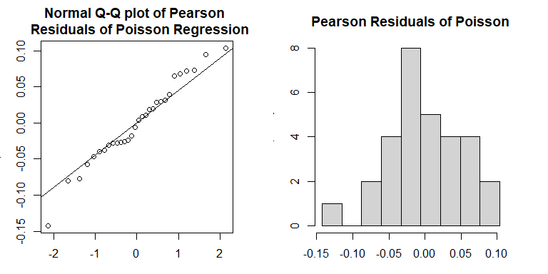
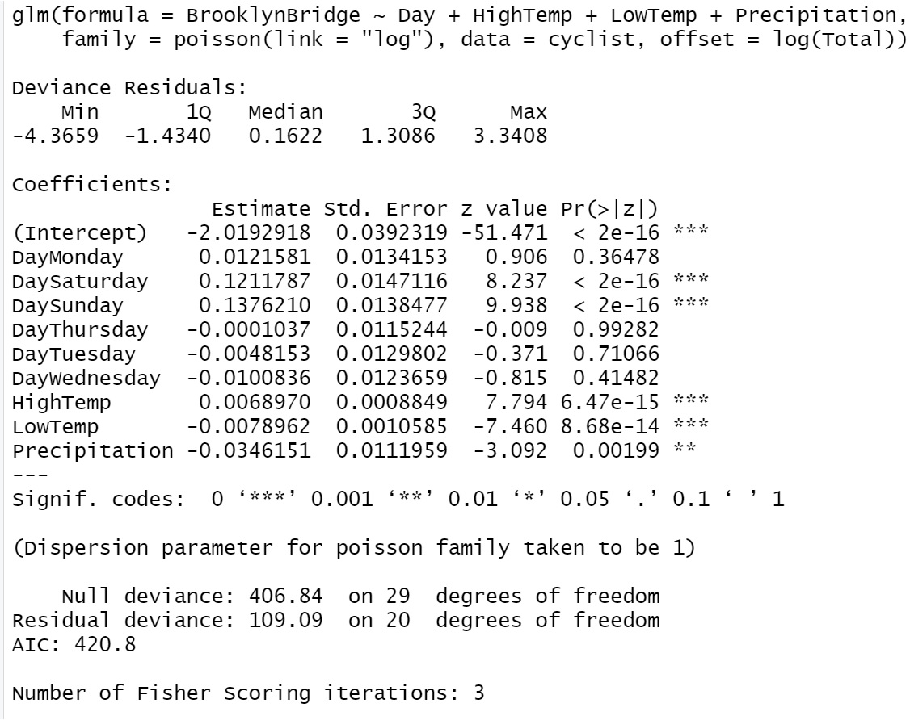
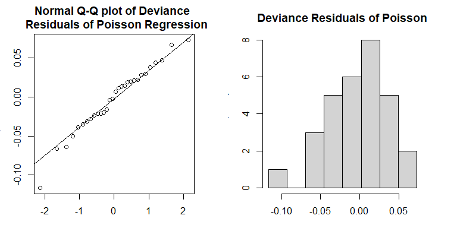
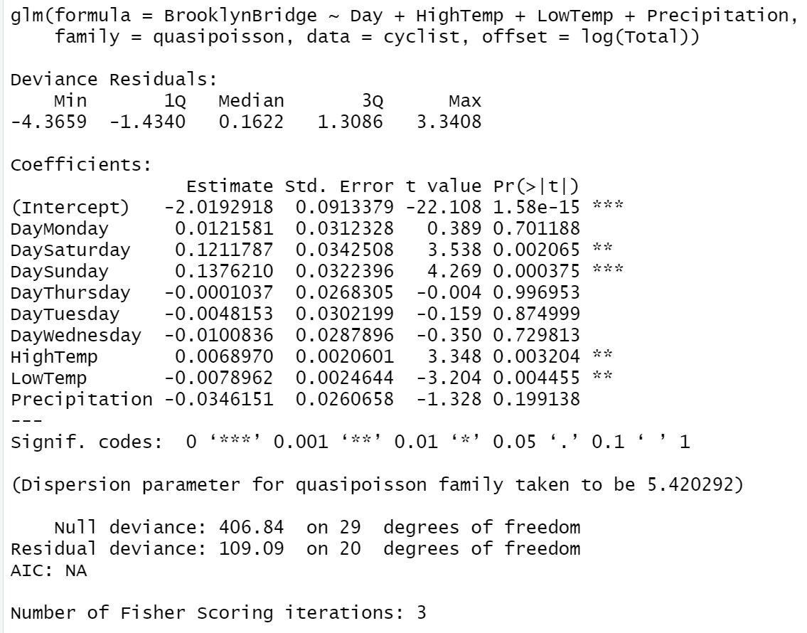

<style type="text/css">
h1.title {
  font-size: 20px;
  color: DarkRed;
  text-align: center;
}
h4.author { /* Header 4 - and the author and data headers use this too  */
    font-size: 18px;
  font-family: "Times New Roman", Times, serif;
  color: DarkRed;
  text-align: center;
}
h4.date { /* Header 4 - and the author and data headers use this too  */
  font-size: 18px;
  font-family: "Times New Roman", Times, serif;
  color: DarkBlue;
  text-align: center;
}
h1 { /* Header 3 - and the author and data headers use this too  */
    font-size: 22px;
    font-family: "Times New Roman", Times, serif;
    color: darkred;
    text-align: center;
}
h2 { /* Header 3 - and the author and data headers use this too  */
    font-size: 18px;
    font-family: "Times New Roman", Times, serif;
    color: navy;
    text-align: left;
}

h3 { /* Header 3 - and the author and data headers use this too  */
    font-size: 15px;
    font-family: "Times New Roman", Times, serif;
    color: navy;
    text-align: left;
}

h4 { /* Header 4 - and the author and data headers use this too  */
    font-size: 18px;
    font-family: "Times New Roman", Times, serif;
    color: darkred;
    text-align: left;
}
</style>


# Introduction 

In the last module, we introduced the basics of Poisson regression on counts and rates. Sometimes Poisson regression may not work well since the variance of the response may not be equal to the mean. In this model, we will look into the issue of potential **dispersion** and other relevant issues and find alternative count and rate regression models.  

The general structure of the Poisson regression model is given by

$$
\log \mu(x) = \beta_0 + \beta_1 x_1 + \cdots + \beta_p x_p
$$

There are several assumptions for the Poisson regression model. The most important one is that the mean and variance of the response variable are equal. The other assumption is the linear relationship between the explanatory variables and the log mean of the response. It is not straightforward to detect the potential violation of these assumptions.  In the next section, we define some metrics based on *residuals* based on the hypothetical model and the observed data.

The learning objectives of this module are (1) to develop measures to detect the violation of the assumptions of the Poisson regression, (2) define measure to estimate the dispersion, (3) introduce the quasi-likelihood Poisson regression model to make robust inference of the regression coefficients.


# Residuals of Poisson Regression

In linear regression, we can use the residual plots to check the potential violation of the model assumption since the residuals are normally distributed with zero mean and constant standard deviation if the model is appropriate. In Poisson regression, we can mimic the way of defining the *kind of residuals* as we did in linear regression. Under large sample assumption, these residuals are approximately normally distributed if the underlying hypothetical model is appropriate. Using this large sample property, we can define some metrics to detect the potential violation of the model assumptions. 

Recall that the residual of $i$-th observation under a model defined by

$$ e_i = y_i - \hat{\mu}_i.$$

where $\hat{\mu}_i$ is the fitted value based on the hypothetical model $\log(\mu) = \hat{\beta}_0 + \hat{\beta}_1x_1 + \cdots + \hat{\beta}_p x_p$. The regression coefficients can be estimated using least square and likelihood methods.

Next I am going to use portion of NYC cyclist data (you will use the similar data for this weeks assignment). I will use this data set as an example to explain the concepts and models discussed in this module.


```r
cyclist = read.csv("w10-NYCcyclistData.csv")
cyclist$log.BrooklynBridge = log(cyclist$BrooklynBridge)
m0.loglinear = lm(log.BrooklynBridge ~ Day + HighTemp + LowTemp + Precipitation, 
                  data = cyclist)
m1.Poisson = glm(BrooklynBridge ~ Day + HighTemp + LowTemp + Precipitation, 
                 family = poisson(link = "log"), offset = log(Total),  data = cyclist)
```

* **Least Square Estimate (LSE) of $\beta$'s**

In this methods, we need to take the logarithm of the observed count as in the data table as shown in the following table.

|ID(optional)|  $x_1$ | $x_2$  |  ...  |$x_k$    |  $y$ (counts) |    log-count ($\log(y)$)|
|------------|--------|--------|-------|---------|---------------|----------------------------|
|      1     |$x_{11}$|$x_{21}$|  ...  |$x_{k1}$ |  $y_1$        |    $\log(y_1)$             |    
|      2     |$x_{12}$|$x_{22}$|  ...  |$x_{k2}$ |  $y_2$        |    $\log(y_2)$             |
|     ...    |  ...   |   ...  |  ...  |  ...    |  ...          |             ...            |
|      n     |$x_{1n}$|$x_{2n}$|  ...  |$x_{kn}$ |  $y_n$        |    $\log(y_n)$             |

We can use the log of the observed count and values of the explanatory variables to find the least square estimates (LSE) the regression coefficients, denoted by $\tilde{\beta}_0, \tilde{\beta}_1, \cdots, \tilde{\beta}_p$, of the Poisson regression model. Then the $i$-th fitted value $\hat{\mu}_i = \exp(\tilde{\beta}_0 + \tilde{\beta}_1 x_1 + \cdots + \tilde{\beta}_p x_p)$. 

* **Maximum Likelihood Estimate (MLE) of $\beta$'s**

Since the the response variable is assumed to have a Poisson with its mean $\mu_j = \exp(\beta_0 + \beta_1 x_{1j} + \cdots + \beta_p x_{pj})$. The kernel of the log-likelihood of observing the data set is defined in the following

$$
l(\beta_0, \beta_1, \cdots, \beta_p) \propto  \sum_{j=1}^n \left[y_j(\beta_0 + \beta_1 x_{1j} + \cdots + \beta_p x_{pj})-\exp(\beta_0 + \beta_1 x_{1j} + \cdots + \beta_p x_{pj}) \right]
$$

The MLE of the $\beta$'s, denoted by $\hat{\beta}_0, \hat{\beta}_1, \cdots, \hat{\beta}_p$, maximizes the above log-likelihood. With the MLE, we can find the fitted value by $\hat{\mu}_i = \exp(\hat{\beta}_0 + \hat{\beta}_1 x_1 + \cdots + \hat{\beta}_p x_p)$. 

## Pearson Residuals

The Pearson residual of $i$-th observation is defined to be

$$
Pearson.Residual_i = \frac{y_i-\hat{\mu}_i}{\sqrt{\hat{\mu}_i}}
$$

Pearson residuals are standardized value of the observed $y_i$ with the assumption that $Y_i$ is a Poisson normal random variable. Under large sample assumption, we would expect that residuals are approximately normally distributed. We can use this property to assess the appropriateness of the Poisson regression model. 

Next, we extract the residuals ($y_i-\hat{mu}_i$) direct from the linear regression model and the then divided by the square root of $\hat{\mu}_i$, fitted values of $y_i$, to find the Pearson residuals.


```r
par(mfrow=c(1,2), mar=c(3,3,3,3))
resid.loglin = m0.loglinear$residuals
fitted.loglin = m0.loglinear$fitted.values
pearson.resid = resid.loglin/sqrt(fitted.loglin)
qqnorm(pearson.resid, main = "Normal Q-Q plot of Pearson \n  Residuals of Poisson Regression")
qqline(pearson.resid)
##
seq.bound=seq(range(pearson.resid)[1], range(pearson.resid)[2], length=10)
hist(pearson.resid, breaks = seq.bound, 
     main = "Pearson Residuals of Poisson")
```



Both Q-Q plot and histogram indicate that the distribution of Pearson residuals are skewed. There is a discrepancy between frequency distribution and a normal distribution. Since the Pearson residuals are derived based on the least square algorithm, they don't have good distributional properties to develop a test.


## Deviance Residuals

Deviance residuals of Poisson regression are defined based on the likelihood method in the following

$$
Deviance.Residual_i=sign(y_i - \hat{\mu}_i)\sqrt{2\left[y_i\log(y_i/\hat{\mu}_i) -(y_i-\hat{\mu}_i)\right]}
$$

where

$$
sign(x) = \begin{cases} 
           1    & \text{if } x \geq 0 \\
           - 1  & \text{if } x < 0   \\
           0    & \text{if } x =0
          \end{cases}
$$

Since the deviance residuals based on Poisson regression are defined based on the likelihood, there are asymptotically normally distributed. We can use this asymptotic property of normal distribution to assess the appropriateness of the Poisson regression.


The residual deviance of Poisson (or other generalized linear models) is defined to be the sum of all deviance residuals: $deviance =\sum_i(deviance.residual_i)^2$. In the output of **glm()** in R, the **null deviance residual** (corresponding to the model with no explanatory variable in it) and **deviance residual** (corresponding to the fitted model) are report with the corresponding degrees of freedom.


```r

```


We can see from the Poisson regression output in R that only deviance residuals and the corresponding descriptive statistics are reported (the five-number-summary of deviance residuals, null deviance, and deviance with corresponding degrees of freedoms). This is because the inference of Poisson regression in **glm()** is based on the likelihood theory.

We can also extract the deviance residuals from **glm()** object and make a Q-Q plot in the following


```r
par(mfrow=c(1,2), mar=c(3,3,3,3))
qqnorm(m1.Poisson$residuals, 
       main = "Normal Q-Q plot of Deviance \n  Residuals of Poisson Regression")
qqline(m1.Poisson$residuals)
resid.m1 = m1.Poisson$residuals
seq.bound=seq(range(resid.m1)[1], range(resid.m1)[2], length=9)
hist(m1.Poisson$residuals, breaks = seq.bound, 
     main = "Deviance Residuals of Poisson")
```



Both Q-Q plot and histogram indicate that distribution of the deviance residuals is slightly different from a normal distribution. If the model is correctly specified, the sum of squared residuals $\sum_i(Deviance.Residual_i)^2$ is distributed as $\chi^2_{n-p}$. The deviance and the degrees of freedom of the deviance are given in the output of the **glm()** (see the output given in the above figure). 

For example, we next extract the deviance and degrees of freedom from the output and perform a chi-sqaure test.


```r
deviance.resid = m1.Poisson$deviance
deviance.df = m1.Poisson$df.residual
# p-value of chi-square test
p.value = 1-pchisq(deviance.resid, deviance.df)
pval = cbind(p.value = p.value)
kable(pval, caption="The p-value of deviance chi-square test")
```


Table: The p-value of deviance chi-square test

| p.value|
|-------:|
|       0|
The p-value is almost equal to zero. The assumption of the Poisson regression model was violated. 

## Goodness-of-fit

The deviance has an asymptotic $\chi^2_{n-p}$ distribution if the model is correct. If the p-value calculated based in the deviance from $\chi^2_{n-p}$ is less than the significance level, we claim the model has poor fit (also lack-of-fit, badness-of-fit). There could be different reasons that cause the poor fit. For examples, (1) data issue such as out-liers, (2) functional form of the explanatory variables (non-linear relationship between the log of the mean of the response), (3) missing some important explanatory variable in the data set, (4) dispersion issue, etc.


The deviance residual can be used naturally to **compare hierarchical models** by defining the likelihood ratio chi-square tests. 


The dispersion issue will be detailed in the next section. 


## Dispersion and Dispersed Poisson Regression Model

The issue of **Overdispersion** in Poisson regression is common. It indicates that the variance is bigger than the mean. 

* **Definition of Dispersion**

To detect the overdispersion (i.e., the violation of the assumption in Poisson regression), we define the following dispersion parameter

$$
\hat{\phi} = \frac{\sum_i(Pearson.Residual_i)^2}{n-p} ,
$$

where $p$ is the number of regression coefficients. Note that $\sum_i(Pearson.Residual_i)^2$ has a $\chi_{n-1}^2$ if the Poisson assumption is correct. Since the the expectation of a chi-square distribution is equal to the degrees of freedom, this means that the **estimated dispersion parameter**, $\hat{\phi}$,  should be around 1 if the the Poisson assumption is correct. Therefore, the **estimated dispersion parameter** can be used to detect potential dispersion issue.

* **Impact of Dispersion**

Overdispersion means the assumptions of Poisson model (or other models in the exponential family) are not met, therefore, the p-values in the output of **glm()** are not reliable. We should use p-values in the output to perform significant tests and use it for variable selection.  


* **Quasi-Poisson Regression Model**


We can make an adjustment of the Poisson variance by adding a dispersion parameter. In other words, while for Poisson data $\bar{Y} = s^2_Y$, the quasi-Poisson allows for $\bar{Y} = \phi \cdot s^2_Y$, and estimates the overdispersion parameter $\phi$ (or underdispersion, if $\phi < 1$). The estimated $\phi$ is given earlier.

Next, we use **glm()** to fit the quasi-Poisson model and compare its output with that of the regular Poisson regression.


```r
m2.quasi.pois = glm(BrooklynBridge ~ Day + HighTemp + LowTemp + Precipitation, 
                    family = quasipoisson, offset = log(Total),  data = cyclist)
```


```r

```


We can see from the output of the quasi-likelihood based Poisson regression that the dispersion parameter is $\hat{\phi} = 5.420292$. Since the dispersion parameter is significantly different from 1, the p-values in the output of the Poisson regression model are not reliable. The main effect is the substantially larger errors for the estimates (the point estimates do not change), and hence potentially changed significance of explanatory variables.

We can manually compute the corrected standard errors in the quasi-Poisson model by adjusting the standard error from the Poisson standard errors using relation $SE_Q(\hat{\beta})=SE(\hat{\beta})\times \sqrt{\hat{\phi}}$. For example, considering the standard error of $\hat{\beta}_1$ (associated with dummy variable **DayMonday**), $SE(\hat{\beta}_1) = 0.0134153$, in the output of the regular Poisson regression model. The corresponding corrected standard error in the quasi-Poisson model is given by $\sqrt{5.420292}\times 0.0134153 = 0.03123286$, which is the same as the one reported in the quasi-Poisson model.   

**Remarks**: 

1. Since the quasi-likelihood is not the maximum likelihood method, there is no AIC and no overdispersion tests can be used.

2. quasi-Poisson regression still carry the same simple model formula. The interpretation of the regression coefficients are the same as that in the regular Poisson model. 

3. We cannot use the deviance of the regular Poisson model to define likelihood ratio tests for variable selection.


# Case Study


In this case study, we use data from Long (1990) on the number of publications produced by Ph.D. biochemists to illustrate the application of Poisson models. The variables in the data set are listed below.

## Variable Description

* articles: integer. articles in the last three years of Ph.D.
* gender: factor. coded one for females.
* married: factor. coded one if married.
* kids: integer. number of children under age six.
* prestige: numeric. prestige of Ph.D. program
* mentor: integer. articles by mentor in last three years

## Research Question

We want to assess how factors affect the number of articles published in the last three years in the Ph.D. programs.

## Variable Inspection

Variable **kids** is a discrete variable. We create a frequency table of **kids** and found that 16 of 915 Ph.D. students had 3 kids. After additional exploratory analysis. we decide to dichotomize **kids** and redefine a new variable under name **newkids**.


```r
phd=read.table("w10-ph-data.txt",skip=10, header=TRUE )[,-1] # drop the ID variable
id.3 = which(phd$kids > 0)
newkids = phd$kids
newkids[id.3] = 1
phd$newkids = newkids
```

## Poison Count Regression

We build both regular Poisson and Quasi-poisson regression model and extract the dispersion parameter.


```r
## phd=read.table("w10-ph-data.txt",skip=10, header=TRUE )[,-1] # drop the ID variable
## Regular Poison Model
pois.model = glm(article ~ gender + married + factor(newkids) + prestige + mentor, family = poisson(link="log"), data =phd)  
## Quasi Poisson or dispersed Poisson model
quasi.model = glm(article ~ gender + married + factor(newkids) + prestige + mentor, family = quasipoisson, data =phd)
## Extracting dispersion parameter
SE.q = summary(quasi.model)$coef[2,2]
SE = summary(pois.model)$coef[2,2]
dispersion = (SE.q/SE)^2
disp = cbind(dispersion = dispersion)
kable(disp, caption="Dispersion parameter", align = 'c')
```


Table: Dispersion parameter

| dispersion |
|:----------:|
|  1.841565  |

The dispersion parameter 1.829006 that indicates that the Poisson model is inappropriate. We need to correct the dispersion issue. Qusi-likelihood-based Poisson model is one option. 

Next, we summarize the inferential statistics about the regression coefficients in the following table


```r
SE.quasi.pois = summary(quasi.model)$coef
kable(SE.quasi.pois, caption = "Summary statistics of quasi-poisson regression model")
```


Table: Summary statistics of quasi-poisson regression model

|                 |   Estimate| Std. Error|    t value| Pr(>&#124;t&#124;)|
|:----------------|----------:|----------:|----------:|------------------:|
|(Intercept)      |  0.4579404|  0.1290407|  3.5488055|          0.0004068|
|genderWomen      | -0.2179247|  0.0742536| -2.9348721|          0.0034208|
|marriedSingle    | -0.1516973|  0.0855315| -1.7735846|          0.0764666|
|factor(newkids)1 | -0.2495633|  0.0859576| -2.9033304|          0.0037815|
|prestige         |  0.0102754|  0.0359069|  0.2861675|          0.7748150|
|mentor           |  0.0258173|  0.0027397|  9.4233384|          0.0000000|

In the above quasi-Poisson regression, variable **prestige** is insignificant (p-value = 0.72). The p-value of the for testing the significance of variable **married** is 0.079.  We refit the quasi-poisson model by dropping **prestige**.


```r
quasi.model.02 = glm(article ~ gender + factor(newkids) + mentor, family = quasipoisson, data =phd)
summary(quasi.model.02)$coef
```

```
##                     Estimate  Std. Error   t value     Pr(>|t|)
## (Intercept)       0.42384447 0.064597192  6.561345 8.933519e-11
## genderWomen      -0.23327860 0.073884804 -3.157328 1.644599e-03
## factor(newkids)1 -0.17961531 0.076784938 -2.339200 1.954039e-02
## mentor            0.02577624 0.002658596  9.695432 3.204709e-21
```

The above model will be used as the final model.

The interpretation of coefficients to come.....


\

\

\


