<style type="text/css">
h1.title {
  font-size: 20px;
  color: DarkRed;
  text-align: center;
}
h4.author { /* Header 4 - and the author and data headers use this too  */
    font-size: 18px;
  font-family: "Times New Roman", Times, serif;
  color: DarkRed;
  text-align: center;
}
h4.date { /* Header 4 - and the author and data headers use this too  */
  font-size: 18px;
  font-family: "Times New Roman", Times, serif;
  color: DarkBlue;
  text-align: center;
}
h1 { /* Header 3 - and the author and data headers use this too  */
    font-size: 22px;
    font-family: "Times New Roman", Times, serif;
    color: darkred;
    text-align: center;
}
h2 { /* Header 3 - and the author and data headers use this too  */
    font-size: 18px;
    font-family: "Times New Roman", Times, serif;
    color: navy;
    text-align: left;
}

h3 { /* Header 3 - and the author and data headers use this too  */
    font-size: 15px;
    font-family: "Times New Roman", Times, serif;
    color: navy;
    text-align: left;
}

h4 { /* Header 4 - and the author and data headers use this too  */
    font-size: 18px;
    font-family: "Times New Roman", Times, serif;
    color: darkred;
    text-align: left;
}
</style>

```{r setup, include=FALSE}
# code chunk specifies whether the R code, warnings, and output 
# will be included in the output files.
if (!require("ISwR")) {
   install.packages("ISwR")
   library(ISwR)
}
if (!require("MASS")) {
   install.packages("MASS")
   library(MASS)
}
if (!require("knitr")) {
   install.packages("knitr")
   library(knitr)
}
if (!require("forecast")) {
   install.packages("forecast")
   library(forecast)
}
knitr::opts_chunk$set(echo = TRUE,       
                      warnings = FALSE,   
                      results = TRUE,   
                      message = FALSE,
                      fig.align='center', 
                      fig.pos = 'ht')
```


# Concepts of Prediction/Forecasting


Recall that the structure of data sets we used so far are based on random sampling: *a snapshot of information taken from a group of subjects at a particular time point - cross-sectional data.*


```{r echo = FALSE, fig.align='center', out.width="60%", fig.cap="Data types"}
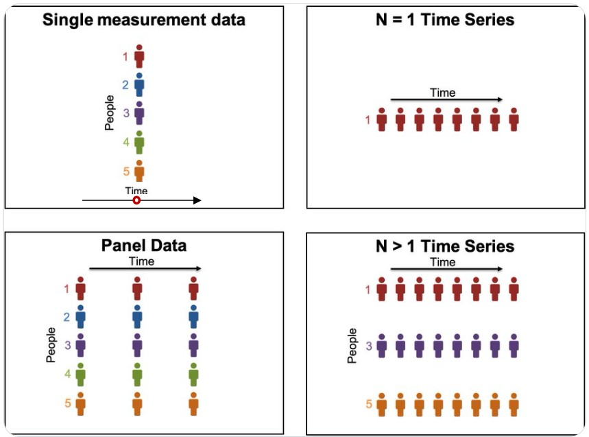
```


A univariate *time series* is a sequence of data values with certain random behaviors that occur in successive order over some period of time. A time series can be constructed by any data that is measured over time at evenly-spaced intervals. Some examples are historical stock prices, earnings, GDP, rainfalls, university enrollments, daily counts of ER patients, annual death counts due to traffic accidents in a country, inflation rates, or other sequences of financial or economic data that can be analyzed as a time series.


A forecast is a prediction of some future events. Forecasting problems can be found in many applied areas such as business and industry, economics, finance, environmental sciences, social sciences, political sciences, etc., and can be categorized into

1.	Short-term forecasting is when a prediction is only made for a few periods ahead (hours, days, weeks). 

2.	Medium-term in which one or two years of forecasting will be made.

3.	Long-term forecasting in which predictions for several years ahead will be made.

We have discussed different regression models such as linear models and logistic regression models. We also discussed predictions using the fitted regression models.  In practice, if the data are collected over time, then the aforementioned regression models are not valid for this type of data since the data values are serially correlated. New models that address time series are needed.

For time-series data, the typical scatter plot of the data values versus the time point at which the data values are observed is shown below.

```{r echo = FALSE, fig.align='center', fig.width=5, fig.height=5}
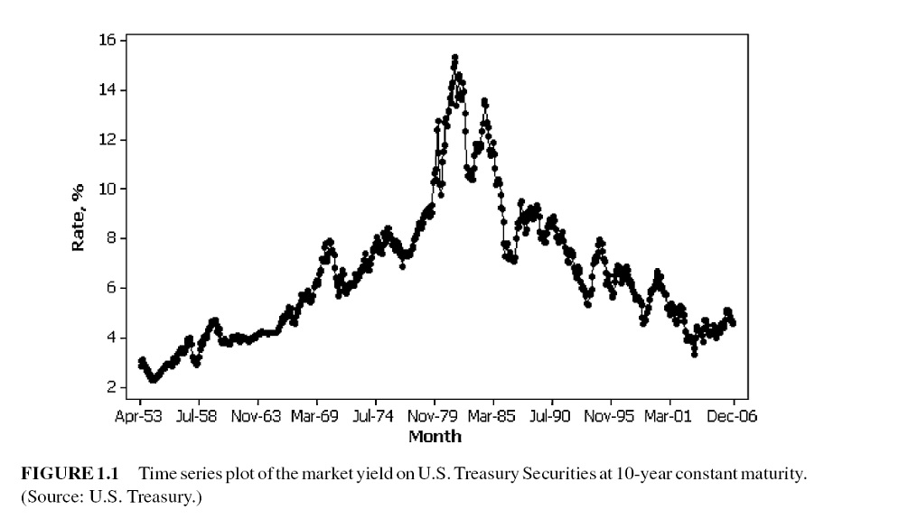
```

Many business applications of forecasting utilize daily, weekly, monthly, quarterly, or annual data, but any reporting interval may be used. 

The data may be instantaneous, such as the viscosity of a chemical product at the point in time where it is measured; it may be cumulative, such as the total sales of a product during the month; or it may be a statistic that in some way reflects the activity of the variable during the period, such as the daily closing price of a specific stock on the New York Stock Exchange.

* **Methods of forecasting**: There are two major methods for forecasting: 

  + Quantitative forecasting methods that make formal use of historical data to build a mathematical/statistical model to project into the future.

  + Qualitative forecasting methods are used when little data are available (new product introduction). In this case, expert opinion is often used.


Next we introduce a few technical terms in time series.

* **Some terminology**: 

  + *Point forecast* or point estimate - a single predicted value.
   
  + *Prediction interval* - interval prediction, information on accuracy is available.

  + *Forecast horizon* or lead time - based on the fitted model, the number of periods specified to be predicted.


There are two modes for analyzing time series: frequency domain and time domain approaches. We restrict our discussion within the time domain to avoid more advanced mathematical tools in this class.

* **Statistical forecasting models**:

  + Regression methods.
   
  + Smoothing methods.

  + Formal time series analysis methods - ARIMA Box-Jenkins methodology.

  + Dynamic regression methods.


# Types of Time Series Data


## Uncorrelated data, constant process model: random time series

Random time series is the result of many influences that act independently to yield nonsystematic and non-repeating patterns about some average value. 

A purely random series has a constant mean and no systematic patterns. Simply averaging the models is often the best and the most accurate way to forecast them.

```{r echo = FALSE, fig.align='center', fig.width=5, fig.height=5}
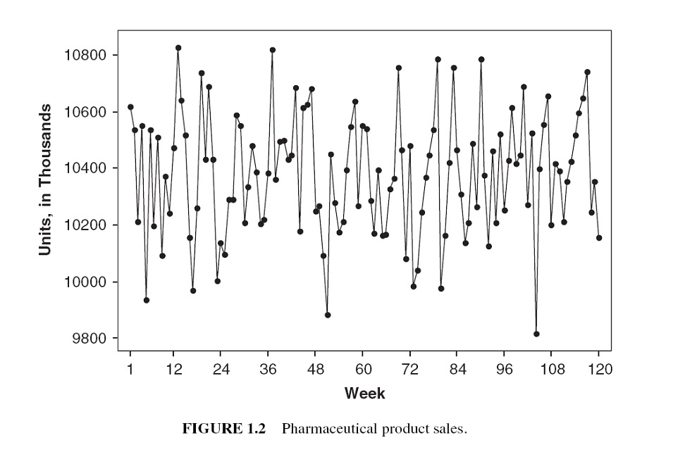
```
A special uncorrelated process:  **white noise process**, $x_t \to_{i.i.d} N(0, \sigma^2)$. That is, a sequence $\{x_t\}$, ($i = 1, 2, \cdots,$)  is a white noise process if each value in the sequence has  a)	zero-mean; b)	constant conditional variance; and c)	is uncorrelated with all other realizations. 


## Autocorrelated data


```{r echo = FALSE, fig.align='center', fig.width=5, fig.height=5}
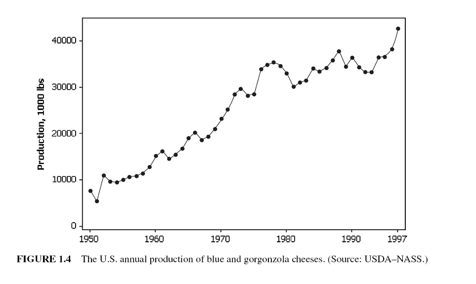
```

The correlation measures the degree of dependence or association between two variables. 

The term auto-correlation means that the value of a series in one time period is related to the value itself in previous periods. 

```{r echo = FALSE, fig.align='center', out.width="30%"}
include_graphics("w11-Figure0.jpg")
```

```{r}
X=1:9
Y=c(0.397,0.157,-0.083,-0.243,-0.323,-0.243,-0.083,0.077,0.347)
Y.lag1 = Y[-1]
Y.truc = Y[-9]
cor(Y.truc, Y.lag1)
plot(X, Y, type="b")
```


## Trend Data

A trend is a general increase or decrease in a time series that lasts for approximately seven or more periods. it can be a period-to-period increase or decrease that follows a straight line - this kind of pattern is called a linear trend. 

```{r echo = FALSE, fig.align='center', fig.width=5, fig.height=5}
include_graphics("w11-Figure04.jpg")
```
Trends are not necessarily linear because there are a large number of nonlinear causal influences that yield nonlinear series. 


## Seasonal Data

```{r echo = FALSE, fig.align='center', fig.width=5, fig.height=5}
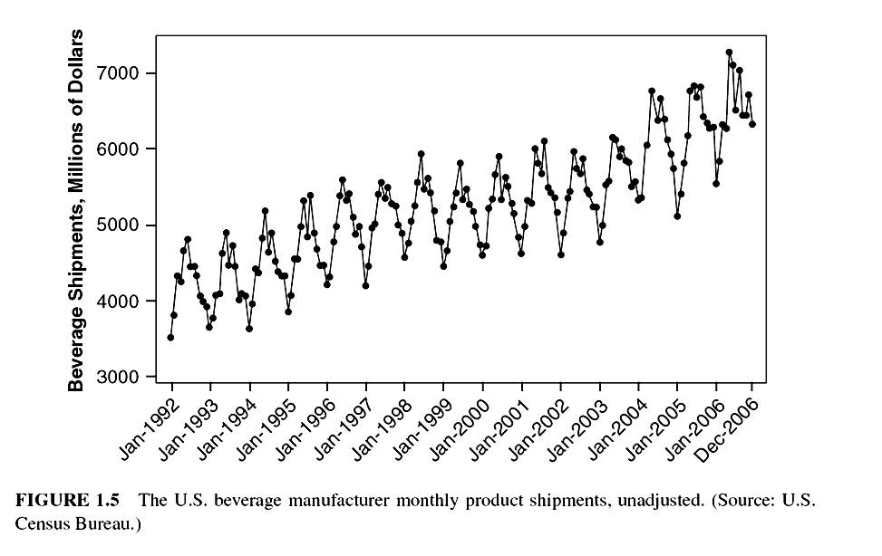
```

The seasonal series result from events that are periodic and recurrent (e.g., monthly, quarterly, changes recurring each year). The	common seasonal influences are climate, human habits, holidays, repeating promotions, and so on.

## Nonstationary Data

A stationary time series is one whose properties do not depend on the time at which the series is observed. 

More formally, a strictly stationary stochastic process is one where given $t_1, \cdots, t_{\mathcal{l}}$ the joint statistical distribution of $X_{t_1} , \cdots ,X_{t_\mathcal{l}}$ is NOT the same as the joint statistical distribution of $X_{t_1 + \tau} , . . . ,X_{t_\mathcal{l}+\tau}$ for all $\mathcal{l}$ and $\tau$.

Thus, time series with trends, or with seasonality, are not stationary — the trend and seasonality will affect the value of the time series at different times.

```{r echo = FALSE, fig.align='center', fig.width=5, fig.height=5}
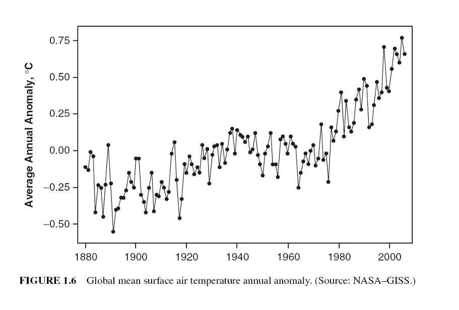
```

```{r echo = FALSE, fig.align='center', fig.width=5, fig.height=5}
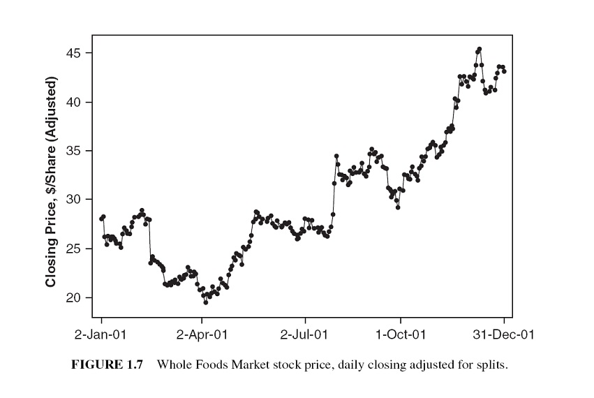
```

However, a time series with cyclic behavior (but with no trend or seasonality) is stationary. 


## Atypical Event (Outliers)

The analysis of past data can be made very complex when the included values are not typical of the past or future. 

These non-typical values are called outliers, which are very large or small observations that are not indicative of repeating past or future patterns. Outliers occur because of unusual events.

```{r echo = FALSE, fig.align='center', fig.width=5, fig.height=5}
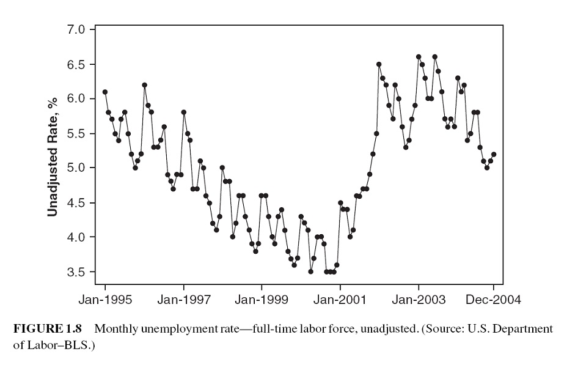
```

#  Some Technical Terms and Baseline Forecasting Models

There are many forecasting models for different time series models. Some of them are extremely simple and surprisingly effective. In this module, we introduce some naive methods as baseline methods to understand some basic concepts and technical terms before introducing formal forecasting models. 


## Some Definitions
 
Notation of a time series data: suppose there are $T$ periods of data available with $T$ the most recent period. The observed data values will be denoted by $y_t$ for $t = 1, 2, \cdots, T$.

**Forecast v.s. fitted values**:  in time series analysis, we distinguish between forecast (predicted) values from the fitted value:

* **Forecast value**: the value was produced at some previous period, say, $t - \tau$ (the predictive model on which the forecasting will be made should be built using the data up to $t - \tau$).

* **Fitted value**: The values produced by the fitted model at historical time points.

```{r echo = FALSE, fig.align='center', fig.width=5, fig.height=5}
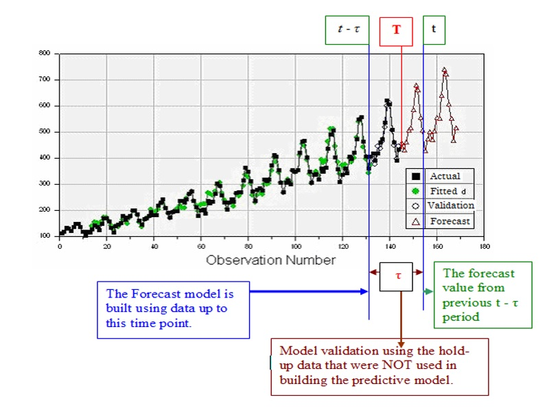
```

**Seasonal/Cycle Frequency** is used to define time series objects for forecasting models in R library **{forecast}**. In the R function **ts()**, the argument **frequency** needs to be specified.

The "**frequency**" is the number of observations <font color = "red">**\color{red}per seasonal cycle**</font>. When using the ts() function in R, the following choices should be used.

|  Data    |  frequency  |
|:--------:|:-----------:|
|  Annual  |     1       |
| Quarterly|     4       |
| Monthly  |    12       |
| Weekly   |    52       |

Actually, there are not 52 weeks in a year, but 365.25/7 = 52.18 on average. But most functions that use **ts** objects require integer frequency.

Once the frequency of observations is smaller than a week, then there is usually more than one way of handling the frequency. For example, data <font color = "red">*\color{red}observed every minute*</font> might have an **hourly seasonality** (frequency=60), a **daily seasonality** (frequency=24x60=1440), a **weekly seasonality** (frequency=24x60x7=10080), and an **annual seasonality** (frequency=24x60x365.25=525960). If we want to use a **ts** object, then we need to decide which of these is the most important.


## Baseline Methods

**Working Data Set**: The Nile dataset was selected to expand knowledge of time series analysis.  The Nile dataset contains 100 annual readings of the Nile River at Aswan from the years 1871 to 1970 (Anonymous, n.d.-a).  Time series analysis and modeling are concerned with data elements that are ordered in a temporal fashion. The Nile data set is analyzed using various time series approaches and the results are discussed.

```{}
1120, 1160, 963, 1210, 1160, 1160, 813, 1230, 1370, 1140, 995, 935, 1110, 994, 1020, 960,
1180, 799, 958, 1140, 1100, 1210, 1150, 1250, 1260, 1220, 1030, 1100, 774, 840, 874, 694,
940, 833, 701, 916, 692, 1020, 1050, 969, 831, 726, 456, 824, 702, 1120, 1100, 832, 764, 
821, 768, 845, 864, 862, 698, 845, 744, 796, 1040, 759, 781, 865, 845, 944, 984, 897, 822,
1010, 771, 676, 649, 846, 812, 742, 801, 1040, 860, 874, 848, 890, 744, 749, 838, 1050, 
918, 986, 797, 923, 975, 815, 1020, 906, 901, 1170, 912, 746, 919, 718, 714, 740
```

When fitting time series models in R, most of the R functions for the time series require a time series object which has a special structure and other features. For a given numeric vector, we can use the R function **ts()** in the library **forecast**.

```{r}
nile.vec = c(1120, 1160, 963, 1210, 1160, 1160, 813, 1230, 1370, 1140, 995, 935, 1110, 994,
1020, 960, 1180, 799, 958, 1140, 1100, 1210, 1150, 1250, 1260, 1220, 1030, 1100, 774, 840,
874, 694, 940, 833, 701, 916, 692, 1020, 1050, 969, 831, 726, 456, 824, 702, 1120, 1100, 832,
764, 821, 768, 845, 864, 862, 698, 845, 744, 796, 1040, 759, 781, 865, 845, 944, 984, 897,
822, 1010, 771, 676, 649, 846, 812, 742, 801, 1040, 860, 874, 848, 890, 744, 749, 838, 1050,
918, 986, 797, 923, 975, 815, 1020, 906, 901, 1170, 912, 746, 919, 718, 714, 740)
##
nile.ts = ts(nile.vec, 
             start = 1871, 
             end = 1970, 
             frequency =1  # one observation per year. 
                           # if there is a weekly seasonal pattern,
                           # then the frequency = 52
             )
 nile.ts
```
This data set is included in library{forecast} as a time series object. We can view the data values in this time series by typing *Nile* to view the time series object. 


**Moving Average Method**

The moving average method forecasts all future values to be equal to the average (or “mean”) of the historical data. If we let the historical data be denoted by  $\{y_1, y_2, \cdots, y_T \}$, then we can write the forecasts as

$$
\hat{y}_{T+h|T} = (y_1+y_2+\cdots+y_T)/T
$$

$\hat{y}_{T+h|T}$ is the estimated value of $y_{T+h|T}$ based on $\{y_1, y_2, \cdots, y_T \}$. 

**Example 1**. We only use the basic moving average on the Nile River data. The following plot shows the pattern of the time series.

```{r}
nile.fcast <- meanf(Nile, h=10)
plot(nile.fcast)
```

The forecasted values for 10 future periods (h = 10 is called the forecast horizon) are given below

```{r}
kable(nile.fcast, caption = "Forecasted readings of the next 10 years with 
      a confidence level at 80% and 95%, respectively.")
```

**Naïve method**

For naïve forecasts, we simply set all forecasts to be the value of the last observation. That is,

 $$
 \hat{y}_{T+h|T} = y_T
 $$
 
The naive forecast method works really well on the time series data generated from a process in which the next value in the sequence is a modification of the previous value in the sequence.

**Example 2**. We will use the naive forecast method on the Nile River data.

The forecasted values for the three future periods and the forecasted intervals are plotted in the following figure. 

```{r fig.align='center', fig.width=5, fig.height=3}
naive.nile = naive(Nile, h=3)
plot(naive.nile)
```

The corresponding values and confidence intervals are given in the following table.

```{r}
kable(naive.nile, caption = "Naive forecasting method on Nile River data")
```

## Seasonal Naive Method

The values of seasonal time series data are influenced by seasonal factors (e.g., the quarter of the year, the month, or the day of the week). seasonal time series are also called periodic time series.

If a data set has a seasonal pattern such as weekly and monthly patterns, the **moving average** and **naive** methods work poorly. We need a method to capture the seasonal pattern. The **seasonal naive method** is modified from the **naive method** and has the following explicit forecasting function

$$
\hat{y}_{T+h|T} = y_{T+h-m(k+1)}
$$

where $m =$ the seasonal period and $k$ is the integer part of $(h-1)/m$ (i.e., the number of complete years in the forecast period before time $T + h$). The forecasting formula looks complex, but it essentially says that, for example, with monthly data, the seasonal naive method forecasts for all future February values are equal to the last observed February value.

**Example 3** Nottingham monthly average temperature - the following data set is a collection of average monthly temperatures in Nottingham from 1920-1939. Since this is monthly data, when we define the time series object with **ts()**, the option **frequency** should be set to 12.

```{r}
nottem =c(40.6,40.8,44.4,46.7,54.1,58.5,57.7,56.4,54.3,50.5,42.9,39.8,44.2,39.8,45.1,47.0,
          54.1,58.7,66.3,59.9,57.0,54.2,39.7,42.8,37.5,38.7,39.5,42.1,55.7,57.8,56.8,54.3,
          54.3,47.1,41.8,41.7,41.8,40.1,42.9,45.8,49.2,52.7,64.2,59.6,54.4,49.2,36.3,37.6,
          39.3,37.5,38.3,45.5,53.2,57.7,60.8,58.2,56.4,49.8,44.4,43.6,40.0,40.5,40.8,45.1,
          53.8,59.4,63.5,61.0,53.0,50.0,38.1,36.3,39.2,43.4,43.4,48.9,50.6,56.8,62.5,62.0,
          57.5,46.7,41.6,39.8,39.4,38.5,45.3,47.1,51.7,55.0,60.4,60.5,54.7,50.3,42.3,35.2,
          40.8,41.1,42.8,47.3,50.9,56.4,62.2,60.5,55.4,50.2,43.0,37.3,34.8,31.3,41.0,43.9,
          53.1,56.9,62.5,60.3,59.8,49.2,42.9,41.9,41.6,37.1,41.2,46.9,51.2,60.4,60.1,61.6,
          57.0,50.9,43.0,38.8,37.1,38.4,38.4,46.5,53.5,58.4,60.6,58.2,53.8,46.6,45.5,40.6,
          42.4,38.4,40.3,44.6,50.9,57.0,62.1,63.5,56.3,47.3,43.6,41.8,36.2,39.3,44.5,48.7,
          54.2,60.8,65.5,64.9,60.1,50.2,42.1,35.8,39.4,38.2,40.4,46.9,53.4,59.6,66.5,60.4,
          59.2,51.2,42.8,45.8,40.0,42.6,43.5,47.1,50.0,60.5,64.6,64.0,56.8,48.6,44.2,36.4,
          37.3,35.0,44.0,43.9,52.7,58.6,60.0,61.1,58.1,49.6,41.6,41.3,40.8,41.0,38.4,47.4,
          54.1,58.6,61.4,61.8,56.3,50.9,41.4,37.1,42.1,41.2,47.3,46.6,52.4,59.0,59.6,60.4,
          57.0,50.7,47.8,39.2,39.4,40.9,42.4,47.8,52.4,58.0,60.7,61.8,58.2,46.7,46.6,37.8)
nottem.ts = ts(nottem, frequency = 12, start = c(1920, 1))
```
Next, we plot the original series and the forecasted future values as well. Assuming forecasting horizon h = 5.

```{r}
seasonal.naive = snaive(nottem, h = 5)
plot(seasonal.naive)
```

The actual forecasted temperatures in the next 5 months and their predictive intervals are given by

```{r}
kable(seasonal.naive, caption="Forecasted monthly average temperatures of Nottingham between Jan - May 1940")
```

## Drift Method

The seasonal naive method allows non-constant predictive values by taking the same values from the time period in the previous season. The drift method is another variation of the naive method that allows the forecasts to increase or decrease over time. To be more specific, the next one-step forecast value is set to be the average change seen in the historical data. Thus the forecast for time $T + h$ is given by $$\hat{y}_{T+h|T} = y_T +h(y_T-y_1)/(T-1)$$

where the amount of change over time $y_T-y_1$ is called the drift. This is where the name of the method comes from.  


**Example 4** New York City Monthly Birth Counts - the dataset contains the number of births per month in New York City, from January 1946 to December 1958. The data set can be downloaded from  <https://raw.githubusercontent.com/pengdsci/sta321/main/datasets/w11-nycbirths.txt>.  We will use the seasonal naive method to forecast future values using function **naive()** in library{forecast}. 

```{r}
nycbirth = read.table("https://raw.githubusercontent.com/pengdsci/sta321/main/datasets/w11-nycbirths.txt")
births <- ts(nycbirth, frequency = 12, start = c(1946, 1))
drift.pred = rwf(births, h= 5, drift = TRUE)
plot(drift.pred)
```

As usual, we can extract the predicted value from the above drift forecast procedure in the following

```{r}
kable(drift.pred, caption = "Forecast birth counts using the drift method")
```


# Accuracy Measures in Time Series Forecasting

## Training and Testing Data

To evaluate forecast accuracy using genuine forecasts, we separate the available data into two portions, training and test data, where the training data is used to estimate any parameters of a forecasting method, and the test data is used to evaluate its accuracy. We have used this logic in logistic predictive modeling. The difference is that we cannot use the random split method as we did in the predictive modeling using logistic regression.

We have introduced several baseline forecasting methods in the previous section. 

```{r echo = FALSE, fig.align='center'}
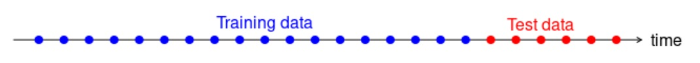
```


## Forecasting Errors

In a given time series data with n observations, we hold up k observations for evaluating forecast errors and use the rest of the $n-k$ values to build time series models. We set the forecast horizon h = k. We can find the difference between the predicted and actual hold-up values to define various error metrics in the following table.

```{r echo = FALSE, fig.align='center'}
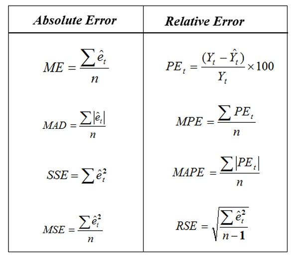
```

The error term $\hat{e}_i = \hat{y}_i - y_i$. We will use the above error measures to define the accuracy metrics in a case study. 

# Case Study

**Daily Female Births Dataset**: This dataset describes the number of daily female births in California in 1959. The units are a count and there are 365 observations


**A. Training and testing data**

```{r}
female.births = read.csv("https://raw.githubusercontent.com/pengdsci/sta321/main/datasets/w11-daily-total-female-births.csv")[,-1]
## training and testing data: hold-up last 6 months of data for calculating forecasting errors
training = female.births[1:350]
testing = female.births[351:365]
##
female.births.ts = ts(training, frequency = 12, start = c(1959, 1))
## shampoo.ts
```

**B. Building 4 Forecasting Models**

We next use the four baseline forecasting methods and the first 30 data values to forecast the next 6 month's data values.

```{r}
pred.mv = meanf(female.births.ts, h=15)$mean
pred.naive = naive(female.births.ts, h=15)$mean
pred.snaive = snaive(female.births.ts, h=15)$mean
pred.rwf = rwf(female.births.ts, h=15, drift = TRUE)$mean
###
###
pred.table = cbind( pred.mv = pred.mv,
                    pred.naive = pred.naive,
                    pred.snaive = pred.snaive,
                    pred.rwf = pred.rwf)
kable(pred.table, caption = "Forecasting Table")
```

**C. Visualization**

We now make a time series plot and the predicted values. Note that, the forecast values were based on the model that uses 350 historical data in the time series. The following only show observations #320 -#365 and the 15 forecasted values.

```{r}
plot(340:365, female.births[340:365], type="l", xlim=c(340,365), ylim=c(20, 90),
     xlab = "observation sequence",
     ylab = "Female birth counts",
     main = "Monthly female counts and forecasting")
points(340:365, female.births[340:365],pch=20)
##
points(351:365, pred.mv, pch=15, col = "red")
points(351:365, pred.naive, pch=16, col = "blue")
points(351:365, pred.rwf, pch=18, col = "navy")
points(351:365, pred.snaive, pch=17, col = "purple")
##
lines(351:365, pred.mv, lty=2, col = "red")
lines(351:365, pred.snaive, lty=2, col = "purple")
lines(351:365, pred.naive, lty=2, col = "blue")
lines(351:365, pred.rwf, lty=2, col = "navy")
## 
legend("topright", c("moving avergae", "naive", "drift", "seasonal naive"),
       col=c("red", "blue", "navy", "purple"), pch=15:18, lty=rep(2,4),
       bty="n", cex = 0.8)
```

We can see that the **moving average** method worked pretty well. The performance of naive and drift methods in this seasonal time series are close to each other. But **naive**, **seasonal naive**, and **drift** methods worked poorly compared to the **moving average** method.

Intuitively, **moving average** should produce non-constant forecast values. What 


**D. Accuracy Metrics**

We will use the mean absolute prediction error (MAPE) to compare the performance of the four forecasting methods.


```{r}
true.value = female.births[351:365]
PE.mv =  100*(true.value - pred.mv)/true.value
PE.naive =  100*(true.value - pred.naive)/true.value
PE.snaive =  100*(true.value - pred.snaive)/true.value
PE.rwf =  100*(true.value - pred.rwf)/true.value
##
MAPE.mv = mean(abs(PE.mv))
MAPE.naive = mean(abs(PE.naive))
MAPE.snaive = mean(abs(PE.snaive))
MAPE.rwf = mean(abs(PE.rwf))
##
MAPE = c(MAPE.mv, MAPE.naive, MAPE.snaive, MAPE.rwf)
## residual-based Error
e.mv = true.value - pred.mv
e.naive = true.value - pred.naive
e.snaive = true.value - pred.snaive
e.rwf = true.value - pred.rwf
## MAD
MAD.mv = sum(abs(e.mv))
MAD.naive = sum(abs(e.naive))
MAD.snaive = sum(abs(e.snaive))
MAD.rwf = sum(abs(e.rwf))
MAD = c(MAD.mv, MAD.naive, MAD.snaive, MAD.rwf)
## MSE
MSE.mv = mean((e.mv)^2)
MSE.naive = mean((e.naive)^2)
MSE.snaive = mean((e.snaive)^2)
MSE.rwf = mean((e.rwf)^2)
MSE = c(MSE.mv, MSE.naive, MSE.snaive, MSE.rwf)
##
accuracy.table = cbind(MAPE = MAPE, MAD = MAD, MSE = MSE)
row.names(accuracy.table) = c("Moving Average", "Naive", "Seasonal Naive", "Drift")
kable(accuracy.table, caption ="Overall performance of the four forecasting methods")
```

In summary, the **moving average method** has the best performance. Note that the methods introduced in this module are baseline forecasting. They are all descriptive since we did not use any statistical assumptions. In the next module, we will introduce a few formal non-parametric forecasting methods - exponential forecasting methods. We will use the same accuracy measures to compare different forecasting methods.

\

\


