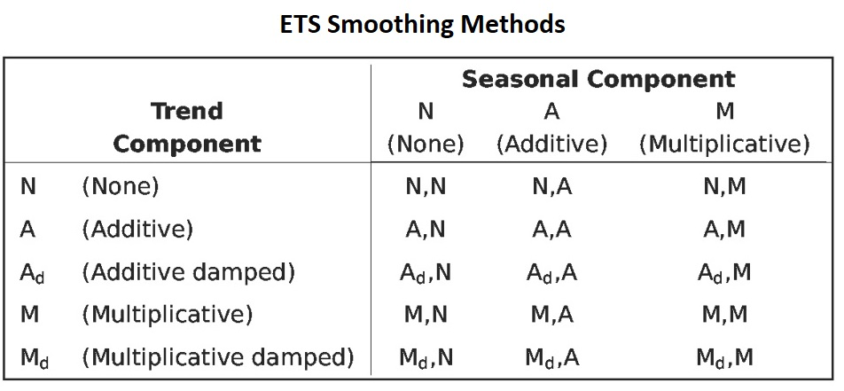
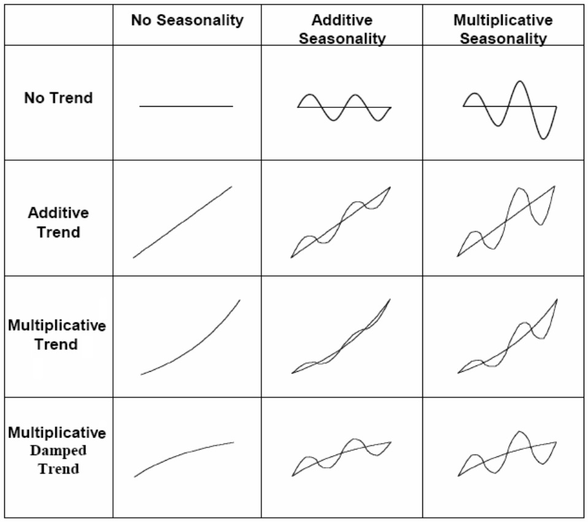
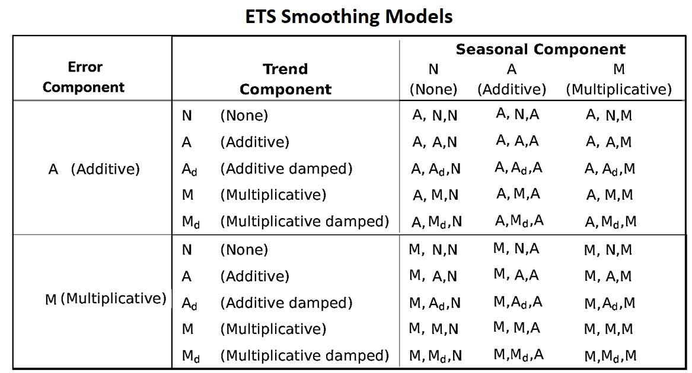

<style type="text/css">
h1.title {
  font-size: 20px;
  color: DarkRed;
  text-align: center;
}
h4.author { /* Header 4 - and the author and data headers use this too  */
    font-size: 18px;
  font-family: "Times New Roman", Times, serif;
  color: DarkRed;
  text-align: center;
}
h4.date { /* Header 4 - and the author and data headers use this too  */
  font-size: 18px;
  font-family: "Times New Roman", Times, serif;
  color: DarkBlue;
  text-align: center;
}
h1 { /* Header 3 - and the author and data headers use this too  */
    font-size: 22px;
    font-family: "Times New Roman", Times, serif;
    color: darkred;
    text-align: center;
}
h2 { /* Header 3 - and the author and data headers use this too  */
    font-size: 18px;
    font-family: "Times New Roman", Times, serif;
    color: navy;
    text-align: left;
}

h3 { /* Header 3 - and the author and data headers use this too  */
    font-size: 15px;
    font-family: "Times New Roman", Times, serif;
    color: navy;
    text-align: left;
}

h4 { /* Header 4 - and the author and data headers use this too  */
    font-size: 18px;
    font-family: "Times New Roman", Times, serif;
    color: darkred;
    text-align: left;
}
</style>

```{r setup, include=FALSE}
# code chunk specifies whether the R code, warnings, and output 
# will be included in the output files.
if (!require("ISwR")) {
   install.packages("ISwR")
   library(ISwR)
}
if (!require("MASS")) {
   install.packages("MASS")
   library(MASS)
}
if (!require("knitr")) {
   install.packages("knitr")
   library(knitr)
}
if (!require("forecast")) {
   install.packages("forecast")
   library(forecast)
}


knitr::opts_chunk$set(echo = TRUE,       
                      warnings = FALSE,   
                      results = TRUE,   
                      message = FALSE,
                      fig.align='center', 
                      fig.pos = 'ht')
```


# Introduction


Exponential smoothing methods are a family of algorithms that forecast future values by using exponentially decreasing weights of historical observations to forecast new values. Therefore as observations get older, the importance of these values diminishes exponentially. The more recent the observation the higher the associated weight. The exponentially decreasing weights are controlled by several smoothing coefficients based on the patterns of the underlying time series. 


There are some obvious **advantages** of exponential smoothing methods:

* Exponential smoothing is very simple in concept and structure. It is also very easy to understand.

* Exponential smoothing is very powerful because of its exponentially-decayed weighting process.

* Exponential smoothing methods including Holt-Winters methods are appropriate for non-stationary data. In fact, they are only really appropriate if the data are non-stationary. Using an exponential smoothing method on stationary data is not wrong but is sub-optimal.

* Because exponential smoothing relies on only two pieces of data: (1). the last period's actual value; (2). the forecast value for the same period. This minimizes the use of random access memory (RAM). 

* Exponential smoothing requires minimum intervention in terms of model maintenance, it is can be adapted to make large-scale forecasting.


There are also **limitations** of exponential smoothing methods:

* The method is useful for short-term forecasting only. It assumes that future patterns and trends will not change significantly from the current patterns and trends. This kind of assumption may sound reasonable in the short term. However, it creates problems for the long-term forecast.

* Exponential smoothing will lag. In other words, the forecast will be behind, as the trend increases or decreases over time.

* Exponential smoothing will fail to account for the dynamic changes at work in the real world, and the forecast will constantly require updating to respond to new information.


To avoid getting bogged down in too much technical detail for various smoothing methods, we only outline the basic components in exponential smoothing models built on several reliable smoothing algorithms under the ETS framework in the following sections.


# ETS Framework

The general exponential smoothing methods combine **error (E)**, **trend (T)**, and **seasonal(S)** components in such a way that the resulting functional forms and relevant smoothing coefficients best fit the historical data.  **Each term** can be combined in one of three different ways: additive (**A**), multiplicative (**M**), and None (**N**). These three terms (**E**rror, **T**rend, and **S**eason) together with the ways of combinations are referred to as the **ETS** framework. **ETS** is also called the abbreviation of **E**xponen**T**ial **S**moothing.


The following table summarizes the possible ways to construct smoothing algorithms and forecasting models within the ETS framework.


|      Error (E)         |          Trend (T)              |      Seasonality (S)        |
|:----------------------:|:-------------------------------:|:---------------------------:|
| Additive: **A**        |  Additive: **A**                |  Additive: **A**            |
| Multiplicative: **M**  |  Multiplicative: **M**          |  Multiplicative: **M**      |
|                        |  None: **N**                    |  None: **N**                |
|                        |  Additive Damped **Ad**         |                             |
|                        |  Multiplicative damped: **Md**  |                             |


## Exponential Smoothing Methods

The idea of exponential smoothing is to smooth out the random fluctuations to see a clearer signal (trend and cycle, and seasonality). Depending on the pattern of the underlying time series, there are 15 different smoothing methods. 

```{r echo = FALSE, fig.align='center', fig.width=5, fig.height=5, fig.cap = "ETS smoothing methods"}

```
The patterns in different smoothing methods (except for the damped additive trend) are sketched in the following figure.

```{r echo = FALSE, fig.align='center', fig.width=5, fig.height=5, fig.cap = "ETS smoothing charts"}

```

These patterns can be used in selecting specific smoothing models from the complete list of all possible models outlined in the following section.

## Exponential Smoothing Models


The smoothing methods can only produce a point forecast. We can attach random error to the smoothing methods to build statistical forecast models. We can attach the error term to the combined trend and seasonality in the form of addition or multiplication. There are 30 exponential smoothing models.


```{r echo = FALSE, fig.align='center', fig.width=5, fig.height=5, fig.cap = "ETS smoothing models"}

```
We can use the notation **ETS(error, trend, seasonality)** to represent different smoothing models. For example, (1) **ETS(A,N,N)** - simple exponential smoothing model with additive errors, (2) **ETS(A,A,N)** - additive trend with additive errors (so Holt's linear method with additive errors).  

Since some of the ETS smoothing models are unstable, in this note, we only focus on a few commonly used smoothing models:

* **ETS(A,N,N)**: Simple exponential smoothing with additive errors.

* **ETS(A,A,N)**: Holt’s linear method with additive errors.

* **ETS(A,A,A)**: Additive Holt-Winters’ method with additive errors.

* **ETS(M,A,M)**: Multiplicative Holt-Winters’ method with multiplicative errors.

* **ETS(A,$A_d$,N)**: Damped trend method with additive errors.


## Estimation Smoothing Parameters in Smoothing Models


There are different ways to estimate the coefficient of the smoothing parameter. One way is to find the smoothing parameters by minimizing the means square error (MSE). This is similar to the least square method. This is a distribution-free method and can be used to automate the exponential smoothing models.

The other method is the **likelihood** approach. After we include a random error with specific parametric distribution, we can estimate the coefficient parameters by using the likelihood method. We will not discuss estimation methods in detail.

Most of the smoothing models are implemented in the R library **forecast**. We will use this library to perform data analysis in this note. 


# Simple Exponential Smoothing

Exponential smoothing is a very popular scheme to produce a smoothed time series and assigns exponentially decreasing weights as the observation gets older. That is, more recent data points affect the forecast trend more heavily than older data points. This unequal weighting is accomplished by using one or more smoothing constants.

Assume we have historical data $\{Y_1, Y_2, \cdots, Y_T \}$, the forecast value of the next period is 

$$
Y_{(T+1)|T} = \alpha Y_T + \alpha(1-\alpha)Y_{T-1} + \alpha(1-\alpha)^2Y_{T-2}+\alpha(1-\alpha)^3Y_{T-3} + \cdots
$$

$0 < \alpha < 1$ is called **smoothing coefficients**. The forms of the coefficients in the above expression  


It provides a forecasting method that is most effective when the components like trend and seasonal factors of the time series may change over time. Several equivalent formulations of simple exponential smoothing:

* $Y_{(t+1)|t} = \alpha Y_t + (1-\alpha)Y_{t|(t-1)}$.

* Forecasting form: $\hat{Y}_{t+1|t} = \mathfrak{l}_t$

* Smoothing equation: $\mathfrak{l}_t = \alpha Y_t + (1-\alpha)\mathfrak{l}_{t-1}$

* Error correction form: $\mathfrak{l}_t=\mathfrak{l}_{t-1} + \alpha (y_t-\mathfrak{l}_{t-1}) = \mathfrak{l}_{t-1} + \alpha e_{t}$, where $e_t=y_t - \mathfrak{l}_{t-1} = y_t-\hat{y}_{t|t-1}$.

**Example** We use stock price data to build three models with different smoothing coefficients and then use the accuracy measures to choose the optimal smoothing model. The optimal smoothing coefficient will be identified by the built-in algorithm and will be reported in the output (if the $\alpha$ is not specified in the model formula).

```{r fig.align='center',fig.width=6, fig.height=5, fig.cap="Comparing simple exponential models with various smoothing coefficients."}
stock=read.table("https://raw.githubusercontent.com/pengdsci/sta321/main/ww13/w13-stockprice.txt")
price=stock$V1[1:35]
fit1 = ses(price, alpha=0.2, initial="optimal", h=3)
fit2 = ses(price, alpha=0.6, initial="simple", h=3)
fit3 = ses(price, h=3)  ## alpha is unspecified, it will be estimated
plot(fit1,  ylab="Stock Price",
  xlab="Time", main="", fcol="white", type="o", lwd=2, cex=0.5)
title("Comparing SES Models: Different Smoothinh Coefficients")
lines(fitted(fit1), col="blue", type="o", cex=0.5)
lines(fitted(fit2), col="red", type="o", cex=0.5)
lines(fitted(fit3), col="darkgreen", type="o", cex=0.5)
points(fit1$mean, col="blue", pch=16) ## plot forecast values
points(fit2$mean, col="red", pch=18)
points(fit3$mean, col="darkgreen", pch=21)
legend("bottomleft",lty=1, col=c(1,"blue","red","darkgreen"),
  c("data", expression(alpha == 0.2), expression(alpha == 0.6),
  expression(alpha ==  0.9332)),pch=1)
```

The following table summarizes the accuracy measures based on various smoothing models with different smoothing coefficients.


```{r}
accuracy.table = round(rbind(accuracy(fit1), accuracy(fit2), accuracy(fit3)),4)
row.names(accuracy.table)=c("alpha=0.2", "alpha=0.6", "optimal alpha = 0.09332")
kable(accuracy.table, caption = "The accuracy measures of simple exponential 
      smoothing models with different smoothing coefficients.")
```

**Remark**: The above measures are based on the training data (i.e., based on the observed values and the fitted values). We can also hold up test data to calculate the actual accuracy measures. 


# Holt's Smoothing Model: Linear (additive) Trend 

Holt generalized simple exponential smoothing by adding a trend parameter to allow the forecasting of data with a linear trend. The model components are given in the following:

* Forecast function: $\hat{y}_{t+h|t} = \mathfrak{l}_t + h b_t$.

* Level: $\mathfrak{l}_t = \alpha y_t + (1-\alpha)(\mathfrak{l}_{t-1} + b_{t-1})$.

* Trend: $b_t=\beta^*(\mathfrak{l}_t-\mathfrak{l}_{t-1}) + (1-\beta^*)b_{t-1}$.

* Error: $e_t = y_t-{\mathfrak{l}_{t-1} + b_t} = y_t-\hat{y}_{t|t-1}$.

where $\alpha$ is the smoothing coefficient for level and $\beta^*$ the smoothing coefficient of trend. The smoothing coefficients are estimated by minimizing the sum of the squared error (SSE) of the model. 

The R function **holt()** computes the smoothing coefficients and forecasts future values for a given $h$ period of future values.


**Example 2**: We apply Holt’s method to annual passenger numbers for Australian airlines from 1990 to 2016. 

```{r fig.align='center',fig.width=6, fig.height=5, fig.cap=" Comparing Holt's exponential trend models with various smoothing coefficients."}
ausair=read.table("https://raw.githubusercontent.com/pengdsci/sta321/main/ww13/w13-ausair.txt")[,3]
air = ts(ausair,start=1990,end=2016)
fit0 = holt(air, initial="simple", exponential=TRUE,h=5)  ### optimal alpha and beta
fit1 = holt(air, alpha=0.8, beta=0.2, exponential=TRUE, initial="simple", h=5)
###### Plot the original data
plot(fit0, lwd=2,type="o", ylab="Air Passengers", xlab="Time",
     fcol="white", ylim=c(10, 110))
lines(fitted(fit0), col="red")
lines(fitted(fit1), col="blue")
#points(fit0, col="black", pch=1)
points(fitted(fit0), col="red", pch=16, cex=0.6)
points(fitted(fit1), col="blue", pch=22, cex=0.6)
#######################
lines(fit0$mean, col="red", type="o")
lines(fit1$mean, col="blue", type="o")
legend("topleft", lty=1, col=c("red","black","blue"),pch=c(16,1,22),
   c("Holt's Exp Trend(optimal)","Data","Holt's Exp trend"), bty="n")

```

As expected, we can see from the above chart that

* the smoothing model with exponential trend works equally well as the linear trend model for air passenger data;

* the smoothing model with exponential trend works better than the linear trend model for the beverage data;


# Damped Trend Methods


Empirical evidence indicates that these methods tend to over-forecast, especially for longer forecast horizons. Gardner's damped trend models are shown to be effective in improving accuracy for prediction. 

To capture the damped trend (the trend component curve flattens over time instead of being linear), in addition to the two smoothing parameters $\alpha$ and $\beta^*$ in linear and exponential trend models, Gardener added a third parameter $\phi$ ($0< \phi < 1$) that damps the trend as h gets bigger.


**For an additive (linear) trend model**, the additional parameter is added in the model component in the following form.

* Forecast Model: $\hat{y}_{t+h|t} = \mathfrak{l}_t + (1 + \phi+\phi^2|\cdots+\phi^h)b_t$

* Level: $\mathfrak{l}_t = \alpha y_t + (1-\alpha)(\mathfrak{l}_{t-1}+\phi b_{t-1})$

* Trend: $b_t = \beta^* (\mathfrak{l}_t-\mathfrak{l}_{t-1}) + (1-\beta^*)\phi b_{t-1}$. where $\phi$ is called the **damping parameter**.

Let error $e_t = y_t-(\mathfrak{l}_{t-1}+b_{t-1})=y_t-\hat{y}_{t|t-1}$, then the level and trend can be re-expressed as 

* Level: $\mathfrak{l}_t = \mathfrak{l}_{t-1} + \phi b_{t-1} + \alpha e_t$.

* Additive Trend: $b_t=\phi b_{t-1} + \alpha \beta^* e_t$.


**For a multiplicative (exponential) trend mode**, the additional parameter is added in the model component in the following form.

* Forecast Model: $\hat{y}_{t+h|t} = \mathfrak{l}_t b_{t}^{(1 + \phi+\phi^2|\cdots+\phi^h)}$.

* Level: $\mathfrak{l}_t = \alpha y_t + (1-\alpha)\mathfrak{l}_{t-1}b_{t-1}^\phi$

* Multiplicative Trend: $b_t=\beta^*\mathfrak{l}_t/\mathfrak{l}_{t-1} + (1-\beta^*) b_{t-1}^\phi$.

Since this is a modification of the smoothing model with the exponential trend, $b_t$ and $h$ are interpreted in the same way as in the exponential trend smoothing model and $\phi$ is between 0 and 1, exclusively.

Let error $e_t = y_t - \hat{y}_{t-1|t} = y_t-\mathfrak{l}_{t-1}b_{t-1}$. The corresponding error correction form is given by

* Level: $\mathfrak{l}_t = \alpha e_t + \mathfrak{l}_{t-1} b_{t-1}^\phi$.

* Multiplicative Trend: $b_t = b_{t-1}^\phi + \alpha\beta^* e_t/\mathfrak{l}_{t-1}$


**Example 3**: We use Australian GDP data as an example to illustrate the application of the R function holt() for the damped trend models (both additive and multiplicative models).

```{r fig.align='center',fig.width=6, fig.height=5, fig.cap="Comparing Holt's exponential damped trend models."}
ausgdp = read.table("https://raw.githubusercontent.com/pengdsci/sta321/main/ww13/w13-ausgdp.txt")
ausgdp0=ts(ausgdp$V1,frequency=4,start=1971+2/4)
ausgdp1=ausgdp$V1
fit1 = ses(ausgdp1)
fit2 = holt(ausgdp1)
fit3 = holt(ausgdp1,exponential=TRUE)
fit4 = holt(ausgdp1,damped=TRUE)      ## additive damping
fit5 = holt(ausgdp1,exponential=TRUE,damped=TRUE)  ## multiplicative dampling
###
plot(fit3, type="o", ylab="Australia GDP",flwd=1, 
main="Comparison of various smoothing models")
lines(fitted(fit1),col=2)
lines(fitted(fit2),col=3)
lines(fitted(fit4),col=5)
lines(fitted(fit5),col=6)
######
lines(fit1$mean,col=2)
lines(fit2$mean,col=3)
lines(fit4$mean,col=5)
lines(fit5$mean,col=6)
legend("topleft", lty=1, pch=1, col=1:6,
    c("Data","SES","Holt's","Exponential",
      "Additive Damped","Multiplicative Damped"), cex=0.8, bty="n")

```


```{r}
accuracy.table = round(rbind(accuracy(fit1), accuracy(fit2), accuracy(fit3), 
                             accuracy(fit4), accuracy(fit5)),4)
row.names(accuracy.table)=c("SES","Holt's","Exponential",
                    "Additive Damped","Multiplicative Damped")
kable(accuracy.table, caption = "The accuracy measures of various exponential 
      smoothing models")
```

From the above accuracy table, we can see the additive and multiplicative damped trend models are better than other models. The additive damped model is marginally better than the multiplicative damped model.


# Holt-Winters Model for Trend and Seasonal Data 

Holt and Winter's exponential smoothing method is used to deal with time series containing both trend and seasonal variation. There are two Holt-Winter (HW) models: Additive and Multiplicative models. 

**The additive method** is preferred when the seasonal variations are roughly constant through the series, while **the multiplicative method** is preferred when the seasonal variations are changing proportionally to the level of the series.

The Holt-Winters seasonal method comprises the forecast equation and three smoothing equations — one for the level $\mathfrak{l}_t$, one for trend $b_t$, and one for the seasonal component denoted by $s_t$, with smoothing parameters $\alpha$, $\beta^*$ and $\gamma$.


**Additive Holt-Winters Model** Components of additive HW model:

* Level: $\mathfrak{l}_t = \alpha(y_t-s_{t-s})+(1-\alpha)(\mathfrak{l}_{t-1} + b_{t-1})$.

* Trend: $b_t=\beta^*(\mathfrak{l}_t-\mathfrak{l}_{t-1})+(1-\beta^*)b_{t-1}$.

* Seasonality: $s_t=\gamma(y_t-\mathfrak{l}_{t-1}) +(1-\gamma)s_{t-s}$.

* Forecast Model: $\hat{y}_{t+h|t} = \mathfrak{l}_t + hb_t + s_{t-s+h}$.

where $s$ is the length of the seasonal cycle, for $0 \le \alpha \le 1$ , $0 \le \beta^* \le 1$,  and  $0 \le \gamma \le 1$. $h$ is the number of periods to be predicted.

Let $e_t=\hat{y}_t - \hat{y}_{t|t-1} = y_t-(\mathfrak{l}_{t-1} + b_{t-1} + s_{t-1})$ be the one-step training error, we can re-express level, trend and seasonality equation in the following form:

* Level: $\mathfrak{l}_t= \mathfrak{l}_{t-1} + b_{t-1} + \alpha e_t$.

* Trend: $b_t = b_{t-1} + \alpha \beta^* e_t$.

* Seasonality: $s_t = s_{t-2} + \gamma e_t$.

Interpretations of individual components:

**Level**: the current level is the weighted average of the difference between the current observation and previous seasonality and the sum of the previous level and trend.

**Trend**: the current trend is the weighted average of the previous trend and the difference between the current level and the previous level.

**Seasonality**: the current seasonality is the weighted average of the previous seasonality and the difference between the current observation and the current level. 


**Multiplicative Holt-Winters Model**: An alternative Holt-Winter’s model multiplies the forecast by a seasonal factor. Its equations are:

* Level: $\mathfrak{l}_t=\alpha y_t/s_{t-s} + (1-\alpha)(\mathfrak{l}_{t-1}+b_{t01})$.

* Trend: $b_t = \beta^*(\mathfrak{l}_t - \mathfrak{l}_{t-1}) + (1-\beta^*)b_{t-1}$.

* Seasonality: $s_t = \gamma y_t/(\mathfrak{l}_{t-1}+b_{t-1}) + (1-\gamma)s_{t-s}$.

* Forecast Model: $\hat{y}_{t+h|t} = (\mathfrak{l}_t + h b_t)s_{t-s-h}$.

where $s$ is the length of the seasonal cycle, for $0 \le \alpha \le 1$ , $0 \le \beta^* \le 1$, and  $0 \le \gamma \le 1$. $h$ is the number of periods to be predicted.

Similarly, we denote the one-step error for the multiplicative model to be $e_t=\hat{y}_t-\hat{y}_{t|t-1} = y_t -(\mathfrak{l}_{t-1}+b_{t-1} + s_{s-t})$, the error correction representation of the model can be written as

* Level: $\mathfrak{l}_t = \mathfrak{l}_{t-1} + b_{t-1} + \alpha e_t/s_{t-s}$.

* Trend: $b_t = b_{t-1} + \alpha\beta^* e_t / s_{t-s}$.

* Seasonality: $s_t = s_{t-s} + \gamma e_t /(\mathfrak{l}_{t-1}+b_{t-1})$.


**Holt-Winters Model with a Damped Trend and Multiplicative Seasonality**.  This is a simple modification of the HW multiplicative model with a damped trend. The model formulation is given below

* Level: $\mathfrak{l}_t = \alpha y_t/s_{t-s} + (1-\alpha)(\mathfrak{l}_{t-1}+\phi b_{t-1})$.

* Trend: $b_t = \beta^*(\mathfrak{l}_t - \mathfrak{l}_{t-1}) + (1-\beta^*)\phi b_{t-1}$.

* Seasonality: $s_t = \gamma y_t/(\mathfrak{l}_{t-1}+\phi b_{t-1}) + (1-\gamma)s_{t-s}$.

* Forecast Model: $\hat{y}_{t+h|t}=\left[\mathfrak{l}_t +(1 + \phi +\phi^2+ \cdots + \phi^h)b_t \right]s_{t-s+h}$. 

where $0< \phi < 1$.


Three R functions can be used to fit Holt-Winters model: **hw()**,**ets()**, and **HoltWinters()** in package **{forecast}**.

* The estimation of parameters used in function **HoltWinters()** uses **optim()** which requires the initial values for the parameters $\alpha$, $\beta^*$ and $\gamma$. The default initial values of these parameters are 0.3, 0.1, and 0.1. You can provide your own more accurate values. **HoltWinters()** is using heuristic values for the initial states and then estimating the smoothing parameters by optimizing the MSE.

* **ets()** also use **optim()** to estimate the parameters and the initial states by optimizing the likelihood function (which is only equivalent to optimizing the MSE for the linear additive models).

* **hw()** has the option to fit a HW model with a damped trend. **HoltWinters()** does not have the option.


**Example 4**: We use a simulated time series to illustrate how to R functions to fit various HW models. 

**HW models**: additive, multiplicative and damped HW models with R function **hw()**.

```{r fig.align='center',fig.width=6, fig.height=4.5, fig.cap=" Comparing Holt-Winter's (damped) trend and seasonal models."}
dat01=read.table("https://raw.githubusercontent.com/pengdsci/sta321/main/ww13/w13-ts3.txt")
datset=ts(dat01$V1+55, start=2000, frequency=12)
## Model building
fit1 = hw(datset,h=12, seasonal="additive")   # default h = 10
fit2 = hw(datset,h=12, seasonal="multiplicative")
fit3 = hw(datset,h=12, seasonal="additive",damped=TRUE)   
### plots
plot(fit2,ylab="Artificial Series",main="Various Holt-Winters Models",
     type="o", fcol="white", xlab="Year", ylim=c(0,300), cex = 0.6)
lines(fitted(fit1), col="red", lty=2, cex = 0.6)
lines(fitted(fit2), col="green", lty=2, cex = 0.6)
lines(fitted(fit3), col="blue", lty=2, cex = 0.6)
##
lines(fit1$mean, type="o", col="red", cex = 0.6)
lines(fit2$mean, type="o", col="green", cex = 0.6)
lines(fit3$mean, type="o", col="blue", cex = 0.6)
###
legend("topleft",lty=1, pch=1, col=c("black", "red", "green", "blue"),
  c("data","Holt Winters' Additive","Holt Winters' Multiplicative",
    "HW Additive Damped Trend"), cex=0.7, bty = "n")
```

The accuracy measures of the three models are summarized in the following table.


```{r}
accuracy.table = round(rbind(accuracy(fit1), accuracy(fit2), accuracy(fit3)),4)
row.names(accuracy.table)=c("Holt Winters' Additive","Holt Winters' Multiplicative",
    "HW Additive Damped Trend")
kable(accuracy.table, caption = "The accuracy measures of various Holt-Winter's 
        exponential smoothing models")
```

We can see from the above table that Holt-Winter’s additive model outperformed the other two models.


**HW models: additive, multiplicative, and damped HW models with R function HoltWinters()**.  Since **HoltWinters()** does not have the option to make predict values directly. We need to use the R function **predict.HoltWinters()** to make the prediction.


\newpage

```{r fig.align='center',fig.width=6, fig.height=4.5, fig.cap="Comparing Holt's exponential trend and seasonal models."}
dat01=read.table("https://raw.githubusercontent.com/pengdsci/sta321/main/ww13/w13-ts3.txt")
datset=ts(dat01$V1+55, start=2000, frequency=12)
## Model building
fit1 = HoltWinters(datset, seasonal="additive")   # default h = 10
fit2 = HoltWinters(datset, seasonal="multiplicative")
### plots
plot(fit1,ylab="Artificial Series",main="Various Holt-Winters Models", 
     type="o", xlab="Year", cex = 0.7)
#lines(fitted(fit1)[,1], col="red", lty=2)
lines(fitted(fit2)[,1], col="blue", lty=2, cex = 0.7)
###
legend("topleft",lty=1, pch=1, col=c("black", "red", "blue"),
  c("data","Holt Winters' Additive","Holt Winters' Multiplicative"),
  cex = 0.7, bty = "n")

```


The accuracy measures of the three models are summarized in the following table.

```{r fig.align='center',fig.width=6, fig.height=4.5, fig.cap="Exponential damped trend models with Holt-Winters Filtering."}
pred = predict(fit1, 50, prediction.interval = TRUE)
pred2 = predict(fit2, 50, prediction.interval = TRUE)
plot(fit1, pred, lwd=2, main="HW Models with R Function HoltWinters()")
lines(pred[,2], col="red", lwd=1, lty=3)
lines(pred[,3], col="red", lwd=1, lty=3)
lines(fitted(fit2)[,1], col="blue", lty=1, lwd=2)
lines(pred2[,2], col="blue", lty=2)
lines(pred2[,1], col="blue", lty=1, lwd=2)
lines(pred2[,3], col="blue", lty=2)
legend("topleft",lty=1, col=c("black", "red", "blue"),
  c("data","Holt Winters' Additive","Holt Winters' Multiplicative"),
  cex = 0.7, bty = "n")

```

The above figure shows that the original series is a typical exponential trend with a seasonal pattern. As expected, the Holt-Winters additive model performed poorly (a very wide prediction band). 


# Case study

In this case study, we use the beverage consumption data to compare various models introduced in this note.

```{r fig.align='center',fig.width=6, fig.height=4.5, fig.cap="Case study: Comparing various expoential smoothing models."}
beverage = read.table("https://raw.githubusercontent.com/pengdsci/sta321/main/ww13/w13-beverage01.txt")
test.bev = beverage$V1[169:180]
train.bev = beverage$V1[1:168]
bev=ts(beverage$V1[1:168], start=2000, frequency = 12)
fit1 = ses(bev, h=12)
fit2 = holt(bev, initial="optimal", h=12)             ## optimal alpha and beta
fit3 = holt(bev,damped=TRUE, h=12 )                   ## additive damping
fit4 = holt(bev,exponential=TRUE, damped=TRUE, h =12) ## multiplicative damp
fit5 = hw(bev,h=12, seasonal="additive")              ## default h = 10
fit6 = hw(bev,h=12, seasonal="multiplicative")
fit7 = hw(bev,h=12, seasonal="additive",damped=TRUE)
fit8 = hw(bev,h=12, seasonal="multiplicative",damped=TRUE)
```

```{r}
accuracy.table = round(rbind(accuracy(fit1), accuracy(fit2), accuracy(fit3), accuracy(fit4),
                             accuracy(fit5), accuracy(fit6), accuracy(fit7), accuracy(fit8)),4)
row.names(accuracy.table)=c("SES","Holt Linear","Holt Add. Damped", "Holt Exp. Damped",
                            "HW Add.","HW Exp.","HW Add. Damp", "HW Exp. Damp")
kable(accuracy.table, caption = "The accuracy measures of various exponential smoothing models 
      based on the training data")
```

The above table shows that the HW additive seems to be the most appropriate. 

```{r fig.align='center',fig.width=6, fig.height=6.5, fig.cap="Case study: Comparing various exponential smoothing models."}
par(mfrow=c(2,1), mar=c(3,4,3,1))
###### plot the original data
pred.id = 169:180
plot(1:168, train.bev, lwd=2,type="o", ylab="Beverage", xlab="", 
     xlim=c(1,180), ylim=c(2500, 7500), cex=0.3,
     main="Non-seasonal Smoothing Models")
lines(pred.id, fit1$mean, col="red")
lines(pred.id, fit2$mean, col="blue")
lines(pred.id, fit3$mean, col="purple")
lines(pred.id, fit4$mean, col="navy")
##
points(pred.id, fit1$mean, pch=16, col="red", cex = 0.5)
points(pred.id, fit2$mean, pch=17, col="blue", cex = 0.5)
points(pred.id, fit3$mean, pch=19, col="purple", cex = 0.5)
points(pred.id, fit4$mean, pch=21, col="navy", cex = 0.5)
#points(fit0, col="black", pch=1)
legend("bottomright", lty=1, col=c("red","blue","purple", "navy"),pch=c(16,17,19,21),
   c("SES","Holt Linear","Holt Linear Damped", "Holt Multiplicative Damped"), 
   cex = 0.7, bty="n")
###########
plot(1:168, train.bev, lwd=2,type="o", ylab="Beverage", xlab="", 
     xlim=c(1,180), ylim=c(2500, 7500), cex=0.3,
     main="Holt-Winterd Teend and Seasonal Smoothing Models")
lines(pred.id, fit5$mean, col="red")
lines(pred.id, fit6$mean, col="blue")
lines(pred.id, fit7$mean, col="purple")
lines(pred.id, fit8$mean, col="navy")
##
points(pred.id, fit5$mean, pch=16, col="red", cex = 0.5)
points(pred.id, fit6$mean, pch=17, col="blue", cex = 0.5)
points(pred.id, fit7$mean, pch=19, col="purple", cex = 0.5)
points(pred.id, fit8$mean, pch=21, col="navy", cex = 0.5)
###
legend("bottomright", lty=1, col=c("red","blue","purple", "navy"),pch=c(16,17,19,21),
   c("HW Additive","HW Multiplicative","HW Additive Damped", "HW Multiplicative Damped"), 
   cex = 0.7, bty="n")
```

We can see from the above accuracy table that HW’s linear trend with an additive seasonal model is the best of the eight smoothing models. This is consistent with the patterns in the original serial plot.


Since we train the model with the training data and identify the best model using both training and testing data. Both methods yield the same results. To use the model for real-forecast, we need to refit the model using the entire data to update the smoothing parameters in the final working model.


```{r}
acc.fun = function(test.data, mod.obj){
  PE=100*(test.data-mod.obj$mean)/mod.obj$mean
  MAPE = mean(abs(PE))
  ###
  E=test.data-mod.obj$mean
  MSE=mean(E^2)
  ###
  accuracy.metric=c(MSE=MSE, MAPE=MAPE)
  accuracy.metric
}
```

```{r}
pred.accuracy = rbind(SES =acc.fun(test.data=test.bev, mod.obj=fit1),
                      Holt.Add =acc.fun(test.data=test.bev, mod.obj=fit2),
                      Holt.Add.Damp =acc.fun(test.data=test.bev, mod.obj=fit3),
                      Holt.Exp =acc.fun(test.data=test.bev, mod.obj=fit4),
                      HW.Add =acc.fun(test.data=test.bev, mod.obj=fit5),
                      HW.Exp =acc.fun(test.data=test.bev, mod.obj=fit6),
                      HW.Add.Damp =acc.fun(test.data=test.bev, mod.obj=fit7),
                      HW.Exp.Damp =acc.fun(test.data=test.bev, mod.obj=fit8))
kable(pred.accuracy, caption="The accuracy measures of various exponential smoothing models 
      based on the testing data")
```

We can see from the above accuracy table that HW's linear trend with an additive seasonal model is the best of the eight smoothing models. This is consistent with the patterns in the original serial plot. 


In the previous analysis, we train the model with the training data and identify the best model using both training and testing data. **In real-forecast, we need to refit the model at the very end using the entire data to update the smoothing parameters in the final working model**.

```{r}
beverage = read.table("https://raw.githubusercontent.com/pengdsci/sta321/main/ww13/w13-beverage01.txt")
bev=ts(beverage$V1[1:180], start=2000, frequency = 12)
final.model = hw(bev,h=12, seasonal="additive") 
smoothing.parameter = final.model$model$par[1:3]
kable(smoothing.parameter, caption="Estimated values of the smoothing parameters in
      Holt-Winters linear trend with additive seasonality")
```

In summary, the updated values of the three smoothing parameters in the Holt-Winters linear trend and with additive seasonality using the entire data are given in the above table.


\

\


